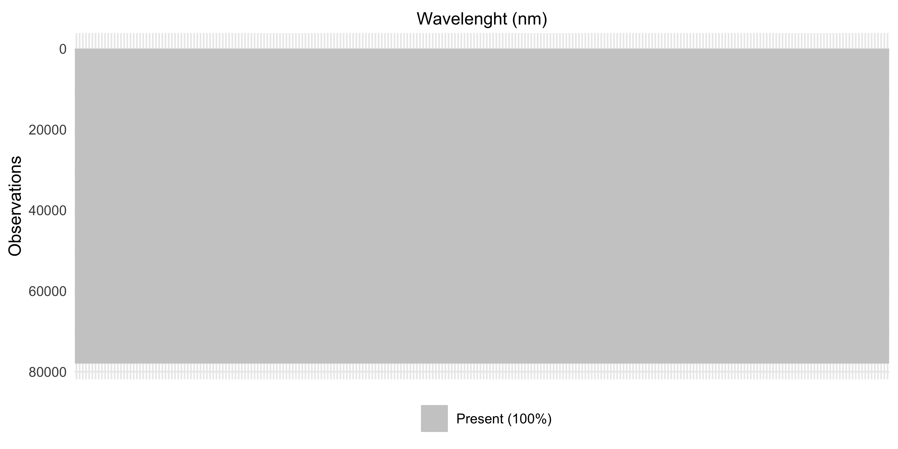

-   [Milk Quality Spectroscopy](#milk-quality-spectroscopy)
-   [Dataset](#dataset)
    -   [Key data components](#key-data-components)
    -   [Important limitations](#important-limitations)
    -   [Data evolution](#data-evolution)
    -   [Data processing](#data-processing)

<!-- README.md is generated from README.Rmd. Please edit that file -->

# Milk Quality Spectroscopy

<!-- badges: start -->
<!-- badges: end -->

``` r
if (requireNamespace("ggplot2", quietly = TRUE)) {
  ggplot2::theme_set(ggplot2::theme_minimal(base_size = 12))
}
```

``` r
set.seed(123)
```

``` r
suppressPackageStartupMessages({
  library(tidyverse)
  library(viridis)
  library(arrow) 
})
```

# Dataset

The data is structured by sensor/stall with each sensor directory
containing:

-   **Lab results** (CSV format with tube_no as primary key)
-   **Sensor configuration** (wavelengths, calibration coefficients)
-   **Spectral measurements** (Parquet files, one per milk sample)
-   **Dark spectra** (reference measurements)

## Key data components

**Lab Results**: Milk analysis including fat percentage, protein,
somatic cell count and, lactose linked to specific cows and milking
sessions.

**Spectral Data**: Raw 16-bit spectral arrays captured during milking,
with metadata like temperature, LED current, and integration time. Each
spectrum is classified as “dark,” “sample,” or “empty.”

**Sensor Info**: Each sensor has unique wavelength calibrations and
measurement parameters that aren’t standardized across sensors.

## Important limitations

-   Temperature and LED measurements are raw ADC values, not
    standardized between sensors
-   Each sensor measures different wavelengths
-   Some timing discrepancies remain due to clock source differences

## Data evolution

The dataset has evolved from initial CSV format to Parquet compression,
with spectral data consolidated into array columns rather than
individual wavelength columns for more efficient storage and processing.

## Data processing

``` r
dataset_path <- "Dataset/"
read_sensor_csvs <- function(sensor_folder) {
  sensor_path <- file.path(dataset_path, sensor_folder)
  lab_results <- read_csv(file.path(sensor_path, "lab_results.csv"), show_col_types = FALSE)
  lab_results$sensor <- sensor_folder
  sensor_data <- read_csv(file.path(sensor_path, "sensor.csv"), show_col_types = FALSE)
  sensor_data$sensor <- sensor_folder
  
  return(list(lab_results = lab_results, sensor_data = sensor_data))
}
```

``` r
read_sensor_parquets <- function(sensor_folder) {
  sensor_path <- file.path(dataset_path, sensor_folder)
  dark_spectra_path <- file.path(sensor_path, "dark_spectra", "dark_spectra.parquet")
  dark_spectra <- read_parquet(dark_spectra_path)
  spectra_path <- file.path(sensor_path, "spectra")
  tube_files <- list.files(spectra_path, pattern = "tube_no_\\d+\\.parquet$", full.names = TRUE)
  tube_spectra_list <- map(tube_files, read_parquet)
  names(tube_spectra_list) <- basename(tube_files)
  dark_spectra$sensor <- sensor_folder
  
  tube_spectra_list <- map(tube_spectra_list, ~ {
    .x$sensor <- sensor_folder
    return(.x)
  })
  
  return(list(dark_spectra = dark_spectra, tube_spectra = tube_spectra_list))
}
```

``` r
subtract_dark_spectrum <- function(tube_spectrum, dark_spectrum, verbose = FALSE) {
  if (nrow(tube_spectrum) != nrow(dark_spectrum)) {
    if (verbose) {
      cat(
        "Row count mismatch - Tube:",
        nrow(tube_spectrum),
        "Dark:",
        nrow(dark_spectrum),
        "- Trimming to",
        min(nrow(tube_spectrum), nrow(dark_spectrum)),
        "rows\n"
      )
    }
    min_rows <- min(nrow(tube_spectrum), nrow(dark_spectrum))
    tube_spectrum <- tube_spectrum[1:min_rows, ]
    dark_spectrum <- dark_spectrum[1:min_rows, ]
  }
  spectral_cols <- names(tube_spectrum)[sapply(tube_spectrum, is.numeric)]
  spectral_cols <- spectral_cols[spectral_cols != "sensor"]
  corrected_spectrum <- tube_spectrum
  
  for (col in spectral_cols) {
    if (col %in% names(dark_spectrum)) {
      if (length(tube_spectrum[[col]]) == length(dark_spectrum[[col]])) {
        corrected_spectrum[[col]] <- tube_spectrum[[col]] - dark_spectrum[[col]]
      } else {
        if (verbose) {
          cat("Column", col, "length mismatch, skipping\n")
        }
      }
    }
  }
  
  return(corrected_spectrum)
}
```

``` r
process_nir_data <- function(verbose = FALSE) {
  sensor_folders <- paste0("sensor_", 1:12)
  
  cat("Processing CSV files...\n")
  csv_data <- map(sensor_folders, read_sensor_csvs)
  names(csv_data) <- sensor_folders
  all_lab_results <- map_dfr(csv_data, ~ .x$lab_results)
  all_sensor_data <- map_dfr(csv_data, ~ .x$sensor_data)
  
  cat("Processing parquet files...\n")
  parquet_data <- map(sensor_folders, read_sensor_parquets)
  names(parquet_data) <- sensor_folders
  all_dark_spectra <- map_dfr(parquet_data, ~ .x$dark_spectra)
  corrected_spectra_list <- list()
  
  for (sensor in sensor_folders) {
    if (verbose) {
      cat(paste("Processing", sensor, "...\n"))
    } else {
      cat(".")
    }
    
    dark_spectrum <- parquet_data[[sensor]]$dark_spectra
    tube_spectra <- parquet_data[[sensor]]$tube_spectra
    corrected_tubes <- map(
      tube_spectra,
      ~ subtract_dark_spectrum(.x, dark_spectrum, verbose = verbose)
      )
    
    for (i in seq_along(corrected_tubes)) {
      tube_file <- names(corrected_tubes)[i]
      tube_number <- gsub("tube_no_(\\d+)\\.parquet", "\\1", tube_file)
      corrected_tubes[[i]]$tube_number <- tube_number
    }
    corrected_spectra_list[[sensor]] <- corrected_tubes
  }
  
  cat("\n")
  all_corrected_spectra <- map_dfr(corrected_spectra_list, ~ map_dfr(.x, identity))
  cat("Data processing complete!\n")
  
  return(
    list(
      lab_results = all_lab_results,
      sensor_data = all_sensor_data,
      dark_spectra = all_dark_spectra,
      corrected_spectra = all_corrected_spectra
    )
  )
}
```

``` r
nir_data <- process_nir_data(verbose = FALSE)
#> Processing CSV files...
#> Processing parquet files...
#> ............
#> Data processing complete!
```

``` r
cat("\n=== Data Summary ===\n")
#> 
#> === Data Summary ===
cat("Lab results shape:", nrow(nir_data$lab_results), "x", ncol(nir_data$lab_results), "\n")
#> Lab results shape: 1080 x 26
cat("Sensor data shape:", nrow(nir_data$sensor_data), "x", ncol(nir_data$sensor_data), "\n")
#> Sensor data shape: 12 x 11
cat("Dark spectra shape:", nrow(nir_data$dark_spectra), "x", ncol(nir_data$dark_spectra), "\n")
#> Dark spectra shape: 3991 x 9
cat("Corrected spectra shape:", nrow(nir_data$corrected_spectra), "x", ncol(nir_data$corrected_spectra), "\n")
#> Corrected spectra shape: 309142 x 13
cat("\nUnique sensors in corrected spectra:", length(unique(nir_data$corrected_spectra$sensor)), "\n")
#> 
#> Unique sensors in corrected spectra: 12
cat("Unique tube numbers:", length(unique(nir_data$corrected_spectra$tube_number)), "\n")
#> Unique tube numbers: 1080
```

``` r
nir_data$lab_results
#> # A tibble: 1,080 × 26
#>    tube_no barnname    rfid  lact grp   dim_days date       day_of_study
#>      <dbl>    <dbl>   <dbl> <dbl> <chr>    <dbl> <date>            <dbl>
#>  1       1     1126 8.40e14     1 A1         218 2025-06-30            1
#>  2      13     1161 8.40e14     1 A1         129 2025-06-30            1
#>  3      25     1181 8.40e14     1 A1          88 2025-06-30            1
#>  4      37     1083 8.40e14     1 A1         248 2025-06-30            1
#>  5      49     1149 8.40e14     1 A1          83 2025-06-30            1
#>  6      61      616 8.40e14     4 B2         204 2025-06-30            1
#>  7      73      456 8.40e14     5 B2         211 2025-06-30            1
#>  8      85      408 8.40e14     5 B2         249 2025-06-30            1
#>  9      97      746 8.40e14     3 B2          88 2025-06-30            1
#> 10     109      913 8.40e14     2 B2         246 2025-06-30            1
#> # ℹ 1,070 more rows
#> # ℹ 18 more variables: daily_milking <dbl>, study_milking <dbl>,
#> #   milking_end <chr>, avgmilkdur_mins <dbl>, milking_stall <dbl>,
#> #   milk_wt_lbs <dbl>, tube_number <dbl>, date_1 <date>, fat_percent <dbl>,
#> #   protein_percent <dbl>, scc_thous_per_ml <dbl>, lactose_percent <dbl>,
#> #   other_solids_percent <dbl>, mun_mg_per_dl <dbl>,
#> #   solids_not_fat_percent <dbl>, total_solids_percent <dbl>, endtime <dttm>, …
```

``` r
nir_data$sensor_data
#> # A tibble: 12 × 11
#>    sensor_uid       pcba box_number adc_gain adc_offset stall_number stall_title
#>    <chr>           <dbl>      <dbl>    <dbl>      <dbl>        <dbl> <chr>      
#>  1 B182C08004014D…    24         33       39        511            1 East Offic…
#>  2 B182C08004015A…    11          2       37        511            2 East       
#>  3 B182C08004018F…    37         25       38        511            3 East       
#>  4 B182C08004014A…    30         12       37        511            4 East       
#>  5 B182C08004016C…    16         21       38        511            5 East       
#>  6 B182C08004014E…    67         37       37        511            6 East-Entra…
#>  7 B182C080040163…    36         56       37        511            7 West Offic…
#>  8 B182C080040154…    15          4       39        511            8 West       
#>  9 B182C080040169…    21         20       37        511            9 West       
#> 10 B182C080040131…    14         24       37        511           10 West       
#> 11 B182C08004013D…    19          1       37        511           11 West       
#> 12 B182C080040191…    86         11       38        511           12 West Entra…
#> # ℹ 4 more variables: imager_sn <dbl>, sensor_wavelength_coefficients <chr>,
#> #   wavelengths_nm <chr>, sensor <chr>
```

``` r
visualize_all_sensors_temporal_summary <- function(nir_data) {
  temporal_summary <- nir_data$corrected_spectra %>%
    mutate(datetime = as.POSIXct(datetime)) %>%
    group_by(sensor) %>%
    summarise(
      n_measurements = n(),
      n_unique_tubes = n_distinct(tube_number),
      min_time = min(datetime),
      max_time = max(datetime),
      time_span_hours = as.numeric(difftime(max(datetime), min(datetime), units = "hours")),
      .groups = "drop"
    ) %>%
    mutate(avg_measurements_per_tube = round(n_measurements / n_unique_tubes, 2))
  print(temporal_summary)
  
  p_timeline <- nir_data$corrected_spectra %>%
    mutate(datetime = as.POSIXct(datetime)) %>%
    ggplot(aes(x = datetime, y = sensor, color = sensor)) +
    geom_point(alpha = 0.6, size = .5) +
    ggsci::scale_color_ucscgb() +
    labs(
      title = "Measurement Timeline Across All Sensors",
      x = "Date/Time",
      y = " ",
      caption = "Each point represents one spectral measurement"
    ) +
    theme_minimal() +
    theme(legend.position = "none")
  
  print(p_timeline)
  return(list(summary = temporal_summary, timeline_plot = p_timeline))
}
```

``` r
all_sensors_summary <- visualize_all_sensors_temporal_summary(nir_data)
#> # A tibble: 12 × 7
#>    sensor  n_measurements n_unique_tubes min_time            max_time           
#>    <chr>            <int>          <int> <dttm>              <dttm>             
#>  1 sensor…          25124             90 2025-06-30 22:43:44 2025-07-03 16:49:55
#>  2 sensor…          26353             90 2025-06-30 22:49:27 2025-07-03 16:47:42
#>  3 sensor…          26306             90 2025-06-30 22:49:40 2025-07-03 16:50:59
#>  4 sensor…          26820             90 2025-06-30 22:50:23 2025-07-03 16:51:14
#>  5 sensor…          23778             90 2025-06-30 22:43:59 2025-07-03 16:56:57
#>  6 sensor…          25791             90 2025-06-30 22:44:42 2025-07-03 16:50:31
#>  7 sensor…          25719             90 2025-06-30 22:39:36 2025-07-03 16:49:00
#>  8 sensor…          26679             90 2025-06-30 22:38:43 2025-07-03 16:50:48
#>  9 sensor…          26038             90 2025-06-30 22:45:30 2025-07-03 16:51:16
#> 10 sensor…          25764             90 2025-06-30 22:50:03 2025-07-03 16:49:00
#> 11 sensor…          25651             90 2025-06-30 22:48:41 2025-07-03 16:50:05
#> 12 sensor…          25119             90 2025-06-30 22:49:05 2025-07-03 16:47:37
#> # ℹ 2 more variables: time_span_hours <dbl>, avg_measurements_per_tube <dbl>
```



``` r
visualize_nirs_time_series <- function(
    nir_data,
    target_sensor = "sensor_1",
    min_measurements = 2
    ) {
  sensor_data <- nir_data$corrected_spectra %>%
    filter(sensor == target_sensor) %>%
    mutate(datetime = as.POSIXct(datetime))
  
  cat("=== Time Series Analysis for", target_sensor, "===\n")
  cat("Total measurements:", nrow(sensor_data), "\n")
  
  repeated_samples <- sensor_data %>%
    group_by(tube_number) %>%
    summarise(
      n_measurements = n(),
      time_span = difftime(max(datetime), min(datetime), units = "hours"),
      first_measurement = min(datetime),
      last_measurement = max(datetime),
      .groups = "drop"
    ) %>%
    filter(n_measurements >= min_measurements) %>%
    arrange(desc(n_measurements))
  
  cat(
    "Samples with",
    min_measurements,
    "or more measurements:",
    nrow(repeated_samples),
    "\n"
  )
  
  if (nrow(repeated_samples) == 0) {
    cat("No samples found with repeated measurements for time series analysis.\n")
    cat("Showing measurement frequency instead...\n")
    
    p1 <- sensor_data %>%
      ggplot(aes(x = datetime)) +
      geom_histogram(bins = 30, fill = "steelblue", alpha = 0.7) +
      labs(
        title = paste("Measurement Frequency Over Time -", target_sensor),
        x = "Date/Time",
        y = "Number of Measurements"
      ) +
      theme_minimal()
    
    print(p1)
    return(list(repeated_samples = repeated_samples, plot = p1))
  }
  
  samples_to_plot <- repeated_samples %>%
    slice_head(n = 5) %>%
    pull(tube_number)
  
  cat(
    "\nPlotting time series for tubes:",
    paste(samples_to_plot, collapse = ", "),
    "\n"
    )
  
  time_series_data <- sensor_data %>%
    filter(tube_number %in% samples_to_plot) %>%
    arrange(tube_number, datetime)
  
  extract_spectral_data <- function(data) {
    spectral_list <- list()
    for (i in 1:nrow(data)) {
      spec_array <- data$spec_array[[i]]
      spec_df <- data.frame(
        wavelength_index = 1:length(spec_array),
        intensity = as.numeric(spec_array),
        tube_number = data$tube_number[i],
        datetime = data$datetime[i],
        measurement_id = paste(data$tube_number[i], data$datetime[i])
      )
      spectral_list[[i]] <- spec_df
    }
    do.call(rbind, spectral_list)
  }
  
  spectral_data <- extract_spectral_data(time_series_data)
  
  p2 <- spectral_data %>%
    ggplot(aes(
      x = wavelength_index,
      y = intensity,
      color = datetime,
      group = measurement_id
    )) +
    geom_line(alpha = 0.7, size = 0.5) +
    facet_wrap(
      ~ tube_number,
      scales = "free_y",
      labeller = labeller(
        tube_number = function(x)
          paste("Tube", x)
      )
    ) +
    scale_color_viridis_c(name = "Time", trans = "time") +
    labs(
      title = paste("NIRS Spectra Time Series -", target_sensor),
      subtitle = "Each line represents a spectrum at a different time point",
      x = "Wavelength Index",
      y = "Corrected Intensity",
      caption = "Colors represent measurement time (darker = earlier, lighter = later)"
    ) +
    theme_minimal() +
    theme(strip.text = element_text(size = 10, face = "bold"),
          legend.position = "bottom")
  print(p2)
}
```

``` r
visualize_nirs_time_series(nir_data, "sensor_1", min_measurements = 2)
#> === Time Series Analysis for sensor_1 ===
#> Total measurements: 25124 
#> Samples with 2 or more measurements: 90 
#> 
#> Plotting time series for tubes: 1, 1021, 1057, 109, 169
```


