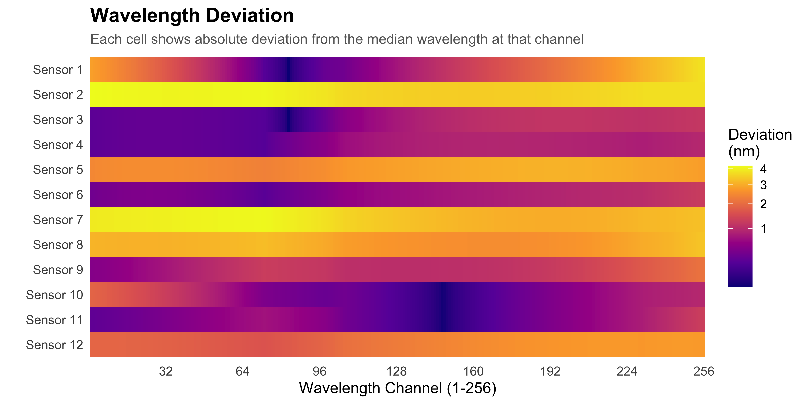
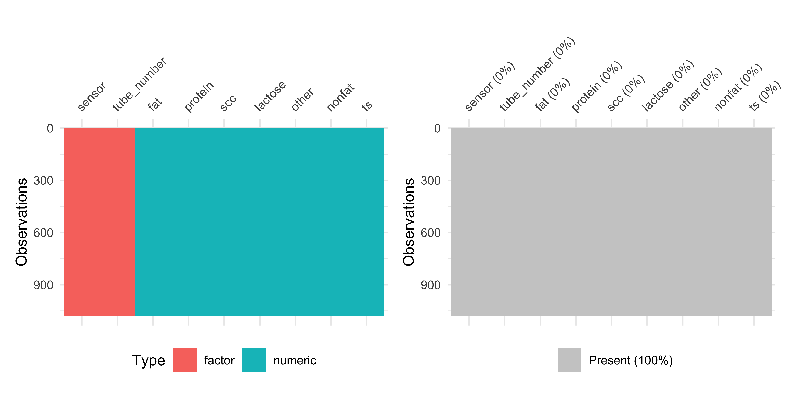
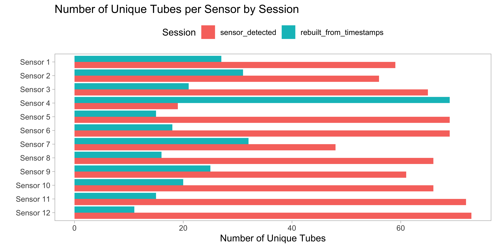
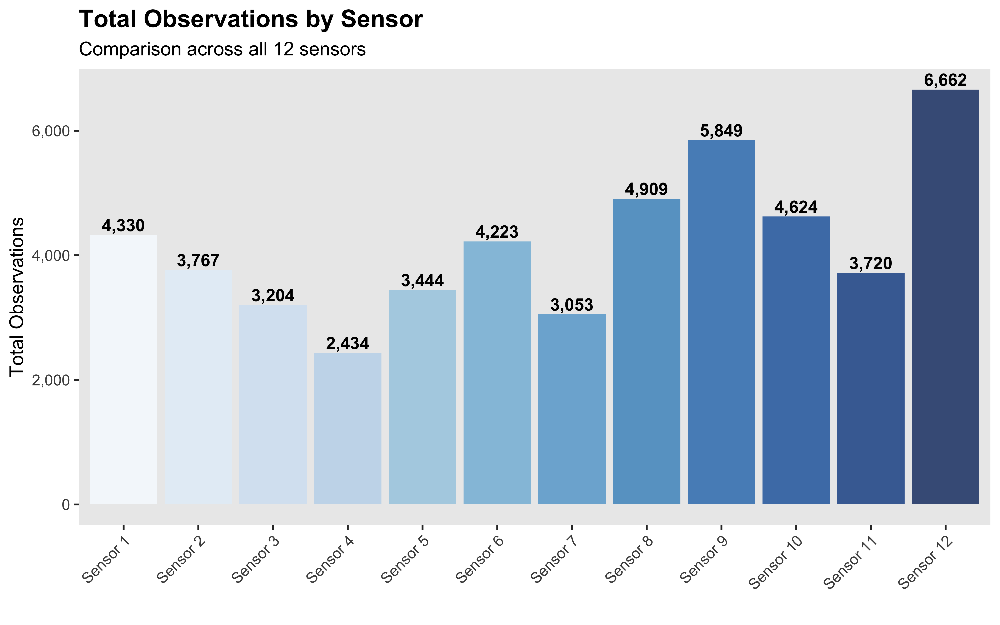
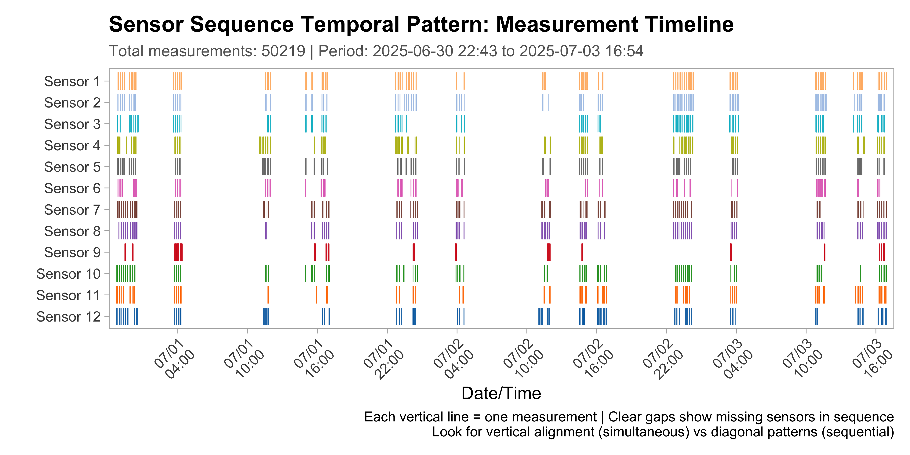
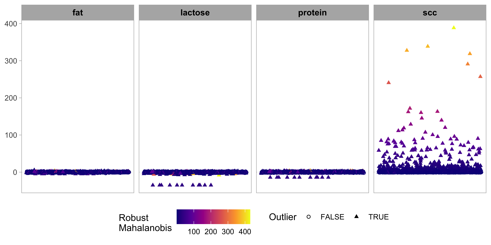
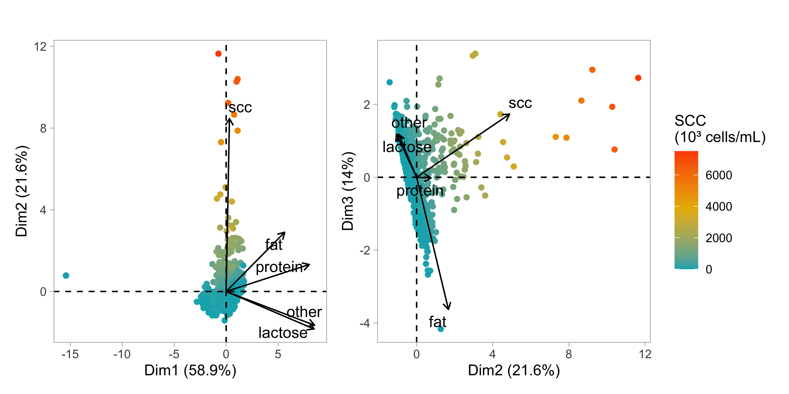
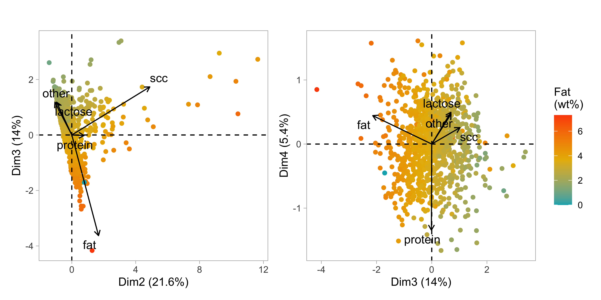
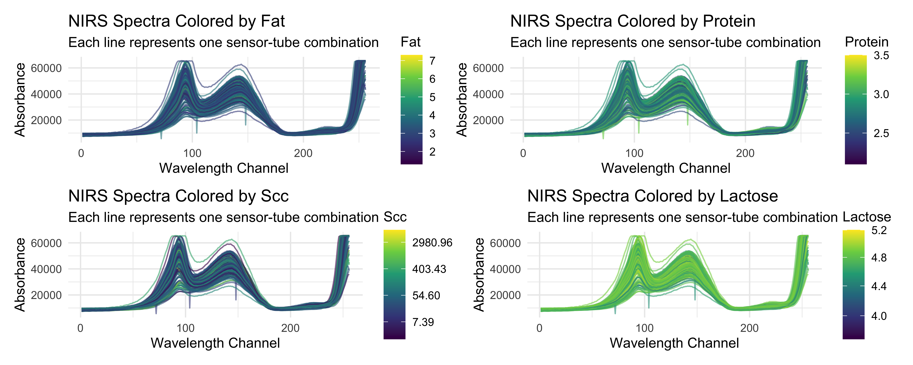
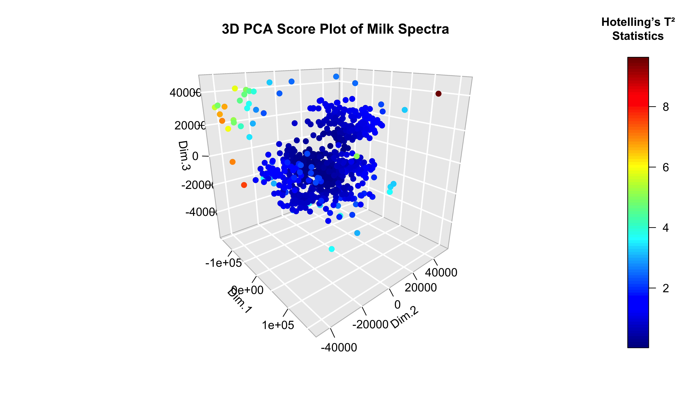

- [Milk Quality Spectroscopy](#milk-quality-spectroscopy)
- [Dataset](#dataset)
  - [Key data components](#key-data-components)
  - [Important limitations](#important-limitations)
  - [Data evolution](#data-evolution)
- [Data processing](#data-processing)
  - [Data loading](#data-loading)
  - [Sensor wavelengths](#sensor-wavelengths)
  - [Sensor data](#sensor-data)
  - [Laboratory data](#laboratory-data)
  - [Processed data](#processed-data)
  - [Cleaned data](#cleaned-data)
  - [Measurements by Sensor and Tube](#measurements-by-sensor-and-tube)
  - [Measurements timeline](#measurements-timeline)
- [Exploratory Data Analysis](#exploratory-data-analysis)
  - [Descriptive statistics](#descriptive-statistics)
  - [Milk quality components](#milk-quality-components)
    - [PCA analysis](#pca-analysis)
  - [NIRS spectra](#nirs-spectra)
    - [Measurement Quality Assessment](#measurement-quality-assessment)
    - [Spectral Noise](#spectral-noise)
    - [Averaged Spectra](#averaged-spectra)
    - [PCA analysis](#pca-analysis-1)
- [Modeling](#modeling)
  - [Data splits and preprocessing](#data-splits-and-preprocessing)
  - [Models training](#models-training)

<!-- README.md is generated from README.Rmd. Please edit that file -->

# Milk Quality Spectroscopy

<!-- badges: start -->

<!-- badges: end -->

``` r
suppressPackageStartupMessages({
  library(tidyverse)
  library(magrittr)
  library(reticulate)
  library(viridis)
  library(arrow)
  library(tidymodels)
  library(future)
  library(doFuture)
  library(corrplot)
  library(vip)
  library(patchwork)
  library(yardstick)
  library(skimr)
  library(GGally)
  library(FactoMineR)
  library(factoextra)
  library(gridExtra)
  library(RColorBrewer)
  library(knitr)
  library(janitor)
  library(ggforce)
  library(ranger)
  library(glmnet)
  library(xgboost)
  library(mixOmics)
  library(plsmod)
})
```

``` r
tidymodels_prefer()
theme_set(theme_light(base_size = 12))
options(
  mc_doScale_quiet = TRUE,
  width = 120,
  max.print = 100,
  tibble.print_max = 30,
  tibble.width = 120,
  digits = 3
  )
```

# Dataset

The data is structured by sensor/stall with each sensor directory
containing:

- **Lab results** (CSV format with tube_no as primary key)
- **Sensor configuration** (wavelengths, calibration coefficients)
- **Spectral measurements** (Parquet files, one per milk sample)
- **Dark spectra** (reference measurements)

## Key data components

**Lab Results**: Milk analysis including fat percentage, protein,
somatic cell count and, lactose linked to specific cows and milking
sessions.

**Spectral Data**: Raw 16-bit spectral arrays captured during milking,
with miscellaneous_vardata like temperature, LED current, and
integration time. Each spectrum is classified as “dark,” “sample,” or
“empty.”

**Sensor Info**: Each sensor has unique wavelength calibrations and
measurement parameters that aren’t standardized across sensors.

## Important limitations

- Temperature and LED measurements are raw ADC values, not standardized
  between sensors
- Each sensor measures different wavelengths
- Some timing discrepancies remain due to clock source differences

## Data evolution

The dataset has evolved from initial CSV format to Parquet compression,
with spectral data consolidated into array columns rather than
individual wavelength columns for more efficient storage and processing.

# Data processing

``` r
set.seed(123)
```

## Data loading

``` r
dataset_path <- "Dataset/"
functions_path <- "~/Documents/GitHub/milk-quality-spectroscopy/R/"
```

``` r
source(paste0(functions_path, "read_sensor_csvs.R"))
source(paste0(functions_path, "read_sensor_parquets.R"))
source(paste0(functions_path, "subtract_dark_spectrum.R"))
source(paste0(functions_path, "process_raw_data.R"))
source(paste0(functions_path, "derivative.R"))
```

``` r
raw_dataset <- process_raw_data(verbose = FALSE)
#> Beginning NIR data processing for 12 sensor(s)
#> Processing CSV files...
#> Processing parquet files...
#> Performing baseline correction...
#> 
#> Data processing complete!
```

## Sensor wavelengths

``` r
sensor_wavelengths_list <- raw_dataset$sensor_data %>%
  select(sensor, wavelengths_nm) %>%
  mutate(
    wavelength_chars = 
      str_remove_all(wavelengths_nm, "\\[|\\]") %>%
      str_split(",\\s*")
    ) %>%
  select(sensor, wavelength_chars) %>%
  deframe()
```

``` r
wavelengths_summary <- sensor_wavelengths_list %>%
  map_dfr(~ {
    wl <- as.numeric(.x)
    steps <- abs(diff(wl))
    tibble(
      min = min(wl),
      max = max(wl),
      range = max(wl) - min(wl),
      mean_step = mean(steps),
      min_step = min(steps),
      max_step = max(steps),
      total = length(wl)
    )
  }, .id = "sensor")
```

``` r
wavelengths_summary
#> # A tibble: 12 × 8
#>    sensor      min   max range mean_step min_step max_step total
#>    <chr>     <dbl> <dbl> <dbl>     <dbl>    <dbl>    <dbl> <int>
#>  1 sensor_1   452. 1102.  651.      2.55     1.95     3.22   256
#>  2 sensor_2   453. 1105.  651.      2.55     1.94     3.24   256
#>  3 sensor_3   455. 1102.  647.      2.54     1.93     3.21   256
#>  4 sensor_4   457. 1105.  648.      2.54     1.94     3.20   256
#>  5 sensor_5   458. 1107.  650.      2.55     1.95     3.20   256
#>  6 sensor_6   458. 1108.  651.      2.55     1.94     3.21   256
#>  7 sensor_7   453. 1104.  651.      2.55     1.95     3.23   256
#>  8 sensor_8   452. 1102.  650.      2.55     1.95     3.21   256
#>  9 sensor_9   453. 1104.  651.      2.55     1.95     3.23   256
#> 10 sensor_10  453. 1105.  651.      2.55     1.94     3.22   256
#> 11 sensor_11  458. 1109.  650.      2.55     1.95     3.22   256
#> 12 sensor_12  458. 1102.  643.      2.52     1.91     3.19   256
```

``` r
wavelength_tbl <- sensor_wavelengths_list %>%
  map(as.numeric) %>%
  map_dfr(~ tibble(wavelength = .x), .id = "sensor") %>%
  group_by(sensor) %>%
  mutate(channel = row_number()) %>%
  ungroup() %>%
  mutate(sensor_num = as.integer(str_extract(sensor, "\\d+")))

median_by_channel <- wavelength_tbl %>%
  group_by(channel) %>%
  summarise(
    channel_median = median(wavelength, na.rm = TRUE),
    .groups = "drop"
  )
```

``` r
wavelength_tbl %>%
  left_join(median_by_channel, by = "channel") %>%
  mutate(deviation_from_median = abs(wavelength - channel_median)) %>%
  ggplot() +
  aes(
    x = channel, 
    y = factor(sensor_num, levels = 1:12), 
    fill = deviation_from_median
    ) +
  geom_raster() +
  scale_fill_viridis_c(
    name = "Deviation\n(nm)",
    option = "plasma",
    trans = "sqrt"
  ) +
  scale_x_continuous(
    breaks = seq(0, 256, by = 32),
    expand = c(0, 0)
  ) +
  scale_y_discrete(
    labels = paste("Sensor", 12:1)
  ) +
  labs(
    title = "Wavelength Deviation",
    subtitle = "Each cell shows absolute deviation from the median wavelength at that channel",
    x = "Wavelength Channel (1-256)",
    y = ""
  ) +
  theme_minimal() +
  theme(
    panel.grid = element_blank(),
    plot.title = element_text(size = 14, face = "bold"),
    plot.subtitle = element_text(size = 10, color = "gray40"),
    axis.text.x = element_text(size = 9),
    axis.text.y = element_text(size = 9),
    legend.position = "right"
  )
```



## Sensor data

``` r
sensor_dataset <- raw_dataset %>%
  pluck("corrected_spectra") %>%
  filter(spec_type == "SAMPLE") %>%
  select(session_from, datetime, tube_number, sensor, spec_array) %>%
  modify_at("session_from", as_factor) %>%
  modify_at("tube_number", as_factor) %>%
  modify_at("sensor", as_factor) %>%
  mutate(
    spec_valid = case_when(
      map_lgl(spec_array, is.null) ~ FALSE,
      map_int(spec_array, length) == 0 ~ FALSE,
      map_lgl(spec_array, ~ all(is.na(.x))) ~ FALSE,
      TRUE ~ TRUE
    )
  ) %>%
  filter(spec_valid) %>%
  rowwise() %>%
  mutate(
    df = list({
      tryCatch(
        {
          values <- as.numeric(unlist(spec_array))
          valid_values <- values[!is.na(values)]
          if (length(valid_values) > 0) {
            setNames(valid_values, paste0("X", seq_along(valid_values)))
          } else {
            NULL
          }
        },
        error = function(e) {
          NULL
        }
      )
    })
  ) %>%
  ungroup() %>%
  filter(!map_lgl(df, is.null)) %>%
  select(-spec_array, -spec_valid) %>%
  unnest_wider(df) %>%
  relocate(sensor, .before = tube_number)
```

``` r
p1 <- sensor_dataset %>%
  select(-starts_with("X")) %>%
  visdat::vis_dat() + 
  theme(legend.position = "bottom")
```

``` r
p2 <- sensor_dataset %>%
  select(starts_with("X")) %>%
  visdat::vis_miss(warn_large_data = FALSE, large_data_size = 1e6) +
  labs(x = "Wavelength Channels") +
  theme(
    axis.ticks.x = element_blank(),
    axis.text.x = element_blank()
  )
```

``` r
p1 | p2
```


## Laboratory data

``` r
lab_dataset <- raw_dataset %>%
  pluck("lab_results") %>%
  select(
    sensor,
    tube_number,
    fat_percent,
    protein_percent,
    scc_thous_per_ml,
    lactose_percent,
    other_solids_percent,
    solids_not_fat_percent,
    total_solids_percent
  ) %>%
  modify_at("tube_number", as_factor) %>%
  modify_at("sensor", as_factor) %>%
  rename(
    fat = fat_percent,
    protein = protein_percent,
    scc = scc_thous_per_ml,
    lactose = lactose_percent,
    other = other_solids_percent,
    nonfat = solids_not_fat_percent,
    ts = total_solids_percent
  )
```

``` r
p3 <- lab_dataset %>% visdat::vis_dat() + theme(legend.position = "bottom")
p4 <- lab_dataset %>% visdat::vis_miss()
```

``` r
p3 | p4
```



``` r
target_var <- lab_dataset %>% select(fat, protein, scc, lactose) %>% names()
miscellaneous_var <- lab_dataset %>% select(-sensor, -tube_number, -all_of(target_var)) %>% names()
```

## Processed data

``` r
processed_data <- sensor_dataset %>%
  left_join(lab_dataset, by = c("sensor", "tube_number")) %>%
  filter(if_all(starts_with("X_"), ~ !is.na(.x))) %>%
  relocate(sensor, .before = tube_number) %>%
  relocate(all_of(target_var), .after = tube_number) %>%
  relocate(all_of(miscellaneous_var), .after = all_of(target_var))
```

``` r
cat("Processed data...\n")
#> Processed data...
cat("Dimensions:", nrow(processed_data), "x", ncol(processed_data), "\n")
#> Dimensions: 77986 x 267
cat("Number of wavelenghts:", sum(grepl("^X", names(processed_data))), "\n")
#> Number of wavelenghts: 256
```

## Cleaned data

``` r
processed_data %>%
  filter(!is.na(session_from), !is.na(sensor), !is.na(tube_number)) %>%
  group_by(session_from, sensor) %>%
  summarise(
    unique_tubes = n_distinct(tube_number),
    total_measurements = n(),
    .groups = "drop"
  ) %>%
  arrange(session_from, sensor) %>%
  ggplot() +
  aes(x = sensor, y = unique_tubes, fill = session_from) +
  geom_col(position = "dodge") +
  scale_x_discrete(
    limits = paste0("sensor_", 12:1),
    labels = paste("Sensor", 12:1)
  ) +
  labs(
    title = "Number of Unique Tubes per Sensor by Session",
    x = "",
    y = "Number of Unique Tubes",
    fill = "Session"
  ) +
  coord_flip() +
  theme_light() +
  theme(
    legend.position = "top",
    panel.grid = element_blank()
    )
```



In the following, we will use only the `sensor_detected` session data
for modeling. Moreover, the note indicates this data is more consistent,
and our analysis shows it already provides excellent compositional
coverage. In NIRS modeling, data quality trumps data quantity. It’s
therefore better to have 723 high-quality, consistent measurements than
1,023 measurements with mixed quality levels.

``` r
cleaned_data <- processed_data %>%
  filter(session_from == "sensor_detected")
```

``` r
cat("Cleaned data...\n")
#> Cleaned data...
cat("Dimensions:", nrow(cleaned_data), "x", ncol(cleaned_data), "\n")
#> Dimensions: 50219 x 267
cat("Number of wavelenghts:", sum(grepl("^X", names(cleaned_data))), "\n")
#> Number of wavelenghts: 256
```

## Measurements by Sensor and Tube

``` r
sensor_summary <- cleaned_data %>%
  select(sensor, tube_number, starts_with("X")) %>%
  group_by(sensor, tube_number) %>%
  summarise(
    observations = n(),
    variables = ncol(.) - 2,
    total_cells = n() * ncol(.),
    .groups = "drop"
  ) %>%
  arrange(sensor)
```

``` r
sensor_summary
#> # A tibble: 723 × 5
#>    sensor   tube_number observations variables total_cells
#>    <fct>    <fct>              <int>     <dbl>       <int>
#>  1 sensor_1 1                     69       256       17802
#>  2 sensor_1 1009                  87       256       22446
#>  3 sensor_1 1021                  33       256        8514
#>  4 sensor_1 1033                  33       256        8514
#>  5 sensor_1 1045                 194       256       50052
#>  6 sensor_1 1057                 194       256       50052
#>  7 sensor_1 1069                  69       256       17802
#>  8 sensor_1 109                  147       256       37926
#>  9 sensor_1 121                   25       256        6450
#> 10 sensor_1 13                    48       256       12384
#> # ℹ 713 more rows
```

``` r
sensor_summary %>%
  group_by(sensor) %>%
  summarise(total_obs = sum(observations), .groups = "drop") %>%
  mutate(sensor_num = as.numeric(str_extract(sensor, "\\d+"))) %>%
  arrange(sensor_num) %>%
  ggplot(aes(x = reorder(sensor, sensor_num), y = total_obs, fill = sensor)) +
  geom_col(alpha = 0.8) +
  geom_text(
    aes(label = scales::comma(total_obs)),
    vjust = -0.3,
    size = 3.5,
    fontface = "bold"
  ) +
  scale_fill_manual(values = colorRampPalette(brewer.pal(9, "Blues"))(12)) +
  scale_x_discrete(
    limits = paste0("sensor_", 1:12),
    labels = paste("Sensor", 1:12)
  ) +
  scale_y_continuous(labels = scales::comma) +
  labs(
    title = "Total Observations by Sensor",
    subtitle = "Comparison across all 12 sensors",
    x = "",
    y = "Total Observations"
  ) +
  theme_grey() +
  theme(
    legend.position = "none",
    panel.grid = element_blank(),
    axis.text.x = element_text(angle = 45, hjust = 1),
    plot.title = element_text(face = "bold", size = 14),
    panel.grid.minor = element_blank()
  )
```



``` r
sensor_summary %>%
  mutate(sensor_num = as.numeric(str_extract(sensor, "\\d+"))) %>%
  group_by(sensor) %>%
  arrange(tube_number) %>%
  mutate(
    tube_position = row_number(),
    max_tubes = max(tube_position)
  ) %>%
  ungroup() %>%
  ggplot(
    aes(
      x = tube_position, 
      y = reorder(sensor, -sensor_num), 
      fill = observations
      )
    ) +
  geom_tile(color = "white", size = 0.3) +
  scale_fill_gradient2(
    low = "lightblue", mid = "yellow", high = "red",
    midpoint = median(sensor_summary$observations),
    name = "Observations"
  ) +
  scale_y_discrete(
    limits = paste0("sensor_", 12:1),
    labels = paste("Sensor", 12:1)
  ) +
  labs(
    title = "Observations Heatmap: All Sensors",
    subtitle = "X-axis shows tube position (1st, 2nd, 3rd, etc.) within each sensor",
    x = "Tube Position (ordered within sensor)",
    y = ""
  ) +
  theme_light() +
  theme(
    plot.title = element_text(face = "bold", size = 14),
    panel.grid = element_blank(),
    axis.text.x = element_text(size = 8)
  ) +
  scale_x_continuous(
    breaks = seq(
      1, 
      max(
        sensor_summary %>% 
          group_by(sensor) %>% 
          summarise(n = n()) %>% 
          pull(n)
        ), 
      by = 5
      )
    )
```


## Measurements timeline

``` r
measurement_data <- cleaned_data %>%
  mutate(datetime = as.POSIXct(datetime)) %>%
  arrange(datetime, sensor)
```

``` r
sequence_plot <- measurement_data %>%
  ggplot(aes(x = datetime, y = factor(sensor), color = factor(sensor))) +
  geom_linerange(
    aes(
      ymin = as.numeric(factor(sensor)) - 0.4,
      ymax = as.numeric(factor(sensor)) + 0.4
    ),
    linewidth = 0.1,
    alpha = 0.8
  ) +
  ggsci::scale_color_d3(palette = "category20") +
  scale_y_discrete(
    limits = paste0("sensor_", 12:1),
    labels = paste("Sensor", 12:1)
  ) +
  scale_x_datetime(
    date_labels = "%m/%d\n%H:%M",
    date_breaks = "6 hours",
    minor_breaks = "1 hour",
    expand = c(0.01, 0)
  ) +
  labs(
    title = "Sensor Sequence Temporal Pattern: Measurement Timeline",
    subtitle = sprintf(
      "Total measurements: %d | Period: %s to %s",
      nrow(measurement_data),
      format(min(measurement_data$datetime), "%Y-%m-%d %H:%M"),
      format(max(measurement_data$datetime), "%Y-%m-%d %H:%M")
    ),
    x = "Date/Time",
    y = "",
    caption = "Each vertical line = one measurement | Clear gaps show missing sensors in sequence\nLook for vertical alignment (simultaneous) vs diagonal patterns (sequential)"
  ) +
  theme_light() +
  theme(
    legend.position = "none",
    panel.grid = element_blank(),
    plot.title = element_text(size = 14, face = "bold"),
    plot.subtitle = element_text(size = 10, color = "gray40"),
    axis.text.x = element_text(angle = 45, hjust = 1, size = 9),
    axis.text.y = element_text(size = 9),
    panel.background = element_rect(fill = "white"),
    plot.background = element_rect(fill = "white"),
    plot.margin = margin(10, 10, 10, 10)
  )
```

``` r
sequence_plot
```



# Exploratory Data Analysis

## Descriptive statistics

``` r
stat_summary <- lab_dataset %>% 
  select(all_of(target_var)) %>%
  specProc::summaryStats(robust = TRUE)
```

``` r
stat_summary
#> # A tibble: 4 × 14
#>   variable median   mad    Qn    Sn medcouple   LMC   RMC    rsd biloc biscale   bivar    rcv count
#>   <chr>     <dbl> <dbl> <dbl> <dbl>     <dbl> <dbl> <dbl>  <dbl> <dbl>   <dbl>   <dbl>  <dbl> <int>
#> 1 fat         3.4  0.74  0.66  0.72      0     0.23  0.33  1.10   3.41    0.8     0.6   32.3   1080
#> 2 lactose     4.8  0.15  0.22  0.12     -0.2   0     0     0.222  4.79    0.18    0.03   4.63  1080
#> 3 protein     2.8  0.3   0.22  0.24      0     0.33 -0.33  0.445  2.81    0.25    0.06  15.9   1080
#> 4 scc        37   46.0  44.2  42.9       0.72 -0.11  0.57 68.1   42.4    68.7  3078.   184.    1080
```

``` r
cor_matrix <- lab_dataset %>%
  select(-sensor, -tube_number) %>%
  cor(use = "complete.obs")

corrplot(
  cor_matrix,
  method = "color",
  type = "upper",
  order = "hclust",
  tl.cex = 0.8,
  tl.col = "black",
  addCoef.col = "black",
  number.cex = 0.8,
  title = "Correlation matrix of all variables",
  mar = c(0, 0, 2, 0)
)
```


``` r
lab_dataset %>%
  select(-tube_number) %>%
    ggpairs(
      columns = 1:5,
      ggplot2::aes(colour = sensor),
      title = "Pairwise relationships between target variables"
    )
```


``` r
p <- lab_dataset %>% 
  select(all_of(target_var)) %>%
  specProc::adjusted_boxplot()

p + facet_wrap(~ variable, scales = "free", ncol = 4) +
  scale_fill_viridis_d(option = "viridis") +
  labs(title = "Overall distribution of milk components") +
  theme_light() +
  theme(
    panel.grid = element_blank(),
    strip.text = element_text(size = 10, color = "black", face = "bold"),
    axis.ticks.x = element_blank(),
    axis.text.x = element_blank()
    )
```


Counting the number of zero values across all target variables:

``` r
zeros_tbl <- lab_dataset %>%
  select(all_of(target_var)) %>%
  summarise(across(everything(), ~ sum(.x == 0, na.rm = TRUE)))
```

``` r
zeros_tbl
#> # A tibble: 1 × 4
#>     fat protein   scc lactose
#>   <int>   <int> <int>   <int>
#> 1    11      11    39      11
```

``` r
zero_pct <- lab_dataset %>%
  select(all_of(target_var)) %>%
  summarise(across(everything(), ~ mean(.x == 0, na.rm = TRUE))) %>%
  summarise(overall_zero_pct = mean(c_across(everything())))

nonzero_pct <- 1 - zero_pct$overall_zero_pct
```

``` r
lab_dataset %>%
  select(all_of(target_var)) %>%
  mutate(across(everything(), ~ ifelse(.x == 0, NA, .x))) %>%
  naniar::vis_miss() +
  scale_fill_manual(
    values = c("lightblue", "darkred"),
    labels = c(
      paste0("nonzeros (", round(nonzero_pct * 100, 1), "%)"),
      paste0("zeros (", round(zero_pct$overall_zero_pct * 100, 1), "%)")
    ),
    name = ""
  )
```


These zero values probably represent missing or invalid data rather than
true biological zeros, and might be better handled through imputation or
exclusion rather than including them in the modeling.

``` r
lab_dataset %>% 
  select(all_of(target_var)) %>%
  specProc::outlierplot(show.mahal = TRUE) +
  theme(strip.text = element_text(size = 10, color = "black", face = "bold"))
```



The color gradient shows the Mahalanobis distance, while the triangular
shape indicates multivariate outliers, i.e. samples that are unusual
when considering all target_var together. Most variables show tight
clustering. Fat, lactose, other_solids, and protein all show the
majority of data points clustered tightly around zero with relatively
few outliers. SCC shows much more variability, showing a broader spread
of Mahalanobis distances.

The yellow triangles in the fat, lactose, other_solids, and protein
panels, represent extreme outliers with very high Mahalanobis distances.
They have unusually low fat, lactose, other solids, and protein content
compared to the normal population. Moreover, the fact that fat, protein,
and lactose all have exactly 11 zeros suggests these might be the same
samples with missing or problematic measurements. The 11 samples with
zeros across multiple variables would definitely appear as extreme
multivariate outliers (explaining some of those yellow triangular points
at very negative values).

SCC has a highly skewed distribution based on its box plot. This extreme
right skew in SCC explains why it showed such different patterns in the
outlier detection plot. The other variables (fat, protein, lactose) show
more symmetric, normal-like distributions in their box plots, which is
why their outliers in the Mahalanobis plot were primarily samples with
unusually low values. For SCC, however, the natural distribution is so
skewed that most “normal” samples cluster near zero. The outliers
detected by the robust Mahalanobis method are likely the samples with
moderately high SCC values that, while not extreme on the raw scale, are
unusual in the context of the multivariate relationship with other milk
components.

``` r
transf_list <- lab_dataset %>%
  select(all_of(target_var)) %>%
  specProc::robustBCYJ(var = c("scc", "lactose"))
```

``` r
transf_list %>%
  pluck("transformation") %>%
  bind_cols(lab_dataset %>% select(fat, protein)) %>%
  relocate(c("scc", "lactose"), .after = protein) %>%
  specProc::adjusted_boxplot() +
  facet_wrap(~ variable, scales = "free", ncol = 4) +
  scale_fill_viridis_d(option = "viridis") +
  labs(title = "Robust Box-Cox transformation of SCC and lactose") +
  theme_light() +
  theme(
    panel.grid = element_blank(),
    strip.text = element_text(size = 10, color = "black", face = "bold"),
    axis.ticks.x = element_blank(),
    axis.text.x = element_blank()
    )
```


``` r
transf_list %>%
  pluck("transformation") %>%
  bind_cols(lab_dataset %>% select(fat, protein)) %>%
  relocate(c("scc", "lactose"), .after = protein) %>%
  specProc::outlierplot(show.outlier = FALSE, show.mahal = TRUE) +
  theme(strip.text = element_text(size = 10, color = "black", face = "bold"))
```


After the Box-Cox transformation, SCC now shows a more symmetric
distribution around zero, rather than the extreme right skew we saw in
the original data. The transformation has successfully normalized the
SCC distribution. The dark points (high Mahalanobis distance outliers)
appear across all panels, suggesting these represent samples with
genuinely unusual multivariate patterns rather than just extreme values
driven by SCC’s original skewed distribution.

## Milk quality components

### PCA analysis

A principal component analysis (PCA) was conducted on the four key milk
composition variables. The analysis aimed to understand the underlying
structure of relationships between these variables and assess potential
multicollinearity for subsequent modeling efforts.

``` r
pca_model <- lab_dataset %>%
  select(all_of(target_var), other) %>%
  PCA(scale.unit = TRUE, graph = FALSE)
```

``` r
eigenvalues <- get_eigenvalue(pca_model)
```

``` r
p1 <- pca_model %>%
  fviz_eig(
    addlabels = TRUE,
    ylim = c(0, 60),
    title = "Scree Plot",
    xlab = "Principal Components",
    ylab = "Percentage of Variance Explained"
  ) +
  theme_light() +
  labs(caption = "Red line indicates 10% variance threshold")

p2 <- eigenvalues %>%
  as.data.frame() %>%
  mutate(component = 1:nrow(.)) %>%
  ggplot(aes(x = component, y = cumulative.variance.percent)) +
  geom_line(size = 1.2, color = "steelblue") +
  geom_point(size = 3, color = "steelblue") +
  scale_x_continuous(breaks = 1:nrow(eigenvalues)) +
  labs(
    title = "Cumulative Variance Explained",
    x = "Principal Components",
    y = "Cumulative Variance (%)",
    caption = "Red line indicates 80% variance threshold"
  ) +
  theme_light()
```

``` r
p1 | p2
```


The PCA extracted two principal components that collectively explained
80.5% of the total variance in the dataset. The first principal
component accounted for 58.9% of the variance, while the second
component explained an additional 21.6%.

``` r
pca_contrib <- function(model, axes, title, fill_color, top = 10) {
  p <- model %>%
    fviz_contrib(
      choice = "var",
      axes = axes,
      top = top,
      title = title,
      fill = fill_color,
      color = fill_color
    ) +
    labs(x = "") +
    theme_light() +
    theme(axis.text.x = element_text(angle = 45, hjust = 1))
  
  return(p)
}
```

``` r
pca_contrib(pca_model, axes = 1, title = "Dim1", fill_color = "steelblue") |
  pca_contrib(pca_model, axes = 2, title = "Dim2", fill_color = "coral") |
  pca_contrib(pca_model, axes = 1:2, title = "Dim1 and Dim2", fill_color = "darkgreen")
```


Dim1 represents a milk composition axis, with relatively balanced
contributions from multiple composition variables. The contribution
analysis reveals that fat percentage (18%), protein percentage (17%),
other solids percentage (16%), lactose percentage (15%), and total
solids percentage (15%) all contribute substantially and approximately
equally to this component. Somatic cell count contributes minimally
(\<2%) to Dim1, indicating it varies independently from the primary milk
composition gradient.

Dim2 is primarily driven by milk production quantity, with milk weight
(mlk_wt_lbs) contributing 35% of the variance in this component. This
represents a milk yield dimension that captures variation in production
volume. Other variables show much lower contributions to Dim2, with fat
percentage contributing approximately 12% and SCC contributing
approximately 10-12%.

``` r
corr_circle <- function(
    model,
    axes = c(1, 2),
    title = "",
    legend.title = "Contribution",
    gradient.cols = c("#08519C", "#6BAED6", "#FD8D3C")
    ) {
  p <- model %>%
    fviz_pca_var(
      axes = axes,
      col.var = "contrib",
      gradient.cols = gradient.cols,
      repel = TRUE,
      title = title,
      legend.title = legend.title,
      col.circle = "black"
    ) +
    xlim(-1.01, 1.01) +
    ylim(-1.01, 1.01) +
    theme_light() +
    theme(panel.grid = element_blank())
  
  return(p)
}
```

``` r
corr_circle(pca_model, title = "Correlation Circle of Variable Relationships") |
  corr_circle(pca_model, axes = c(2, 3))
```


The correlation circle and contribution analysis reveal a
three-dimensional structure in the dataset:

- **Composition Quality Dimension (Dim1):** All major milk composition
  variables (fat, protein, lactose, other solids, total solids) cluster
  together with similar contribution patterns, indicating strong
  positive correlations and suggesting they represent facets of overall
  milk nutritional quality.
- **Production Quantity Dimension (Dim2):** Milk weight operates as the
  primary driver of the second dimension, representing production
  volume.
- **Health-Production Trade-off Dimension (Dim2):** The negative
  correlation between milk weight and somatic cell count along Dim2-axis
  reveals that higher milk production is associated with lower SCC,
  while lower production coincides with higher SCC (potentially
  indicating health issues affecting yield).

``` r
t2 <- pca_model$ind$coord[, 1:3] %>%
  HotellingEllipse::ellipseParam(k = 3) %>%
  pluck("Tsquare")
```

``` r
plot3D::scatter3D(
  x = pca_model$ind$coord[, 1],
  y = pca_model$ind$coord[, 2],
  z = pca_model$ind$coord[, 3],
  theta = 50,
  phi = 20,
  bty = "g",
  pch = 20,
  cex = 1.5,
  ticktype = "detailed",
  colvar = t2$value,
  clim = range(t2$value),
  xlab = "Dim.1",
  ylab = "Dim.2",
  zlab = "Dim.3",
  main = "3D PCA Score Plot of Milk Composition",
  clab = "Hotelling’s T²\nStatistics"
)
```


``` r
biplot <- function(model, axes = c(1, 2), col.ind = NULL, legend.title = NULL) {
  p <- model %>%
    fviz_pca_biplot(
      axes = axes,
      geom = "point",
      col.ind = col.ind,
      col.var = "black",
      gradient.cols = c("#00AFBB", "#E7B800", "#FC4E07"),
      col.circle = "white",
      repel = TRUE,
      title = "",
      legend.title = legend.title
    ) +
    theme_light() +
    theme(panel.grid = element_blank())
  
  return(p)
}
```

``` r
(biplot(pca_model, c(1, 2), lab_dataset$scc, "SCC\n(10³ cells/mL)") |
  biplot(pca_model, c(2, 3), lab_dataset$scc, "SCC\n(10³ cells/mL)")
) + plot_layout(guides = "collect")
```



``` r
(biplot(pca_model, c(1, 3), lab_dataset$protein, "Protein\n(wt%)") |
  biplot(pca_model, c(3, 4), lab_dataset$protein, "Protein\n(wt%)")
) + plot_layout(guides = "collect")
```


``` r
(biplot(pca_model, c(2, 3), lab_dataset$fat, "Fat\n(wt%)") |
  biplot(pca_model, c(3, 4), lab_dataset$fat, "Fat\n(wt%)")
) + plot_layout(guides = "collect")
```



``` r
(biplot(pca_model, c(1, 3), lab_dataset$lactose, "Lactose\n(wt%)") |
  biplot(pca_model, c(2, 4), lab_dataset$lactose, "Lactose\n(wt%)")
) + plot_layout(guides = "collect")
```


As previously observed, there’s a distinct point that’s completely
isolated from the main data distribution. This observation indicated by
the teal coloring occupies an extreme position in the principal
component space, far removed from all other samples. The positioning of
these observations as extreme outliers in the PCA space provides
compelling evidence that they do not represent genuine biological
variation in milk composition. Since principal components are
constructed as linear combinations of all input variables, samples
containing multiple zero values become mathematically projected to
peripheral regions of the PC subspace, where they exert disproportionate
influence on the overall data structure.

## NIRS spectra

### Measurement Quality Assessment

``` r
drift_tbl <- cleaned_data %>%
  group_by(sensor, tube_number) %>%
  arrange(datetime) %>%
  mutate(
    measurement_order = row_number(),
    across(X1:X256, ~ abs(.x - median(.x)), .names = "dev_{.col}")
  ) %>%
  rowwise() %>%
  mutate(
    total_spectral_deviation = mean(c_across(starts_with("dev_")), na.rm = TRUE)
  )
```

``` r
drift_tbl %>%
  ggplot() +
  aes(x = measurement_order, y = total_spectral_deviation) +
  geom_point(shape = 21, alpha = 1 / 10) +
  geom_smooth() +
  facet_wrap(
    ~sensor,
    labeller = labeller(sensor = function(x) str_replace(x, "_", " "))
  ) +
  labs(
    title = "Spectral Measurement Consistency Over Time",
    x = "Measurement Order",
    y = "Average Spectral Deviation from Tube Median"
  )
```


### Spectral Noise

``` r
measurement_precision <- cleaned_data %>%
  group_by(sensor, tube_number) %>%
  summarise(
    across(X1:X256, ~ sd(.x, na.rm = TRUE), .names = "sd{.col}"),
    fat = first(fat),
    n_measurements = n(),
    .groups = "drop"
  ) %>%
  relocate(c("fat", "n_measurements"), .after = tube_number)
```

``` r
noise_tbl <- measurement_precision %>%
  select(tube_number, fat, starts_with("sd")) %>%
  pivot_longer(
    cols = starts_with("sd"), 
    names_to = "channel", 
    values_to = "noise"
    ) %>%
  mutate(
    channel = as.numeric(str_extract(channel, "\\d+"))
  ) %>%
  arrange(fat) %>%
  mutate(tube_number = factor(tube_number, levels = unique(tube_number)))
```

``` r
avg_noise_tbl <- noise_tbl %>%
  group_by(channel) %>%
  summarise(
    mean_noise = mean(noise, na.rm = TRUE),
    sd_noise = sd(noise, na.rm = TRUE),
    min_noise = min(noise, na.rm = TRUE),
    max_noise = max(noise, na.rm = TRUE),
    med_noise = median(noise, na.rm = TRUE),
    mad_noise = mad(noise, na.rm = TRUE),
    .groups = "drop"
  )
```

``` r
avg_noise_tbl
#> # A tibble: 256 × 7
#>    channel mean_noise sd_noise min_noise max_noise med_noise mad_noise
#>      <dbl>      <dbl>    <dbl>     <dbl>     <dbl>     <dbl>     <dbl>
#>  1       1       147.     39.5      42.1      250.      148.      48.1
#>  2       2       143.     40.3      46.1      232.      140.      49.8
#>  3       3       135.     39.9      57.3      218.      139.      49.3
#>  4       4       121.     38.4      38.2      205.      127.      45.1
#>  5       5       118.     37.6      33.9      220.      123.      46.9
#>  6       6       127.     38.2      40.0      252.      129.      45.3
#>  7       7       139.     37.6      45.9      239.      138.      40.2
#>  8       8       143.     38.4      52.5      261.      144.      46.4
#>  9       9       137.     37.3      42.0      227.      135.      44.2
#> 10      10       124.     36.5      43.6      223.      124.      43.6
#> # ℹ 246 more rows
```

``` r
p3 <- noise_tbl %>%
  ggplot() +
  aes(x = channel, y = tube_number, fill = noise) +
  geom_tile() +
  scale_fill_viridis_c(name = "Noise", option = "plasma") +
  labs(
    title = "Spectral Noise Across Sensors, Tubes and, Wavelength Channels",
    subtitle = "Tubes ordered by fat content (low to high)",
    x = "Wavelength Channel",
    y = "Tube Number"
  ) +
  theme_minimal() +
  theme(
    axis.text.y = element_blank(),
    axis.ticks.y = element_blank(),
    panel.grid = element_blank()
  )
```

``` r
p4 <- avg_noise_tbl %>%
  ggplot(aes(x = channel, y = 1, fill = mean_noise)) +
  geom_tile(height = 0.5) +
  scale_fill_viridis_c(name = "Mean\nNoise", option = "plasma") +
  labs(
    title = "",
    x = "Wavelength Channel",
    y = ""
  ) +
  theme_minimal() +
  theme(
    axis.text.y = element_blank(),
    axis.ticks.y = element_blank(),
    panel.grid.major.y = element_blank()
  )
```

``` r
p5 <- avg_noise_tbl %>%
  ggplot() +
  aes(x = channel, y = mean_noise) +
  geom_ribbon(
    aes(ymin = mean_noise - sd_noise, ymax = mean_noise + sd_noise),
    alpha = 0.3,
    fill = "blue"
  ) +
  geom_line(color = "blue", size = 1) +
  labs(
    title = "Average Spectral Noise Across All Tubes",
    subtitle = "Ribbon shows ± 1 standard deviation",
    x = "Wavelength Channel",
    y = "Average Noise"
  ) +
  theme_minimal()
```

``` r
(p3 | p4) / p5
```


### Averaged Spectra

``` r
avg_spec <- cleaned_data %>%
  select(-datetime) %>%
  group_by(sensor, tube_number) %>%
  summarise(
    across(c(fat, protein, scc, lactose, other, nonfat, ts), first),
    across(X1:X256, \(x) median(x, na.rm = TRUE)),
    .groups = "drop"
  )
```

``` r
spec_by_target <- function(data, component, trans = NULL) {
  tbl <- data %>%
    filter(!!sym(component) > 0) %>% 
    arrange(!!sym(component)) %>%
    mutate(
      component_rank = rank(!!sym(component)),
      component_percentile = component_rank / max(component_rank)
    ) %>%
    select(
      sensor, 
      tube_number, 
      all_of(component), 
      component_percentile, X1:X256
      ) %>%
    pivot_longer(
      cols = X1:X256, 
      names_to = "channel", 
      values_to = "absorbance"
      ) %>%
    mutate(channel = as.numeric(str_extract(channel, "\\d+")))

  p <- tbl %>%
    ggplot() +
    aes(x = channel, y = absorbance, color = !!sym(component)) +
    geom_line(aes(group = paste(sensor, tube_number)), alpha = 0.6) +
    labs(
      title = paste("NIRS Spectra Colored by", str_to_title(component)),
      subtitle = "Each line represents one sensor-tube combination",
      x = "Wavelength Channel",
      y = "Absorbance"
    ) +
    theme_minimal()
  
  if (!is.null(trans)) {
    p <- p + scale_color_viridis_c(
      name = str_to_title(component),
      trans = trans
      )
  } else {
    p <- p + scale_color_viridis_c(
      name = str_to_title(component)
      )
  }
  
  return(p)
}
```

``` r
p_fat <- spec_by_target(avg_spec, "fat")
p_protein <- spec_by_target(avg_spec, "protein") 
p_scc <- spec_by_target(avg_spec, "scc", trans = "log")
p_lactose <- spec_by_target(avg_spec, "lactose", trans = "sqrt")
```

``` r
(p_fat + p_protein) / (p_scc + p_lactose)
```



``` r
pp1 <- avg_spec %>%
  select(starts_with("X")) %>%
  specProc::snv() %>%
  pluck("correction") %>%
  bind_cols(avg_spec %>% select(sensor, tube_number, all_of(target_var))) %>%
  spec_by_target("protein") +
  labs(
      x = "Wavelength Channel",
      y = "Preprocessed Signal"
    )
```

``` r
pp2 <- avg_spec %>%
  select(starts_with("X")) %>%
  specProc::snv() %>%
  pluck("correction") %>%
  bind_cols(avg_spec %>% select(sensor, tube_number, all_of(target_var))) %>%
  spec_by_target("lactose") +
  labs(
      x = "Wavelength Channel",
      y = "Preprocessed Signal"
    )
```

``` r
pp1 / pp2
```


``` r
corrWave <- function(
    data, 
    var = c("fat", "protein", "scc", "lactose"),
    methods = c("pearson", "spearman"),
    colors = list(low = "#0066CC", mid = "white", high = "#CC0000")
    ) {
  
  plot_fun <- function(method_name) {
    correlation_analysis <- data %>%
      select(all_of(var), X1:X256) %>%
      cor(use = "complete.obs", method = method_name)
  
    df <- correlation_analysis[
      var,
      paste0("X", 1:256)
    ] %>%
      as.data.frame() %>%
      rownames_to_column("component") %>%
      pivot_longer(
        cols = -component,
        names_to = "channel",
        values_to = "correlation"
      ) %>%
      mutate(channel_num = as.numeric(str_extract(channel, "\\d+")))
    
    p <- df %>%
      ggplot() +
      aes(x = channel_num, y = component, fill = correlation) +
      geom_tile() +
      scale_fill_gradient2(
        low = colors$low,
        mid = colors$mid,
        high = colors$high,
        midpoint = 0,
        name = "Correlation",
        limits = c(min(df$correlation), max(df$correlation))
        ) +
      labs(
        title = paste(
          "Spectral-Component Correlation -", 
          str_to_title(method_name)
          ),
        x = "Wavelength Channel",
        y = ""
        ) +
      theme_minimal()
    return(p)
  }
  
  plots <- map(methods, plot_fun)
  names(plots) <- methods
  
  if(length(methods) == 1) {
    return(plots[[1]])
  } else {
    return(wrap_plots(plots, ncol = 1))
    }
}
```

``` r
avg_spec %>% corrWave()
```


### PCA analysis

``` r
pca_mod <- avg_spec %>%
  select(starts_with("X")) %>%
  PCA(scale.unit = FALSE, graph = FALSE)
```

``` r
pca_scores <- pca_mod %>%
  pluck("ind", "coord") %>%
  as_tibble() %>%
  bind_cols(avg_spec %>% select(sensor, all_of(target_var)), .)
```

``` r
t2 <- pca_scores %>%
  select(Dim.1, Dim.2, Dim.3) %>%
  HotellingEllipse::ellipseParam(k = 3) %>%
  pluck("Tsquare")
```

``` r
plot3D::scatter3D(
  x = pca_scores$Dim.1,
  y = pca_scores$Dim.2,
  z = pca_scores$Dim.3,
  theta = 50,
  phi = 20,
  bty = "g",
  pch = 20,
  cex = 1.5,
  ticktype = "detailed",
  colvar = t2$value,
  clim = range(t2$value),
  xlab = "Dim.1",
  ylab = "Dim.2",
  zlab = "Dim.3",
  main = "3D PCA Score Plot of Milk Spectra",
  clab = "Hotelling’s T²\nStatistics"
)
```



``` r
t1 <- round(as.numeric(pca_mod$eig[1,2]), 2)
t2 <- round(as.numeric(pca_mod$eig[2,2]), 2)
t3 <- round(as.numeric(pca_mod$eig[3,2]), 2)
```

``` r
p1 <- pca_scores %>%
  ggplot() +
  aes(x = Dim.1, y = Dim.2, fill = sensor) +
  geom_point(shape = 21, size = 3, color = "black") +
  scale_fill_viridis_d(option = "viridis") +
  geom_hline(
    yintercept = 0,
    linetype = "solid",
    color = "black",
    linewidth = .2
  ) +
  geom_vline(
    xintercept = 0,
    linetype = "solid",
    color = "black",
    linewidth = .2
  ) +
  labs(x = glue::glue("Dim1 [{t1}%]"), y = glue::glue("Dim2 [{t2}%]")) +
  theme_grey() +
  theme(
    legend.position = "none",
    aspect.ratio = .7,
    panel.grid = element_blank(),
    panel.background = element_rect(
      colour = "black",
      linewidth = .3
    )
  )

p2 <- pca_scores %>%
  ggplot() +
  aes(x = Dim.1, y = Dim.3, fill = sensor) +
  geom_point(shape = 21, size = 3, color = "black") +
  scale_fill_viridis_d(option = "viridis") +
  geom_hline(
    yintercept = 0,
    linetype = "solid",
    color = "black",
    linewidth = .2
  ) +
  geom_vline(
    xintercept = 0,
    linetype = "solid",
    color = "black",
    linewidth = .2
  ) +
  labs(
    x = glue::glue("Dim1 [{t1}%]"),
    y = glue::glue("Dim3 [{t3}%]")
  ) +
  theme_grey() +
  theme(
    aspect.ratio = .7,
    panel.grid = element_blank(),
    panel.background = element_rect(
      colour = "black",
      linewidth = .3
    )
  )
```

``` r
wrap_plots(p1, p2, ncol = 1) + plot_layout(guides = "collect")
```


The sensor differences are primarily captured by Dim2 (19.84% variance),
show much more overlap between sensors. This means that the major
sources of variation (Dim1 & Dim3) are likely driven by actual sample
properties (milk composition differences), while the sensor-to-sensor
differences are relegated to a minor component (Dim3).

# Modeling

## Data splits and preprocessing

``` r
split <- avg_spec %>%
    select(all_of(target_var), starts_with("X")) %>%
    initial_split(prop = 0.8)
```

``` r
train_data <- training(split)
test_data <- testing(split)
cv_folds <- vfold_cv(train_data, v = 5, repeats = 3)
```

``` r
cv_folds %>%
  tidy() %>%
  ggplot(aes(x = Fold, y = Row, fill = Data)) +
  geom_tile() + 
  facet_wrap(~Repeat) + 
  scale_fill_brewer(palette = "Paired") +
  theme(legend.position = "top")
```


``` r
recipes <- map(target_var, ~ {
  current_target <- .x
  other_targets <- setdiff(target_var, current_target)
  train_data %>%
    recipe(reformulate(".", response = current_target)) %>%
    update_role(all_of(current_target), new_role = "outcome") %>%
    update_role(all_of(other_targets), new_role = "ID") %>%
    update_role(starts_with("X"), new_role = "predictor") %>%
    step_zv(all_predictors()) %>%
    step_center(all_numeric_predictors())
  }) %>%
  purrr::set_names(target_var)
```

``` r
summary(recipes)
#>         Length Class  Mode
#> fat     9      recipe list
#> protein 9      recipe list
#> scc     9      recipe list
#> lactose 9      recipe list
```

## Models training

``` r
# Partial Least Squares Regression
spls_spec <- pls() %>%
  set_args(predictor_prop = tune(), num_comp = tune()) %>%
  set_engine("mixOmics") %>%
  set_mode("regression")

# Elastic Net
enet_spec <- linear_reg() %>%
  set_args(penalty = tune(), mixture = tune()) %>%
  set_engine("glmnet") %>%
  set_mode("regression")

# Random Forest
rf_spec <- rand_forest() %>%
  set_args(mtry = tune(), trees = tune(), min_n = tune()) %>%
  set_engine("ranger", importance = "impurity") %>%
  set_mode("regression")

# XGBoost 
xgb_spec <- boost_tree() %>%
  set_args(
    trees = tune(), tree_depth = tune(), learn_rate = tune(), min_n = tune()
  ) %>%
  set_engine("xgboost") %>%
  set_mode("regression")
```

``` r
wflowSets <- map(names(recipes), ~ {
  target_name <- .x
  workflow_set(
    preproc = list(base = recipes[[.x]]),
    models = list(
      spls = spls_spec,
      enet = enet_spec,
      rf = rf_spec,
      xgb = xgb_spec
      ),
    cross = TRUE
    ) %>%
    mutate(wflow_id = paste(target_name, wflow_id, sep = "_"))
  }) %>%
  purrr::set_names(names(recipes))
```

``` r
wflowSet <- bind_rows(wflowSets)
```

``` r
wflowSet
#> # A workflow set/tibble: 16 × 4
#>    wflow_id          info             option    result    
#>    <chr>             <list>           <list>    <list>    
#>  1 fat_base_spls     <tibble [1 × 4]> <opts[0]> <list [0]>
#>  2 fat_base_enet     <tibble [1 × 4]> <opts[0]> <list [0]>
#>  3 fat_base_rf       <tibble [1 × 4]> <opts[0]> <list [0]>
#>  4 fat_base_xgb      <tibble [1 × 4]> <opts[0]> <list [0]>
#>  5 protein_base_spls <tibble [1 × 4]> <opts[0]> <list [0]>
#>  6 protein_base_enet <tibble [1 × 4]> <opts[0]> <list [0]>
#>  7 protein_base_rf   <tibble [1 × 4]> <opts[0]> <list [0]>
#>  8 protein_base_xgb  <tibble [1 × 4]> <opts[0]> <list [0]>
#>  9 scc_base_spls     <tibble [1 × 4]> <opts[0]> <list [0]>
#> 10 scc_base_enet     <tibble [1 × 4]> <opts[0]> <list [0]>
#> 11 scc_base_rf       <tibble [1 × 4]> <opts[0]> <list [0]>
#> 12 scc_base_xgb      <tibble [1 × 4]> <opts[0]> <list [0]>
#> 13 lactose_base_spls <tibble [1 × 4]> <opts[0]> <list [0]>
#> 14 lactose_base_enet <tibble [1 × 4]> <opts[0]> <list [0]>
#> 15 lactose_base_rf   <tibble [1 × 4]> <opts[0]> <list [0]>
#> 16 lactose_base_xgb  <tibble [1 × 4]> <opts[0]> <list [0]>
```

``` r
ctrl_grid <- control_grid(
  verbose = TRUE,
  allow_par = TRUE,
  extract = NULL,
  save_pred = TRUE,
  pkgs = "doFuture",
  save_workflow = FALSE,
  event_level = "first",
  parallel_over = "resamples"
  )
```

``` r
if (Sys.getenv("RSTUDIO") == "1") {
  plan(multisession, workers = min(parallel::detectCores() - 1, 8))
  } else if (Sys.info()["sysname"] == "Darwin") {
    plan(multicore, workers = min(parallel::detectCores() - 2, 8))
    } else {
      plan(multisession, workers = min(parallel::detectCores() - 1, 8))
    }

registerDoFuture()
wflowSet %<>%
  workflow_map(
    fn = "tune_grid",
    resamples = cv_folds,
    grid = 10,
    metrics = metric_set(rmse, mae, rsq),
    control = ctrl_grid,
    seed = 3L,
    verbose = TRUE
  )
plan(sequential)
```

``` r
wflowSet %>%
  rank_results(rank_metric = "rmse") %>%
  relocate(c(rank, model, .metric, mean, std_err), .before = wflow_id) %>%
  mutate(mean = round(mean, 4), std_err = round(std_err, 4))
#> # A tibble: 480 × 9
#>     rank model      .metric     mean std_err wflow_id          .config                   n preprocessor
#>    <int> <chr>      <chr>      <dbl>   <dbl> <chr>             <chr>                 <int> <chr>       
#>  1     1 linear_reg mae       0.224   0.0079 protein_base_enet Preprocessor1_Model07    15 recipe      
#>  2     1 linear_reg rmse      0.361   0.0287 protein_base_enet Preprocessor1_Model07    15 recipe      
#>  3     1 linear_reg rsq     NaN      NA      protein_base_enet Preprocessor1_Model07     0 recipe      
#>  4     2 pls        mae       0.228   0.0085 protein_base_spls Preprocessor1_Model07    15 recipe      
#>  5     2 pls        rmse      0.361   0.0283 protein_base_spls Preprocessor1_Model07    15 recipe      
#>  6     2 pls        rsq       0.0077  0.0021 protein_base_spls Preprocessor1_Model07    15 recipe      
#>  7     3 linear_reg mae       0.225   0.0082 protein_base_enet Preprocessor1_Model03    15 recipe      
#>  8     3 linear_reg rmse      0.362   0.0286 protein_base_enet Preprocessor1_Model03    15 recipe      
#>  9     3 linear_reg rsq       0.0033  0.001  protein_base_enet Preprocessor1_Model03    14 recipe      
#> 10     4 pls        mae       0.228   0.0084 protein_base_spls Preprocessor1_Model09    15 recipe      
#> # ℹ 470 more rows
```

``` r
wflowSet %>% 
  autoplot(std_errs = qnorm(0.95), type = "wflow_id") +
  ggsci::scale_color_lancet() +
  theme(legend.position = "bottom") +
  ylab("")
```


``` r
wflowSet %>% 
  autoplot(select_best = TRUE, std_errs = qnorm(0.95), type = "wflow_id") +
  geom_point(size = 3) +
  ggsci::scale_color_lancet() +
  theme(legend.position = "bottom") +
  ylab("")
```


