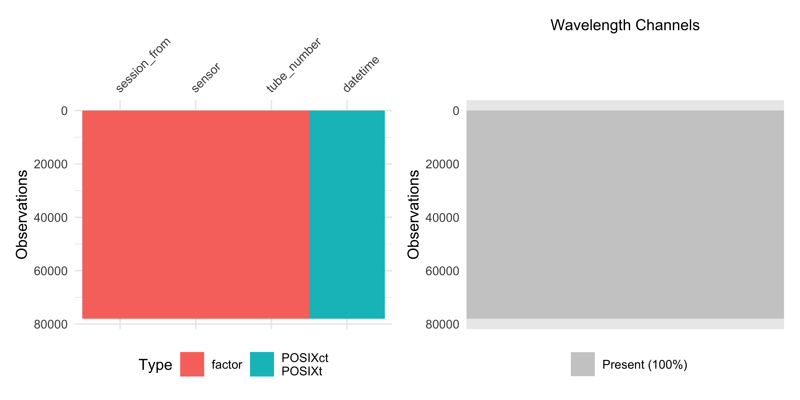
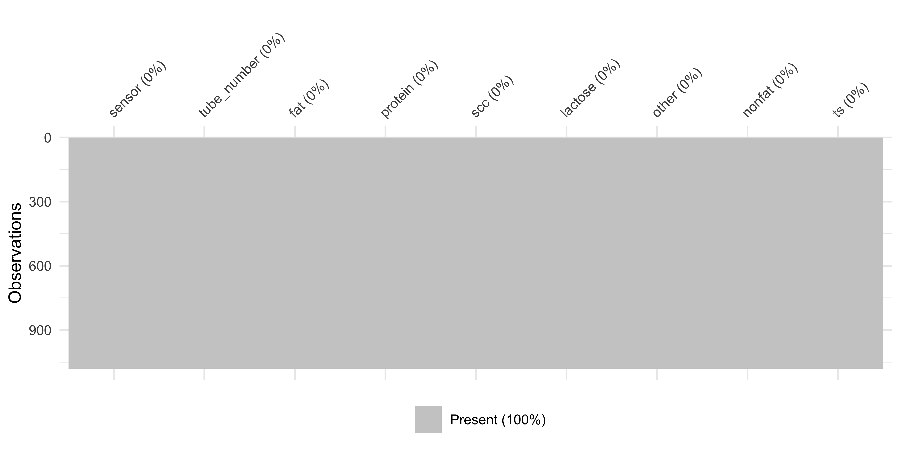
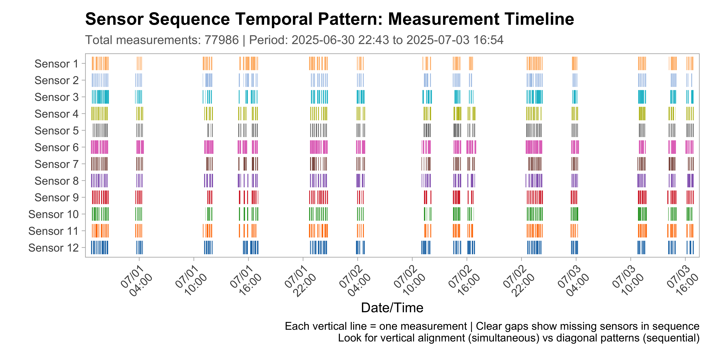
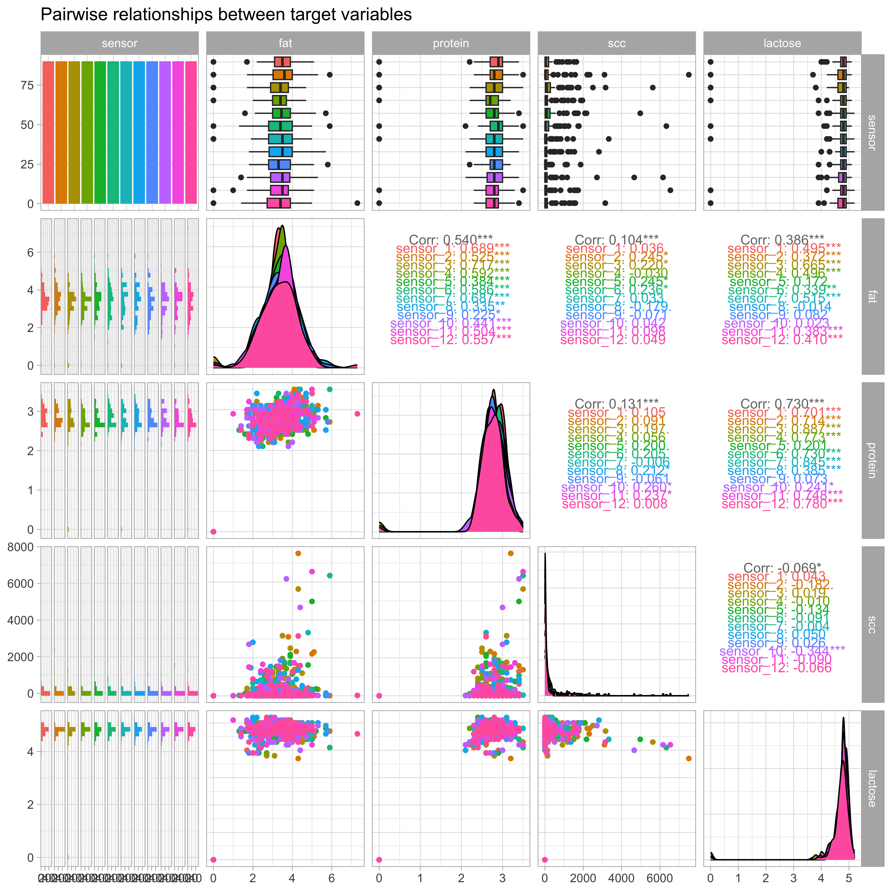
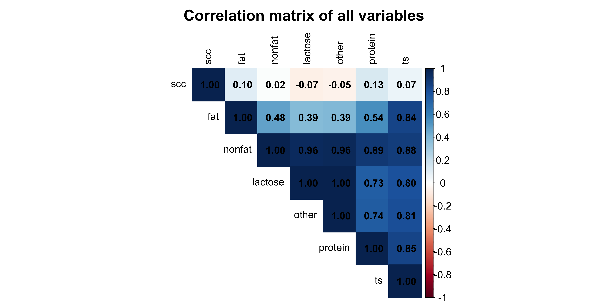
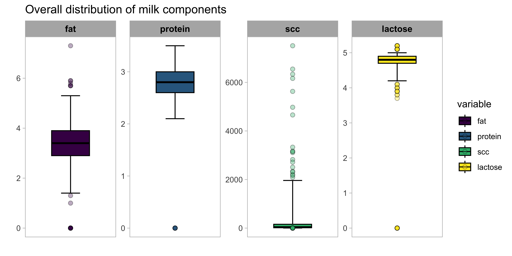
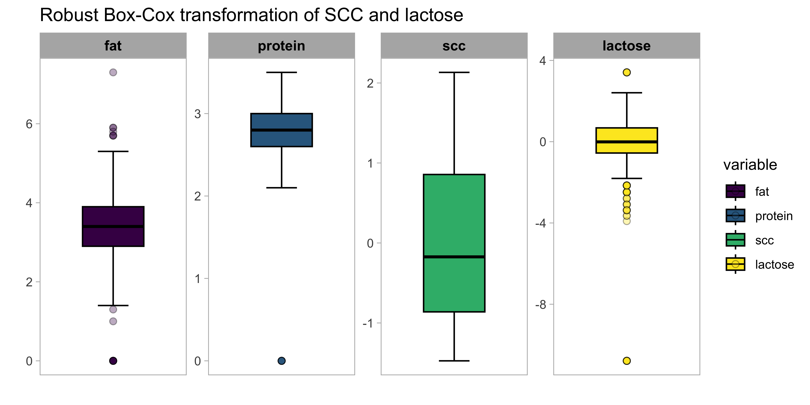
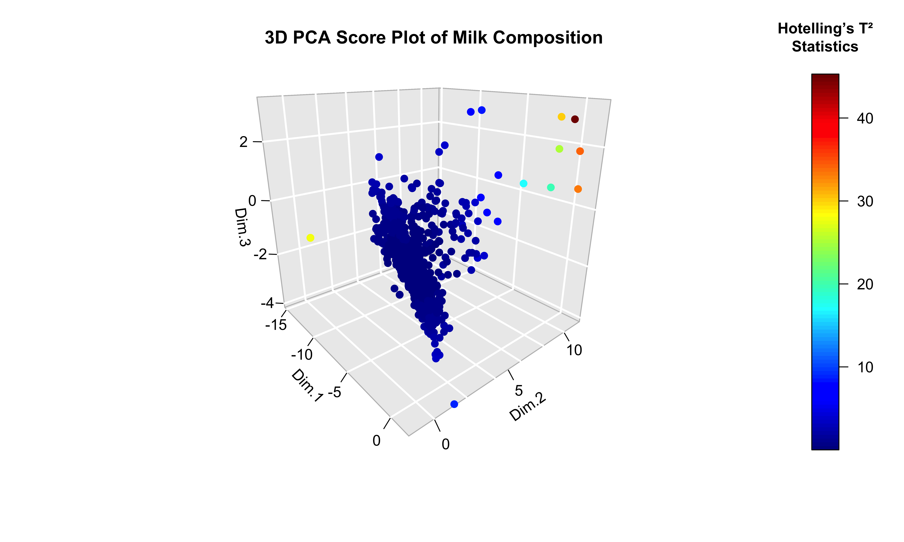
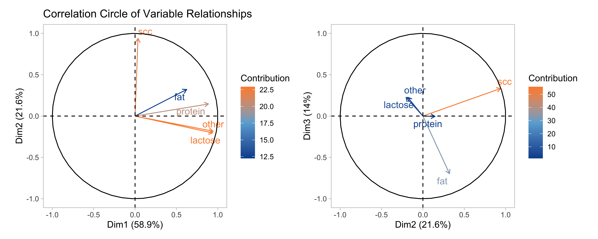
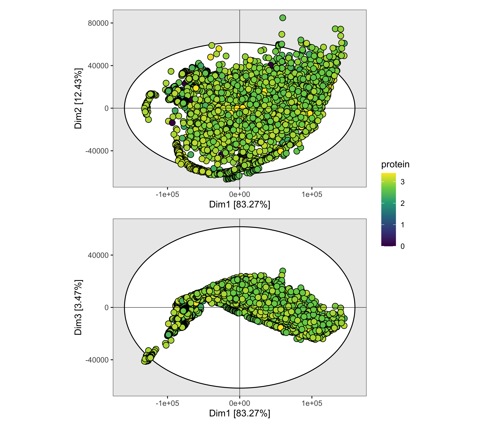

- [Milk Quality Spectroscopy](#milk-quality-spectroscopy)
- [Dataset](#dataset)
  - [Key data components](#key-data-components)
  - [Important limitations](#important-limitations)
  - [Data evolution](#data-evolution)
- [Data processing](#data-processing)
  - [Data loading](#data-loading)
  - [Sensor wavelengths](#sensor-wavelengths)
  - [Sensor data](#sensor-data)
  - [Laboratory data](#laboratory-data)
  - [Cleaned data](#cleaned-data)
  - [Observations by Sensor](#observations-by-sensor)
  - [Measurement timeline](#measurement-timeline)
- [Exploratory Data Analysis](#exploratory-data-analysis)
  - [Descriptive statistics for milk quality target
    variables](#descriptive-statistics-for-milk-quality-target-variables)
  - [PCA analysis](#pca-analysis)
    - [Milk quality target_var](#milk-quality-target_var)
    - [NIRS spectra](#nirs-spectra)
- [Modeling](#modeling)
  - [Data splits and preprocessing](#data-splits-and-preprocessing)
  - [Models tuning and evaluation](#models-tuning-and-evaluation)
  - [Model performance comparison](#model-performance-comparison)
  - [Prediction plots](#prediction-plots)
  - [Feature Importance](#feature-importance)

<!-- README.md is generated from README.Rmd. Please edit that file -->

# Milk Quality Spectroscopy

<!-- badges: start -->

<!-- badges: end -->

``` r
suppressPackageStartupMessages({
  library(tidyverse)
  library(magrittr)
  library(reticulate)
  library(viridis)
  library(arrow)
  library(tidymodels)
  library(future)
  library(corrplot)
  library(vip)
  library(patchwork)
  library(yardstick)
  library(skimr)
  library(GGally)
  library(FactoMineR)
  library(factoextra)
  library(gridExtra)
  library(RColorBrewer)
  library(knitr)
  library(janitor)
  library(ggforce)
  library(ranger)
  library(glmnet)
  library(xgboost)
  library(mixOmics)
})
```

``` r
tidymodels_prefer()
theme_set(theme_light(base_size = 12))
```

# Dataset

The data is structured by sensor/stall with each sensor directory
containing:

- **Lab results** (CSV format with tube_no as primary key)
- **Sensor configuration** (wavelengths, calibration coefficients)
- **Spectral measurements** (Parquet files, one per milk sample)
- **Dark spectra** (reference measurements)

## Key data components

**Lab Results**: Milk analysis including fat percentage, protein,
somatic cell count and, lactose linked to specific cows and milking
sessions.

**Spectral Data**: Raw 16-bit spectral arrays captured during milking,
with miscellaneous_vardata like temperature, LED current, and
integration time. Each spectrum is classified as “dark,” “sample,” or
“empty.”

**Sensor Info**: Each sensor has unique wavelength calibrations and
measurement parameters that aren’t standardized across sensors.

## Important limitations

- Temperature and LED measurements are raw ADC values, not standardized
  between sensors
- Each sensor measures different wavelengths
- Some timing discrepancies remain due to clock source differences

## Data evolution

The dataset has evolved from initial CSV format to Parquet compression,
with spectral data consolidated into array columns rather than
individual wavelength columns for more efficient storage and processing.

# Data processing

``` r
set.seed(123)
```

## Data loading

``` r
dataset_path <- "Dataset/"
functions_path <- "~/Documents/GitHub/milk-quality-spectroscopy/R/"
```

``` r
source(paste0(functions_path, "read_sensor_csvs.R"))
source(paste0(functions_path, "read_sensor_parquets.R"))
source(paste0(functions_path, "subtract_dark_spectrum.R"))
source(paste0(functions_path, "process_nir_data.R"))
```

``` r
nir_data <- process_nir_data(verbose = FALSE)
#> Beginning NIR data processing for 12 sensor(s)
#> Processing CSV files...
#> Processing parquet files...
#> Performing baseline correction...
#> 
#> Data processing complete!
```

## Sensor wavelengths

``` r
sensor_wavelengths_list <- nir_data$sensor_data %>%
  select(sensor, wavelengths_nm) %>%
  mutate(
    wavelength_chars = 
      str_remove_all(wavelengths_nm, "\\[|\\]") %>%
      str_split(",\\s*")
    ) %>%
  select(sensor, wavelength_chars) %>%
  deframe()
```

``` r
wavelengths_summary <- sensor_wavelengths_list %>%
  map_dfr(~ {
    wl <- as.numeric(.x)
    steps <- abs(diff(wl))
    tibble(
      min = min(wl),
      max = max(wl),
      range = max(wl) - min(wl),
      mean_step = mean(steps),
      min_step = min(steps),
      max_step = max(steps),
      total = length(wl)
    )
  }, .id = "sensor")
```

``` r
wavelengths_summary
#> # A tibble: 12 × 8
#>    sensor      min   max range mean_step min_step max_step total
#>    <chr>     <dbl> <dbl> <dbl>     <dbl>    <dbl>    <dbl> <int>
#>  1 sensor_1   452. 1102.  651.      2.55     1.95     3.22   256
#>  2 sensor_2   453. 1105.  651.      2.55     1.94     3.24   256
#>  3 sensor_3   455. 1102.  647.      2.54     1.93     3.21   256
#>  4 sensor_4   457. 1105.  648.      2.54     1.94     3.20   256
#>  5 sensor_5   458. 1107.  650.      2.55     1.95     3.20   256
#>  6 sensor_6   458. 1108.  651.      2.55     1.94     3.21   256
#>  7 sensor_7   453. 1104.  651.      2.55     1.95     3.23   256
#>  8 sensor_8   452. 1102.  650.      2.55     1.95     3.21   256
#>  9 sensor_9   453. 1104.  651.      2.55     1.95     3.23   256
#> 10 sensor_10  453. 1105.  651.      2.55     1.94     3.22   256
#> 11 sensor_11  458. 1109.  650.      2.55     1.95     3.22   256
#> 12 sensor_12  458. 1102.  643.      2.52     1.91     3.19   256
```

``` r
wavelength_tbl <- sensor_wavelengths_list %>%
  map(as.numeric) %>%
  map_dfr(~ tibble(wavelength = .x), .id = "sensor") %>%
  group_by(sensor) %>%
  mutate(channel = row_number()) %>%
  ungroup() %>%
  mutate(sensor_num = as.integer(str_extract(sensor, "\\d+")))

median_by_channel <- wavelength_tbl %>%
  group_by(channel) %>%
  summarise(
    channel_median = median(wavelength, na.rm = TRUE),
    .groups = "drop"
  )
```

``` r
wavelength_tbl %>%
  left_join(median_by_channel, by = "channel") %>%
  mutate(deviation_from_median = abs(wavelength - channel_median)) %>%
  ggplot() +
  aes(
    x = channel, 
    y = factor(sensor_num, levels = 1:12), 
    fill = deviation_from_median
    ) +
  geom_tile(color = "white", linewidth = 0.1) +
  scale_fill_viridis_c(
    name = "Deviation\n(nm)",
    option = "plasma",
    trans = "sqrt"
  ) +
  scale_x_continuous(
    breaks = seq(0, 256, by = 32),
    expand = c(0, 0)
  ) +
  scale_y_discrete(
    labels = paste("Sensor", 12:1)
  ) +
  labs(
    title = "Wavelength Deviation",
    subtitle = "Each cell shows absolute deviation from the median wavelength at that channel",
    x = "Wavelength Channel (1-256)",
    y = ""
  ) +
  theme_minimal() +
  theme(
    panel.grid = element_blank(),
    plot.title = element_text(size = 14, face = "bold"),
    plot.subtitle = element_text(size = 10, color = "gray40"),
    axis.text.x = element_text(size = 9),
    axis.text.y = element_text(size = 9),
    legend.position = "right"
  )
```


## Sensor data

``` r
spec_data <- nir_data$corrected_spectra %>%
  filter(spec_type == "SAMPLE") %>%
  select(datetime, tube_number, sensor, spec_array) %>%
  modify_at("tube_number", as_factor) %>%
  modify_at("sensor", as_factor) %>%
  mutate(
    spec_valid = case_when(
      map_lgl(spec_array, is.null) ~ FALSE,
      map_int(spec_array, length) == 0 ~ FALSE,
      map_lgl(spec_array, ~ all(is.na(.x))) ~ FALSE,
      TRUE ~ TRUE
    )
  ) %>%
  filter(spec_valid) %>%
  rowwise() %>%
  mutate(
    df = list({
      tryCatch(
        {
          values <- as.numeric(unlist(spec_array))
          valid_values <- values[!is.na(values)]
          if (length(valid_values) > 0) {
            setNames(valid_values, paste0("X", seq_along(valid_values)))
          } else {
            NULL
          }
        },
        error = function(e) {
          NULL
        }
      )
    })
  ) %>%
  ungroup() %>%
  filter(!map_lgl(df, is.null)) %>%
  select(-spec_array, -spec_valid) %>%
  unnest_wider(df) %>%
  relocate(sensor, .before = tube_number)
```

``` r
spec_data %>%
  select(starts_with("X")) %>%
  visdat::vis_miss(warn_large_data = FALSE, large_data_size = 1e6) +
  labs(x = "Wavelenght (nm)") +
  theme(
    axis.ticks.x = element_blank(), 
    axis.text.x = element_blank()
    )
```


## Laboratory data

``` r
lab_data <- nir_data$lab_results %>%
  select(
    sensor,
    tube_number,
    fat_percent,
    protein_percent,
    scc_thous_per_ml,
    lactose_percent,
    other_solids_percent,
    solids_not_fat_percent,
    total_solids_percent
  ) %>%
  modify_at("tube_number", as_factor) %>%
  modify_at("sensor", as_factor) %>%
  rename(
    fat = fat_percent,
    protein = protein_percent,
    scc = scc_thous_per_ml,
    lactose = lactose_percent,
    other = other_solids_percent,
    nonfat = solids_not_fat_percent,
    ts = total_solids_percent
  )
```

``` r
lab_data %>% visdat::vis_dat()
```



``` r
lab_data %>% visdat::vis_miss()
```



``` r
target_var <- lab_data %>% select(fat, protein, scc, lactose) %>% names()
miscellaneous_var <- lab_data %>% select(-sensor, -tube_number, -all_of(target_var)) %>% names()
```

## Cleaned data

``` r
modeling_data <- spec_data %>%
  left_join(lab_data, by = c("sensor", "tube_number")) %>%
  filter(if_all(starts_with("X_"), ~ !is.na(.x))) %>%
  relocate(sensor, .before = tube_number) %>%
  relocate(all_of(target_var), .after = tube_number) %>%
  relocate(all_of(miscellaneous_var), .after = all_of(target_var))
```

``` r
cat("Final dataset dimensions:", nrow(modeling_data), "x", ncol(modeling_data), "\n")
#> Final dataset dimensions: 77986 x 266
cat("Number of wavelenghts:", sum(grepl("^X", names(modeling_data))), "\n")
#> Number of wavelenghts: 256
```

## Observations by Sensor

``` r
sensor_summary <- modeling_data %>%
  select(sensor, tube_number, starts_with("X")) %>%
  group_by(sensor, tube_number) %>%
  summarise(
    observations = n(),
    variables = ncol(.) - 2,
    total_cells = n() * ncol(.),
    .groups = "drop"
  ) %>%
  arrange(sensor)
```

``` r
sensor_summary
#> # A tibble: 1,023 × 5
#>    sensor   tube_number observations variables total_cells
#>    <fct>    <fct>              <int>     <dbl>       <int>
#>  1 sensor_1 1                     69       256       17802
#>  2 sensor_1 1009                  87       256       22446
#>  3 sensor_1 1021                  33       256        8514
#>  4 sensor_1 1033                  33       256        8514
#>  5 sensor_1 1045                 194       256       50052
#>  6 sensor_1 1057                 194       256       50052
#>  7 sensor_1 1069                  69       256       17802
#>  8 sensor_1 109                  147       256       37926
#>  9 sensor_1 121                   25       256        6450
#> 10 sensor_1 13                    48       256       12384
#> # ℹ 1,013 more rows
```

``` r
sensor_summary %>%
  group_by(sensor) %>%
  summarise(total_obs = sum(observations), .groups = "drop") %>%
  mutate(sensor_num = as.numeric(str_extract(sensor, "\\d+"))) %>%
  arrange(sensor_num) %>%
  ggplot(aes(x = reorder(sensor, sensor_num), y = total_obs, fill = sensor)) +
  geom_col(alpha = 0.8) +
  geom_text(
    aes(label = scales::comma(total_obs)),
    vjust = -0.3,
    size = 3.5,
    fontface = "bold"
  ) +
  scale_fill_manual(values = colorRampPalette(brewer.pal(9, "Blues"))(12)) +
  scale_x_discrete(
    limits = paste0("sensor_", 1:12),
    labels = paste("Sensor", 1:12)
  ) +
  scale_y_continuous(labels = scales::comma) +
  labs(
    title = "Total Observations by Sensor",
    subtitle = "Comparison across all 12 sensors",
    x = "",
    y = "Total Observations"
  ) +
  theme_grey() +
  theme(
    legend.position = "none",
    panel.grid = element_blank(),
    axis.text.x = element_text(angle = 45, hjust = 1),
    plot.title = element_text(face = "bold", size = 14),
    panel.grid.minor = element_blank()
  )
```


``` r
sensor_summary %>%
  mutate(sensor_num = as.numeric(str_extract(sensor, "\\d+"))) %>%
  group_by(sensor) %>%
  arrange(tube_number) %>%
  mutate(
    tube_position = row_number(),
    max_tubes = max(tube_position)
  ) %>%
  ungroup() %>%
  ggplot(
    aes(
      x = tube_position, 
      y = reorder(sensor, -sensor_num), 
      fill = observations
      )
    ) +
  geom_tile(color = "white", size = 0.3) +
  scale_fill_gradient2(
    low = "lightblue", mid = "yellow", high = "red",
    midpoint = median(sensor_summary$observations),
    name = "Observations"
  ) +
  scale_y_discrete(
    limits = paste0("sensor_", 12:1),
    labels = paste("Sensor", 12:1)
  ) +
  labs(
    title = "Observations Heatmap: All Sensors",
    subtitle = "X-axis shows tube position (1st, 2nd, 3rd, etc.) within each sensor",
    x = "Tube Position (ordered within sensor)",
    y = ""
  ) +
  theme_light() +
  theme(
    plot.title = element_text(face = "bold", size = 14),
    panel.grid = element_blank(),
    axis.text.x = element_text(size = 8)
  ) +
  scale_x_continuous(
    breaks = seq(
      1, 
      max(
        sensor_summary %>% 
          group_by(sensor) %>% 
          summarise(n = n()) %>% 
          pull(n)
        ), 
      by = 5
      )
    )
```


## Measurement timeline

``` r
heatmap_data <- nir_data$corrected_spectra %>%
  mutate(datetime = as.POSIXct(datetime)) %>%
  filter(!is.na(datetime)) %>%
  filter(spec_type == "SAMPLE") %>%
  drop_na() %>%
  mutate(
    date_hour = floor_date(datetime, "hour"),
    sensor_num = as.integer(str_extract(sensor, "\\d+"))
  ) %>%
  count(date_hour, sensor_num, name = "n_measurements")

all_sensors <- as.integer(1:12)
hour_range <- seq(
  floor_date(min(heatmap_data$date_hour), "hour"),
  ceiling_date(max(heatmap_data$date_hour), "hour") - hours(1),
  by = "hour"
)

measurement_data <- nir_data$corrected_spectra %>%
  mutate(datetime = as.POSIXct(datetime)) %>%
  filter(!is.na(datetime)) %>%
  filter(spec_type == "SAMPLE") %>%
  drop_na() %>%
  arrange(datetime, sensor)
```

``` r
sequence_plot <- measurement_data %>%
  ggplot(aes(x = datetime, y = factor(sensor), color = factor(sensor))) +
  geom_linerange(
    aes(
      ymin = as.numeric(factor(sensor)) - 0.4,
      ymax = as.numeric(factor(sensor)) + 0.4
    ),
    linewidth = 0.1,
    alpha = 0.8
  ) +
  ggsci::scale_color_d3(palette = "category20") +
  scale_y_discrete(
    limits = paste0("sensor_", 12:1),
    labels = paste("Sensor", 12:1)
  ) +
  scale_x_datetime(
    date_labels = "%m/%d\n%H:%M",
    date_breaks = "6 hours",
    minor_breaks = "1 hour",
    expand = c(0.01, 0)
  ) +
  labs(
    title = "Sensor Sequence Temporal Pattern: Measurement Timeline",
    subtitle = sprintf(
      "Total measurements: %d | Period: %s to %s",
      nrow(measurement_data),
      format(min(measurement_data$datetime), "%Y-%m-%d %H:%M"),
      format(max(measurement_data$datetime), "%Y-%m-%d %H:%M")
    ),
    x = "Date/Time",
    y = "",
    caption = "Each vertical line = one measurement | Clear gaps show missing sensors in sequence\nLook for vertical alignment (simultaneous) vs diagonal patterns (sequential)"
  ) +
  theme_light() +
  theme(
    legend.position = "none",
    panel.grid = element_blank(),
    plot.title = element_text(size = 14, face = "bold"),
    plot.subtitle = element_text(size = 10, color = "gray40"),
    axis.text.x = element_text(angle = 45, hjust = 1, size = 9),
    axis.text.y = element_text(size = 9),
    panel.background = element_rect(fill = "white"),
    plot.background = element_rect(fill = "white"),
    plot.margin = margin(10, 10, 10, 10)
  )
```

``` r
sequence_plot
```



# Exploratory Data Analysis

## Descriptive statistics for milk quality target variables

``` r
lab_data %>% 
  select(all_of(target_var)) %>%
  specProc::summaryStats(robust = TRUE)
#> # A tibble: 4 × 14
#>   variable median   mad    Qn    Sn medcouple   LMC   RMC    rsd biloc biscale
#>   <chr>     <dbl> <dbl> <dbl> <dbl>     <dbl> <dbl> <dbl>  <dbl> <dbl>   <dbl>
#> 1 fat         3.4  0.74  0.66  0.72      0     0.23  0.33  1.10   3.41    0.8 
#> 2 lactose     4.8  0.15  0.22  0.12     -0.2   0     0     0.222  4.79    0.18
#> 3 protein     2.8  0.3   0.22  0.24      0     0.33 -0.33  0.445  2.81    0.25
#> 4 scc        37   46.0  44.2  42.9       0.72 -0.11  0.57 68.1   42.4    68.7 
#> # ℹ 3 more variables: bivar <dbl>, rcv <dbl>, count <int>
```

``` r
cor_matrix <- lab_data %>%
  select(-sensor, -tube_number) %>%
  cor(use = "complete.obs")

corrplot(
  cor_matrix,
  method = "color",
  type = "upper",
  order = "hclust",
  tl.cex = 0.8,
  tl.col = "black",
  addCoef.col = "black",
  number.cex = 0.8,
  title = "Correlation matrix of all variables",
  mar = c(0, 0, 2, 0)
)
```


``` r
lab_data %>%
  select(-tube_number) %>%
    ggpairs(
      columns = 1:5,
      ggplot2::aes(colour = sensor),
      title = "Pairwise relationships between target variables"
    )
```


``` r
p <- lab_data %>% 
  select(all_of(target_var)) %>%
  specProc::adjusted_boxplot()

p + facet_wrap(~ variable, scales = "free", ncol = 4) +
  scale_fill_viridis_d(option = "viridis") +
  labs(title = "Overall distribution of milk components") +
  theme_light() +
  theme(
    panel.grid = element_blank(),
    strip.text = element_text(size = 10, color = "black", face = "bold"),
    axis.ticks.x = element_blank(),
    axis.text.x = element_blank()
    )
```



Counting the number of zero values across all target variables:

``` r
lab_data %>%
  select(all_of(target_var)) %>%
  summarise(across(everything(), ~ sum(.x == 0, na.rm = TRUE)))
#> # A tibble: 1 × 4
#>     fat protein   scc lactose
#>   <int>   <int> <int>   <int>
#> 1    11      11    39      11
```

``` r
zero_pct <- lab_data %>%
  select(all_of(target_var)) %>%
  summarise(across(everything(), ~ mean(.x == 0, na.rm = TRUE))) %>%
  summarise(overall_zero_pct = mean(c_across(everything())))

nonzero_pct <- 1 - zero_pct$overall_zero_pct
```

``` r
lab_data %>%
  select(all_of(target_var)) %>%
  mutate(across(everything(), ~ ifelse(.x == 0, NA, .x))) %>%
  naniar::vis_miss() +
  scale_fill_manual(
    values = c("lightblue", "darkred"),
    labels = c(
      paste0("nonzeros (", round(nonzero_pct * 100, 1), "%)"),
      paste0("zeros (", round(zero_pct$overall_zero_pct * 100, 1), "%)")
    ),
    name = ""
  )
```


These zero values probably represent missing or invalid data rather than
true biological zeros, and might be better handled through imputation or
exclusion rather than including them in the modeling.

``` r
lab_data %>% 
  select(all_of(target_var)) %>%
  # filter(if_all(everything(), ~ .x > 0)) %>% 
  specProc::outlierplot(show.mahal = TRUE) +
  theme(strip.text = element_text(size = 10, color = "black", face = "bold"))
```



The color gradient shows the Mahalanobis distance, while the triangular
shape indicates multivariate outliers, i.e. samples that are unusual
when considering all target_var together. Most variables show tight
clustering. Fat, lactose, other_solids, and protein all show the
majority of data points clustered tightly around zero with relatively
few outliers. SCC shows much more variability, showing a broader spread
of Mahalanobis distances.

The yellow triangles in the fat, lactose, other_solids, and protein
panels, represent extreme outliers with very high Mahalanobis distances.
They have unusually low fat, lactose, other solids, and protein content
compared to the normal population. Moreover, the fact that fat, protein,
and lactose all have exactly 11 zeros suggests these might be the same
samples with missing or problematic measurements. The 11 samples with
zeros across multiple variables would definitely appear as extreme
multivariate outliers (explaining some of those yellow triangular points
at very negative values).

SCC has a highly skewed distribution based on its box plot. This extreme
right skew in SCC explains why it showed such different patterns in the
outlier detection plot. The other variables (fat, protein, lactose) show
more symmetric, normal-like distributions in their box plots, which is
why their outliers in the Mahalanobis plot were primarily samples with
unusually low values. For SCC, however, the natural distribution is so
skewed that most “normal” samples cluster near zero. The outliers
detected by the robust Mahalanobis method are likely the samples with
moderately high SCC values that, while not extreme on the raw scale, are
unusual in the context of the multivariate relationship with other milk
components.

``` r
transf_list <- lab_data %>%
  select(all_of(target_var)) %>%
  specProc::robustBCYJ(var = c("scc", "lactose"))
```

``` r
transf_list %>%
  pluck("transformation") %>%
  bind_cols(lab_data %>% select(fat, protein)) %>%
  relocate(c("scc", "lactose"), .after = protein) %>%
  specProc::adjusted_boxplot() +
  facet_wrap(~ variable, scales = "free", ncol = 4) +
  scale_fill_viridis_d(option = "viridis") +
  labs(title = "Robust Box-Cox transformation of SCC and lactose") +
  theme_light() +
  theme(
    panel.grid = element_blank(),
    strip.text = element_text(size = 10, color = "black", face = "bold"),
    axis.ticks.x = element_blank(),
    axis.text.x = element_blank()
    )
```



``` r
transf_list %>%
  pluck("transformation") %>%
  bind_cols(lab_data %>% select(fat, protein)) %>%
  relocate(c("scc", "lactose"), .after = protein) %>%
  specProc::outlierplot(show.outlier = FALSE, show.mahal = TRUE) +
  theme(strip.text = element_text(size = 10, color = "black", face = "bold"))
```


After the Box-Cox transformation, SCC now shows a more symmetric
distribution around zero, rather than the extreme right skew we saw in
the original data. The transformation has successfully normalized the
SCC distribution. The dark points (high Mahalanobis distance outliers)
appear across all panels, suggesting these represent samples with
genuinely unusual multivariate patterns rather than just extreme values
driven by SCC’s original skewed distribution.

## PCA analysis

### Milk quality target_var

A principal component analysis (PCA) was conducted on the four key milk
composition variables. The analysis aimed to understand the underlying
structure of relationships between these variables and assess potential
multicollinearity for subsequent modeling efforts.

``` r
pca_model <- lab_data %>%
  select(all_of(target_var), other) %>%
  PCA(scale.unit = TRUE, graph = FALSE)
```

``` r
eigenvalues <- get_eigenvalue(pca_model)
```

``` r
p1 <- pca_model %>%
  fviz_eig(
    addlabels = TRUE,
    ylim = c(0, 60),
    title = "Scree Plot",
    xlab = "Principal Components",
    ylab = "Percentage of Variance Explained"
  ) +
  theme_light() +
  labs(caption = "Red line indicates 10% variance threshold")

p2 <- eigenvalues %>%
  as.data.frame() %>%
  mutate(component = 1:nrow(.)) %>%
  ggplot(aes(x = component, y = cumulative.variance.percent)) +
  geom_line(size = 1.2, color = "steelblue") +
  geom_point(size = 3, color = "steelblue") +
  scale_x_continuous(breaks = 1:nrow(eigenvalues)) +
  labs(
    title = "Cumulative Variance Explained",
    x = "Principal Components",
    y = "Cumulative Variance (%)",
    caption = "Red line indicates 80% variance threshold"
  ) +
  theme_light()
```

``` r
p1 | p2
```


The PCA extracted two principal components that collectively explained
80.5% of the total variance in the dataset. The first principal
component accounted for 58.9% of the variance, while the second
component explained an additional 21.6%.

``` r
pca_contrib <- function(model, axes, title, fill_color, top = 10) {
  p <- model %>%
    fviz_contrib(
      choice = "var",
      axes = axes,
      top = top,
      title = title,
      fill = fill_color,
      color = fill_color
    ) +
    labs(x = "") +
    theme_light() +
    theme(axis.text.x = element_text(angle = 45, hjust = 1))
  
  return(p)
}
```

``` r
pca_contrib(pca_model, axes = 1, title = "Dim1", fill_color = "steelblue") |
  pca_contrib(pca_model, axes = 2, title = "Dim2", fill_color = "coral") |
  pca_contrib(pca_model, axes = 1:2, title = "Dim1 and Dim2", fill_color = "darkgreen")
```



Dim1 represents a milk composition axis, with relatively balanced
contributions from multiple composition variables. The contribution
analysis reveals that fat percentage (18%), protein percentage (17%),
other solids percentage (16%), lactose percentage (15%), and total
solids percentage (15%) all contribute substantially and approximately
equally to this component. Somatic cell count contributes minimally
(\<2%) to Dim1, indicating it varies independently from the primary milk
composition gradient.

Dim2 is primarily driven by milk production quantity, with milk weight
(mlk_wt_lbs) contributing 35% of the variance in this component. This
represents a milk yield dimension that captures variation in production
volume. Other variables show much lower contributions to Dim2, with fat
percentage contributing approximately 12% and SCC contributing
approximately 10-12%.

``` r
corr_circle <- function(
    model,
    axes = c(1, 2),
    title = "",
    legend.title = "Contribution",
    gradient.cols = c("#08519C", "#6BAED6", "#FD8D3C")
    ) {
  p <- model %>%
    fviz_pca_var(
      axes = axes,
      col.var = "contrib",
      gradient.cols = gradient.cols,
      repel = TRUE,
      title = title,
      legend.title = legend.title,
      col.circle = "black"
    ) +
    xlim(-1.01, 1.01) +
    ylim(-1.01, 1.01) +
    theme_light() +
    theme(panel.grid = element_blank())
  
  return(p)
}
```

``` r
corr_circle(pca_model, title = "Correlation Circle of Variable Relationships") |
  corr_circle(pca_model, axes = c(2, 3))
```


The correlation circle and contribution analysis reveal a
three-dimensional structure in the dataset:

- **Composition Quality Dimension (Dim1):** All major milk composition
  variables (fat, protein, lactose, other solids, total solids) cluster
  together with similar contribution patterns, indicating strong
  positive correlations and suggesting they represent facets of overall
  milk nutritional quality.
- **Production Quantity Dimension (Dim2):** Milk weight operates as the
  primary driver of the second dimension, representing production
  volume.
- **Health-Production Trade-off Dimension (Dim2):** The negative
  correlation between milk weight and somatic cell count along Dim2-axis
  reveals that higher milk production is associated with lower SCC,
  while lower production coincides with higher SCC (potentially
  indicating health issues affecting yield).

``` r
t2 <- pca_model$ind$coord[, 1:3] %>%
  HotellingEllipse::ellipseParam(k = 3) %>%
  pluck("Tsquare")
```

``` r
plot3D::scatter3D(
  x = pca_model$ind$coord[, 1],
  y = pca_model$ind$coord[, 2],
  z = pca_model$ind$coord[, 3],
  theta = 50,
  phi = 20,
  bty = "g",
  pch = 20,
  cex = 1.5,
  ticktype = "detailed",
  colvar = t2$value,
  clim = range(t2$value),
  xlab = "Dim.1",
  ylab = "Dim.2",
  zlab = "Dim.3",
  main = "3D PCA Score Plot",
  clab = "Hotelling’s T²"
)
```


``` r
biplot <- function(model, axes = c(1, 2), col.ind = NULL, legend.title = NULL) {
  p <- model %>%
    fviz_pca_biplot(
      axes = axes,
      geom = "point",
      col.ind = col.ind,
      col.var = "black",
      gradient.cols = c("#00AFBB", "#E7B800", "#FC4E07"),
      col.circle = "white",
      repel = TRUE,
      title = "",
      legend.title = legend.title
    ) +
    theme_light() +
    theme(panel.grid = element_blank())
  
  return(p)
}
```

``` r
(biplot(pca_model, c(1, 2), lab_data$scc, "SCC\n(10³ cells/mL)") |
  biplot(pca_model, c(2, 3), lab_data$scc, "SCC\n(10³ cells/mL)")
) + plot_layout(guides = "collect")
```



``` r
(biplot(pca_model, c(1, 3), lab_data$protein, "Protein\n(wt%)") |
  biplot(pca_model, c(3, 4), lab_data$protein, "Protein\n(wt%)")
) + plot_layout(guides = "collect")
```


``` r
(biplot(pca_model, c(2, 3), lab_data$fat, "Fat\n(wt%)") |
  biplot(pca_model, c(3, 4), lab_data$fat, "Fat\n(wt%)")
) + plot_layout(guides = "collect")
```


``` r
(biplot(pca_model, c(1, 3), lab_data$lactose, "Lactose\n(wt%)") |
  biplot(pca_model, c(2, 4), lab_data$lactose, "Lactose\n(wt%)")
) + plot_layout(guides = "collect")
```



As previously observed, there’s a distinct point that’s completely
isolated from the main data distribution. This observation indicated by
the teal coloring occupies an extreme position in the principal
component space, far removed from all other samples. The positioning of
these observations as extreme outliers in the PCA space provides
compelling evidence that they do not represent genuine biological
variation in milk composition. Since principal components are
constructed as linear combinations of all input variables, samples
containing multiple zero values become mathematically projected to
peripheral regions of the PC subspace, where they exert disproportionate
influence on the overall data structure.

### NIRS spectra

``` r
wavelengths_sorted <- sort(as.numeric(sensor_wavelengths_list$sensor_1))
```

``` r
modeling_data %>%
  filter(sensor == "sensor_1") %>%
  select(tube_number, fat, starts_with("X")) %>%
  slice_sample(n = 30) %>%  # Only take 5 samples
  setNames(c("tube_number", "fat", wavelengths_sorted)) %>%
  pivot_longer(
    cols = !c(fat, tube_number),
    names_to = "Wavelength",
    values_to = "Intensity"
  ) %>%
  mutate(Wavelength = as.numeric(Wavelength)) %>%
  ggplot(aes(x = Wavelength, y = Intensity, group = tube_number, color = fat)) +
  geom_line(alpha = 0.7) +
  scale_color_viridis_c(name = "Fat Content", option = "plasma") +
  labs(
    title = "NIRS Spectra by Fat Content",
    x = "Wavelength (nm)",
    y = "Intensity"
  ) +
  theme_minimal()
```


``` r
pca_mod <- modeling_data %>%
  select(starts_with("X")) %>%
  PCA(scale.unit = FALSE, graph = FALSE)
```

``` r
pca_scores <- pca_mod %>%
  pluck("ind", "coord") %>%
  as_tibble() %>%
  bind_cols(modeling_data %>% select(sensor, all_of(target_var)), .) %>%
  print()
#> # A tibble: 77,986 × 10
#>    sensor     fat protein   scc lactose   Dim.1   Dim.2   Dim.3   Dim.4   Dim.5
#>    <fct>    <dbl>   <dbl> <dbl>   <dbl>   <dbl>   <dbl>   <dbl>   <dbl>   <dbl>
#>  1 sensor_1   4.4     3.1     9     4.5   6270.  11757.  -7212. -12294.  -4469.
#>  2 sensor_1   4.4     3.1     9     4.5  51826.  20914.  -1628.  -6135.  -2047.
#>  3 sensor_1   4.4     3.1     9     4.5 -54743.   -569. -10624. -13590.  -8249.
#>  4 sensor_1   4.4     3.1     9     4.5  32866. -21134. -10024.   2166. -14651.
#>  5 sensor_1   4.4     3.1     9     4.5 -41911.   9382.  -7206. -14435.  -6035.
#>  6 sensor_1   4.4     3.1     9     4.5  22100. -12000.  -9712.  -2660. -11956.
#>  7 sensor_1   4.4     3.1     9     4.5  78763. -18191.  -3211.  12269. -13211.
#>  8 sensor_1   4.4     3.1     9     4.5  -3897.  27223.  -4050. -15185.   4031.
#>  9 sensor_1   4.4     3.1     9     4.5  93088.  -4785.   1604.  11211. -11006.
#> 10 sensor_1   4.4     3.1     9     4.5  -1447.  -7378. -10859.  -8628. -11713.
#> # ℹ 77,976 more rows
```

``` r
ellipse1 <- pca_scores %>%
  select(starts_with("Dim")) %>%
  HotellingEllipse::ellipseCoord(pcx = 1, pcy = 2)
```

``` r
t1 <- round(as.numeric(pca_mod$eig[1,2]), 2)
t2 <- round(as.numeric(pca_mod$eig[2,2]), 2)
t3 <- round(as.numeric(pca_mod$eig[3,2]), 2)
```

``` r
p1 <- ggplot() +
  geom_polygon(data = ellipse1, aes(x, y), color = "black", fill = "white") +
  geom_point(data = pca_scores, aes(x = Dim.1, y = Dim.2, fill = sensor), shape = 21, size = 3, color = "black") +
  scale_fill_viridis_d(option = "viridis") +
  geom_hline(yintercept = 0, linetype = "solid", color = "black", linewidth = .2) +
  geom_vline(xintercept = 0, linetype = "solid", color = "black", linewidth = .2) +
  labs(x = glue::glue("Dim1 [{t1}%]"), y = glue::glue("Dim2 [{t2}%]")) +
  theme_grey() +
  theme(
    legend.position = "none",
    aspect.ratio = .7,
    panel.grid = element_blank(),
    panel.background = element_rect(
    colour = "black",
    linewidth = .3
    )
  )

p2 <- ggplot() +
  geom_polygon(data = ellipse1, aes(x, y), color = "black", fill = "white") +
  geom_point(data = pca_scores, aes(x = Dim.1, y = Dim.3, fill = sensor), shape = 21, size = 3, color = "black") +
  scale_fill_viridis_d(option = "viridis") +
  geom_hline(yintercept = 0, linetype = "solid", color = "black", linewidth = .2) +
  geom_vline(xintercept = 0, linetype = "solid", color = "black", linewidth = .2) +
  labs(
    x = glue::glue("Dim1 [{t1}%]"), 
    y = glue::glue("Dim3 [{t3}%]")
    ) +
  theme_grey() +
   theme(
    aspect.ratio = .7,
    panel.grid = element_blank(),
    panel.background = element_rect(
    colour = "black",
    linewidth = .3
    )
  )
```

``` r
wrap_plots(p1, p2, ncol = 1) + 
  plot_layout(guides = "collect")
```


The sensor differences are primarily captured by Dim3 (5.96% variance),
while Dim1 and Dim2 (which together explain 71.38% + 14.13% = ~85.4% of
the variation) show much more overlap between sensors. This means that
the major sources of variation (Dim1 & Dim2) are likely driven by actual
sample properties (milk composition differences), while the
sensor-to-sensor differences are relegated to a minor component (Dim3).
Consequently, models built on this data should be reasonably robust
across sensors since the main variation is sample-driven.

``` r
pca_sensor1 <- modeling_data %>%
  filter(sensor == "sensor_1") %>%
  select(starts_with("X")) %>%
  PCA(scale.unit = FALSE, graph = FALSE)
```

``` r
scores_sensor1 <- pca_sensor1 %>%
  pluck("ind", "coord") %>%
  as_tibble() %>%
  bind_cols(modeling_data %>% filter(sensor == "sensor_1") %>% select(sensor, all_of(target_var)), .) %>%
  print()
#> # A tibble: 7,264 × 10
#>    sensor     fat protein   scc lactose   Dim.1   Dim.2   Dim.3  Dim.4  Dim.5
#>    <fct>    <dbl>   <dbl> <dbl>   <dbl>   <dbl>   <dbl>   <dbl>  <dbl>  <dbl>
#>  1 sensor_1   4.4     3.1     9     4.5  24667.   8379.  12892.  6982.  1053.
#>  2 sensor_1   4.4     3.1     9     4.5  67287.  28093.   6936.  5904.  1291.
#>  3 sensor_1   4.4     3.1     9     4.5 -32718. -16132.  13892. -1733.  -905.
#>  4 sensor_1   4.4     3.1     9     4.5  56691. -17872.  -7024.   692.   847.
#>  5 sensor_1   4.4     3.1     9     4.5 -22103.  -3277.  15507.  -855. -1395.
#>  6 sensor_1   4.4     3.1     9     4.5  44531. -11538.   -693.  2855.  -267.
#>  7 sensor_1   4.4     3.1     9     4.5 100563.  -3015. -17317. -5616.  1177.
#>  8 sensor_1   4.4     3.1     9     4.5  11716.  22983.  19481.  5757.  3926.
#>  9 sensor_1   4.4     3.1     9     4.5 111928.  13658. -15223. -5585. -1717.
#> 10 sensor_1   4.4     3.1     9     4.5  20715. -12641.   6376.  4632. -2400.
#> # ℹ 7,254 more rows
```

``` r
ellipse1 <- scores_sensor1 %>%
  select(starts_with("Dim")) %>%
  HotellingEllipse::ellipseCoord(pcx = 1, pcy = 2)
```

``` r
t1 <- round(as.numeric(pca_sensor1$eig[1,2]), 2)
t2 <- round(as.numeric(pca_sensor1$eig[2,2]), 2)
t3 <- round(as.numeric(pca_sensor1$eig[3,2]), 2)
```

``` r
p1 <- ggplot() +
  geom_polygon(data = ellipse1, aes(x, y), color = "black", fill = "white") +
  geom_point(data = scores_sensor1, aes(x = Dim.1, y = Dim.2, fill = protein), shape = 21, size = 3, color = "black") +
  scale_fill_viridis_c(option = "viridis") +
  geom_hline(yintercept = 0, linetype = "solid", color = "black", linewidth = .2) +
  geom_vline(xintercept = 0, linetype = "solid", color = "black", linewidth = .2) +
  labs(x = glue::glue("Dim1 [{t1}%]"), y = glue::glue("Dim2 [{t2}%]")) +
  theme_grey() +
  theme(
    legend.position = "none",
    aspect.ratio = .7,
    panel.grid = element_blank(),
    panel.background = element_rect(
    colour = "black",
    linewidth = .3
    )
  )

p2 <- ggplot() +
  geom_polygon(data = ellipse1, aes(x, y), color = "black", fill = "white") +
  geom_point(data = scores_sensor1, aes(x = Dim.1, y = Dim.3, fill = protein), shape = 21, size = 3, color = "black") +
  scale_fill_viridis_c(option = "viridis") +
  geom_hline(yintercept = 0, linetype = "solid", color = "black", linewidth = .2) +
  geom_vline(xintercept = 0, linetype = "solid", color = "black", linewidth = .2) +
  labs(
    x = glue::glue("Dim1 [{t1}%]"), 
    y = glue::glue("Dim3 [{t3}%]")
    ) +
  theme_grey() +
   theme(
    aspect.ratio = .7,
    panel.grid = element_blank(),
    panel.background = element_rect(
    colour = "black",
    linewidth = .3
    )
  )
```

``` r
wrap_plots(p1, p2, ncol = 1) + 
  plot_layout(guides = "collect")
```



# Modeling

## Data splits and preprocessing

``` r
models_workflow <- function(modeling_data, target_variable) {
  cat(sprintf("\n=== Creating workflow for %s ===\n", target_variable))
  
  data_split <- initial_split(
    modeling_data, 
    prop = 0.8, 
    strata = all_of(target_variable)
    )
  
  train_data <- training(data_split)
  test_data <- testing(data_split)
  
  cat("Training set:", nrow(train_data), "samples\n")
  cat("Test set:", nrow(test_data), "samples\n")
  
  cv_folds <- vfold_cv(train_data, v = 5, strata = all_of(target_variable))
  
  recipe_spec <- recipe(
    as.formula(paste(target_variable, "~ .")), 
    data = train_data
    ) %>%
    step_rm(tube_number, sensor) %>%
    step_zv(all_predictors()) %>%
    step_center(all_numeric_predictors())
  
  return(list(
    split = data_split,
    train = train_data,
    test = test_data,
    cv_folds = cv_folds,
    recipe = recipe_spec
  ))
}
```

## Models tuning and evaluation

``` r
models_def <- function() {
  cat("Defining model specifications...\n")
  
  rf_spec <- rand_forest() %>%
    set_args(
      mtry = tune(),
      trees = tune(),
      min_n = tune()
      ) %>%
    set_engine("ranger", importance = "impurity") %>%
    set_mode("regression")
  
  elastic_spec <- linear_reg() %>%
    set_args(
      penalty = tune(),
      mixture = tune()
      ) %>%
    set_engine("glmnet") %>%
    set_mode("regression")
  
  xgb_spec <- boost_tree() %>%
    set_args(
      trees = tune(), 
      tree_depth = tune(), 
      learn_rate = tune(), 
      min_n = tune()
      ) %>%
    set_engine("xgboost") %>%
    set_mode("regression")
  
  spls_spec <- pls() %>%
  set_args(
    predictor_prop = tune(), 
    num_comp = tune()
    ) %>%
  set_engine("mixOmics") %>%
  set_mode("regression")
  
  return(list(
    random_forest = rf_spec,
    elastic_net = elastic_spec,
    xgboost = xgb_spec,
    spls = spls_spec
  ))
}
```

``` r
models_eval <- function(workflow_data, models, target_variable) {
  cat(sprintf("Tuning models for %s...\n", target_variable))
  
  if (Sys.info()["sysname"] == "Darwin") {
    plan(multicore, workers = min(parallel::detectCores() - 2, 8))
    } else {
      plan(multisession, workers = parallel::detectCores() - 1)
      }
  
  results <- list()

  for (model_name in names(models)) {
    cat(sprintf("Processing %s...\n", model_name))

    workflow_spec <- workflow() %>%
      add_recipe(workflow_data$recipe) %>%
      add_model(models[[model_name]])

    if (model_name == "random_forest") {
      tune_grid <- grid_regular(
        mtry(range = c(5, 20)),
        trees(range = c(100, 500)),
        min_n(range = c(5, 20)),
        levels = 3
      )
    } else if (model_name == "elastic_net") {
      tune_grid <- grid_regular(
        penalty(),
        mixture(),
        levels = 5
      )
    } else if (model_name == "xgboost") {
      tune_grid <- grid_regular(
        trees(range = c(100, 500)),
        tree_depth(range = c(3, 10)),
        learn_rate(range = c(0.01, 0.3)),
        min_n(range = c(5, 20)),
        levels = 3
      )
    } else if (model_name == "spls") {
      tune_grid <- grid_regular(
        spectral_features(),
        num_comp(),
        levels = 5
      )
    }

    ctrl_grid <- control_grid(
      verbose = TRUE,
      allow_par = TRUE,
      save_pred = TRUE,
      save_workflow = FALSE,
      parallel_over = "resamples"
    )
    
    tune_results <- workflow_spec %>%
      tune_grid(
        resamples = workflow_data$cv_folds,
        grid = tune_grid,
        metrics = metric_set(rmse, rsq, mae),
        control = ctrl_grid
      )

    best_params <- tune_results %>%
      select_best(metric = "rmse")

    final_workflow <- workflow_spec %>%
      finalize_workflow(best_params)

    final_fit <- final_workflow %>%
      fit(workflow_data$train)

    test_predictions <- final_fit %>%
      predict(workflow_data$test) %>%
      bind_cols(workflow_data$test %>% select(all_of(target_variable)))

    test_metrics <- test_predictions %>%
      metrics(truth = !!sym(target_variable), estimate = .pred)

    results[[model_name]] <- list(
      tune_results = tune_results,
      best_params = best_params,
      final_fit = final_fit,
      test_predictions = test_predictions,
      test_metrics = test_metrics
    )
  }
  return(results)
}
```

## Model performance comparison

``` r
models_performance <- function(model_results, target_variable) {
  cat(sprintf("\n=== Model Performance Comparison for %s ===\n", target_variable))
  
  performance_summary <- map_dfr(model_results, ~ {
    .x$test_metrics %>%
      filter(.metric %in% c("rmse", "rsq", "mae")) %>%
      select(.metric, .estimate)
  }, .id = "model")

  performance_table <- performance_summary %>%
    pivot_wider(names_from = .metric, values_from = .estimate) %>%
    arrange(rmse)
  
  print(performance_table)
  
  p1 <- performance_summary %>%
    filter(.metric == "rmse") %>%
    ggplot(aes(x = reorder(model, .estimate), y = .estimate, fill = model)) +
    geom_col() +
    coord_flip() +
    labs(
      title = paste("RMSE Comparison -", target_variable),
      x = "Model",
      y = "RMSE",
      fill = "Model"
    ) +
    theme_light() +
    theme(legend.position = "none")
  
  p2 <- performance_summary %>%
    filter(.metric == "rsq") %>%
    ggplot(aes(x = reorder(model, -.estimate), y = .estimate, fill = model)) +
    geom_col() +
    coord_flip() +
    labs(
      title = paste("R² Comparison -", target_variable),
      x = "Model",
      y = "R²",
      fill = "Model"
    ) +
    theme_light() +
    theme(legend.position = "none")
  
  print(p1 / p2)
  return(performance_table)
}
```

## Prediction plots

``` r
prediction_plots <- function(model_results, target_variable) {
  plots <- map(names(model_results), ~ {
    predictions <- model_results[[.x]]$test_predictions
    
    predictions %>%
      ggplot(aes(x = !!sym(target_variable), y = .pred)) +
      geom_point(alpha = 0.6) +
      geom_abline(intercept = 0, slope = 1, color = "red", linetype = "dashed") +
      labs(
        title = paste(.x, "-", target_variable),
        x = paste("Actual", target_variable),
        y = paste("Predicted", target_variable)
      ) +
      theme_light()
  })
  
  names(plots) <- names(model_results)
  combined_plot <- wrap_plots(plots, ncol = 2)
  
  print(combined_plot)
  return(plots)
}
```

## Feature Importance

``` r
feature_importance <- function(model_results, target_variable, top_n = 15) {
  cat(sprintf("\nExtracting feature importance for %s...\n", target_variable))
  
  importance_plots <- list()
  
  for (model_name in names(model_results)) {
    tryCatch({
      if (model_name %in% c("random_forest", "xgboost")) {
        importance_plot <- model_results[[model_name]]$final_fit %>%
          extract_fit_parsnip() %>%
          vip(num_features = top_n) +
          labs(title = paste("Feature Importance -", model_name, "-", target_variable)) +
          theme_minimal()
        importance_plots[[model_name]] <- importance_plot
      }
    }, error = function(e) {
      cat(sprintf("Could not extract importance for %s: %s\n", model_name, e$message))
    })
  }
  
  if (length(importance_plots) > 0) {
    combined_importance <- wrap_plots(importance_plots, ncol = 2)
    print(combined_importance)
  }
  
  return(importance_plots)
}
```

``` r
run_milk_quality_prediction <- function(
    data, 
    target_var = c("fat_percent", "protein_percent", "scc_thous_per_ml", "lactose_percent")
    ) {
  
  cat("=== NIRS Milk Quality Prediction Analysis ===\n")
  
  models <- models_def()
  all_results <- list()
  all_performance <- list()
  
  for (target in target_var) {
    cat(sprintf("\n\n### PROCESSING TARGET: %s ###\n", target))
    
    workflow_data <- models_workflow(modeling_data, target)
    model_results <- models_eval(workflow_data, models, target)
    performance <- models_performance(model_results, target)
    pred_plots <- prediction_plots(model_results, target)
    importance_plots <- feature_importance(model_results, target)
    
    all_results[[target]] <- model_results
    all_performance[[target]] <- performance
  }
  cat("\n=== Analysis Complete! ===\n")
  cat("Results stored in all_results and all_performance\n")
  
  return(list(
    results = all_results,
    performance = all_performance,
    modeling_data = modeling_data
  ))
}
```
