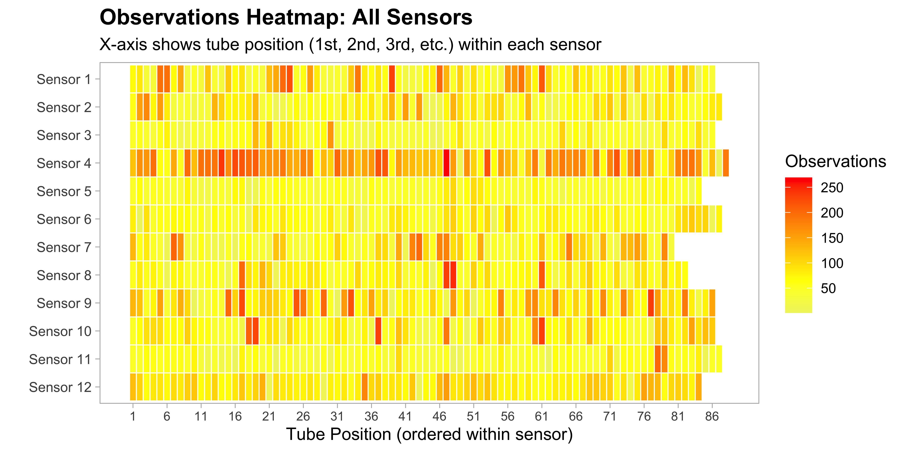

- [Milk Quality Spectroscopy](#milk-quality-spectroscopy)
- [Dataset](#dataset)
  - [Key data components](#key-data-components)
  - [Important limitations](#important-limitations)
  - [Data evolution](#data-evolution)
- [Data processing](#data-processing)
  - [Observations by Sensor](#observations-by-sensor)
  - [Measurement timeline](#measurement-timeline)
  - [Spectra](#spectra)
- [Exploratory Data Analysis](#exploratory-data-analysis)
  - [Descriptive statistics for milk quality target
    variables](#descriptive-statistics-for-milk-quality-target-variables)
  - [PCA analysis of milk quality
    targets](#pca-analysis-of-milk-quality-targets)
- [Modeling](#modeling)
  - [Data splits and preprocessing](#data-splits-and-preprocessing)
  - [Models tuning and evaluation](#models-tuning-and-evaluation)
  - [Model performance comparison](#model-performance-comparison)
  - [Prediction plots](#prediction-plots)
  - [Feature Importance](#feature-importance)

<!-- README.md is generated from README.Rmd. Please edit that file -->

# Milk Quality Spectroscopy

<!-- badges: start -->

<!-- badges: end -->

``` r
suppressPackageStartupMessages({
  library(HotellingEllipse)
  library(ConfidenceEllipse)
  library(tidyverse)
  library(magrittr)
  library(reticulate)
  library(viridis)
  library(arrow)
  library(tidymodels)
  library(future)
  library(corrplot)
  library(vip)
  library(patchwork)
  library(yardstick)
  library(skimr)
  library(GGally)
  library(FactoMineR)
  library(factoextra)
  library(gridExtra)
  library(RColorBrewer)
  library(knitr)
  library(naniar)
  library(janitor)
  library(ggforce)
  library(ranger)
  library(glmnet)
  library(xgboost)
  library(mixOmics)
})
```

``` r
tidymodels_prefer()
theme_set(theme_light(base_size = 12))
```

# Dataset

The data is structured by sensor/stall with each sensor directory
containing:

- **Lab results** (CSV format with tube_no as primary key)
- **Sensor configuration** (wavelengths, calibration coefficients)
- **Spectral measurements** (Parquet files, one per milk sample)
- **Dark spectra** (reference measurements)

## Key data components

**Lab Results**: Milk analysis including fat percentage, protein,
somatic cell count and, lactose linked to specific cows and milking
sessions.

**Spectral Data**: Raw 16-bit spectral arrays captured during milking,
with metadata like temperature, LED current, and integration time. Each
spectrum is classified as “dark,” “sample,” or “empty.”

**Sensor Info**: Each sensor has unique wavelength calibrations and
measurement parameters that aren’t standardized across sensors.

## Important limitations

- Temperature and LED measurements are raw ADC values, not standardized
  between sensors
- Each sensor measures different wavelengths
- Some timing discrepancies remain due to clock source differences

## Data evolution

The dataset has evolved from initial CSV format to Parquet compression,
with spectral data consolidated into array columns rather than
individual wavelength columns for more efficient storage and processing.

# Data processing

``` r
set.seed(123)
```

``` r
dataset_path <- "Dataset/"
functions_path <- "~/Documents/GitHub/milk-quality-spectroscopy/R/"
```

``` r
source(paste0(functions_path, "read_sensor_csvs.R"))
source(paste0(functions_path, "read_sensor_parquets.R"))
source(paste0(functions_path, "subtract_dark_spectrum.R"))
source(paste0(functions_path, "process_nir_data.R"))
```

``` r
nir_data <- process_nir_data(verbose = FALSE)
#> Beginning NIR data processing for 12 sensor(s)
#> Processing CSV files...
#> Processing parquet files...
#> Performing baseline correction...
#> .
#> .
#> .
#> .
#> .
#> .
#> .
#> .
#> .
#> .
#> .
#> .
#> 
#> Data processing complete!
```

``` r
sensor_wavelengths_list <- nir_data$sensor_data %>%
  select(sensor, wavelengths_nm) %>%
  mutate(
    wavelength_chars = 
      str_remove_all(wavelengths_nm, "\\[|\\]") %>%
      str_split(",\\s*")
    ) %>%
  select(sensor, wavelength_chars) %>%
  deframe()
glimpse(sensor_wavelengths_list)
#> List of 12
#>  $ sensor_1 : chr [1:256] "1102.48400000000000" "1100.53794135426760" "1098.58643980292190" "1096.62951676449700" ...
#>  $ sensor_2 : chr [1:256] "1104.60600000000000" "1102.66384679686280" "1100.71620229780360" "1098.76308899488120" ...
#>  $ sensor_3 : chr [1:256] "1102.49500000000000" "1100.56771816807170" "1098.63488862546700" "1096.69653512396700" ...
#>  $ sensor_4 : chr [1:256] "1104.83000000000000" "1102.89167366047600" "1100.94788909409820" "1098.99866782230830" ...
#>  $ sensor_5 : chr [1:256] "1107.49900000000000" "1105.54832734868140" "1103.59228348050350" "1101.63088936899900" ...
#>  $ sensor_6 : chr [1:256] "1108.29400000000000" "1106.35145327512240" "1104.40326972299730" "1102.44947410192780" ...
#>  $ sensor_7 : chr [1:256] "1104.05400000000000" "1102.10089969738800" "1100.14251262580890" "1098.17885937473240" ...
#>  $ sensor_8 : chr [1:256] "1101.92000000000000" "1099.96655459786960" "1098.00787087855250" "1096.04396742775100" ...
#>  $ sensor_9 : chr [1:256] "1104.15900000000000" "1102.21117815077630" "1100.25777023946000" "1098.29880252539530" ...
#>  $ sensor_10: chr [1:256] "1104.58800000000000" "1102.64621399433140" "1100.69857594194240" "1098.74511558116340" ...
#>  $ sensor_11: chr [1:256] "1108.57200000000000" "1106.62058414727100" "1104.66367329538120" "1102.70129231749750" ...
#>  $ sensor_12: chr [1:256] "1101.54000000000000" "1099.63013863556880" "1097.71472921430300" "1095.79379358618300" ...
```

``` r
spec_data <- nir_data$corrected_spectra %>%
  filter(spec_type == "SAMPLE") %>%
  select(tube_number, sensor, spec_array) %>%
  modify_at("tube_number", as_factor) %>%
  modify_at("sensor", as_factor) %>%
  mutate(
    spec_valid = case_when(
      map_lgl(spec_array, is.null) ~ FALSE,
      map_int(spec_array, length) == 0 ~ FALSE,
      map_lgl(spec_array, ~ all(is.na(.x))) ~ FALSE,
      TRUE ~ TRUE
    )
  ) %>%
  filter(spec_valid) %>%
  rowwise() %>%
  mutate(
    df = list({
      tryCatch(
        {
          values <- as.numeric(unlist(spec_array))
          valid_values <- values[!is.na(values)]
          if (length(valid_values) > 0) {
            setNames(valid_values, paste0("X", seq_along(valid_values)))
          } else {
            NULL
          }
        },
        error = function(e) {
          NULL
        }
      )
    })
  ) %>%
  ungroup() %>%
  filter(!map_lgl(df, is.null)) %>%
  select(-spec_array, -spec_valid) %>%
  unnest_wider(df) %>%
  relocate(sensor, .before = tube_number)
print(spec_data)
#> # A tibble: 77,986 × 258
#>    sensor   tube_number    X1    X2    X3    X4    X5    X6    X7    X8    X9
#>    <fct>    <fct>       <dbl> <dbl> <dbl> <dbl> <dbl> <dbl> <dbl> <dbl> <dbl>
#>  1 sensor_1 1            7877  7852  7910  7681  8013  8038  7750  7715  7928
#>  2 sensor_1 1            8050  7832  7825  8153  8085  8033  8050  7890  7934
#>  3 sensor_1 1            7730  7872  7788  7815  7922  7719  7944  7780  7683
#>  4 sensor_1 1            7856  7725  7738  7816  7868  7890  7924  7865  7802
#>  5 sensor_1 1            7941  7867  7858  7928  7727  7996  7807  7977  7952
#>  6 sensor_1 1            8010  7768  7749  7908  7904  8011  8028  7826  7852
#>  7 sensor_1 1            7754  7796  7903  7888  7893  7852  7798  7821  7896
#>  8 sensor_1 1            8306  8270  8244  8212  7897  8261  8327  8334  8404
#>  9 sensor_1 1            7792  7796  7888  7934  7918  7722  7866  7862  7914
#> 10 sensor_1 1            7814  7811  7838  7879  7938  7709  7920  7857  7844
#> # ℹ 77,976 more rows
#> # ℹ 247 more variables: X10 <dbl>, X11 <dbl>, X12 <dbl>, X13 <dbl>, X14 <dbl>,
#> #   X15 <dbl>, X16 <dbl>, X17 <dbl>, X18 <dbl>, X19 <dbl>, X20 <dbl>,
#> #   X21 <dbl>, X22 <dbl>, X23 <dbl>, X24 <dbl>, X25 <dbl>, X26 <dbl>,
#> #   X27 <dbl>, X28 <dbl>, X29 <dbl>, X30 <dbl>, X31 <dbl>, X32 <dbl>,
#> #   X33 <dbl>, X34 <dbl>, X35 <dbl>, X36 <dbl>, X37 <dbl>, X38 <dbl>,
#> #   X39 <dbl>, X40 <dbl>, X41 <dbl>, X42 <dbl>, X43 <dbl>, X44 <dbl>, …
```

``` r
lab_data <- nir_data$lab_results %>%
  select(
    sensor,
    tube_number,
    fat_percent,
    protein_percent,
    scc_thous_per_ml,
    lactose_percent,
    milk_wt_lbs,
    other_solids_percent,
    solids_not_fat_percent,
    total_solids_percent
  ) %>%
  modify_at("tube_number", as_factor) %>%
  modify_at("sensor", as_factor) %>%
  filter(
    !is.na(fat_percent),
    !is.na(protein_percent),
    !is.na(scc_thous_per_ml),
    !is.na(lactose_percent)
  ) %>%
  rename(
    fat = fat_percent,
    protein = protein_percent,
    scc = scc_thous_per_ml,
    lactose = lactose_percent,
    weight = milk_wt_lbs,
    misc_solids = other_solids_percent,
    nonfat_solids = solids_not_fat_percent,
    tot_solids = total_solids_percent
  ) %>%
  print()
#> # A tibble: 1,080 × 10
#>    sensor   tube_number   fat protein   scc lactose weight misc_solids
#>    <fct>    <fct>       <dbl>   <dbl> <dbl>   <dbl>  <dbl>       <dbl>
#>  1 sensor_1 1             4.4     3.1     9     4.5   27.7         5.6
#>  2 sensor_1 13            4       3.4   620     4.8   30.4         5.9
#>  3 sensor_1 25            3.5     2.9   593     5     28.6         6.1
#>  4 sensor_1 37            4.3     3.1    11     4.8   29.8         6  
#>  5 sensor_1 49            2.2     2.5   394     4.7   46.5         5.8
#>  6 sensor_1 61            4.1     3       9     5     34.2         6.1
#>  7 sensor_1 73            3.6     3.1     8     4.9   33           6  
#>  8 sensor_1 85            3.5     3.1   226     4.7   29.7         5.8
#>  9 sensor_1 97            3.1     2.6    13     5     47.8         6.1
#> 10 sensor_1 109           4.7     3.3    12     4.7   28           5.9
#> # ℹ 1,070 more rows
#> # ℹ 2 more variables: nonfat_solids <dbl>, tot_solids <dbl>
```

``` r
targets <- lab_data %>% select(fat, protein, scc, lactose) %>% names()
meta <- lab_data %>% select(-sensor, -tube_number, -all_of(targets)) %>% names()
```

``` r
modeling_data <- spec_data %>%
  left_join(lab_data, by = c("sensor", "tube_number")) %>%
  filter(if_all(starts_with("X_"), ~ !is.na(.x))) %>%
  relocate(sensor, .before = tube_number) %>%
  relocate(all_of(targets), .after = tube_number) %>%
  relocate(all_of(meta), .after = all_of(targets))
```

``` r
cat("Final dataset dimensions:", nrow(modeling_data), "x", ncol(modeling_data), "\n")
#> Final dataset dimensions: 77986 x 266
cat("Number of wavelenghts:", sum(grepl("^X", names(modeling_data))), "\n")
#> Number of wavelenghts: 256
```

``` r
modeling_data %>%
  select(sensor, starts_with("X")) %>%
  group_by(sensor) %>%
  summarise(
    observations = n(),
    variables = ncol(.) - 1,
    total_cells = n() * ncol(.),
    missing_values = sum(is.na(.)),
    completeness = round((1 - sum(is.na(.)) / (n() * ncol(.))) * 100, 1),
    .groups = 'drop'
  ) %>%
  arrange(sensor)
#> # A tibble: 12 × 6
#>    sensor    observations variables total_cells missing_values completeness
#>    <fct>            <int>     <dbl>       <int>          <int>        <dbl>
#>  1 sensor_1          7264       256     1866848              0          100
#>  2 sensor_2          5914       256     1519898              0          100
#>  3 sensor_3          4349       256     1117693              0          100
#>  4 sensor_4         12575       256     3231775              0          100
#>  5 sensor_5          4025       256     1034425              0          100
#>  6 sensor_6          5267       256     1353619              0          100
#>  7 sensor_7          6046       256     1553822              0          100
#>  8 sensor_8          5905       256     1517585              0          100
#>  9 sensor_9          8378       256     2153146              0          100
#> 10 sensor_10         6629       256     1703653              0          100
#> 11 sensor_11         4212       256     1082484              0          100
#> 12 sensor_12         7422       256     1907454              0          100
```

## Observations by Sensor

``` r
sensor_summary <- modeling_data %>%
    select(sensor, tube_number, starts_with("X")) %>%
    group_by(sensor, tube_number) %>%
    summarise(
        observations = n(),
        variables = ncol(.) - 2,
        .groups = 'drop'
    )
```

``` r
sensor_summary %>%
    group_by(sensor) %>%
    summarise(total_obs = sum(observations), .groups = 'drop') %>%
    mutate(sensor_num = as.numeric(str_extract(sensor, "\\d+"))) %>%
    arrange(sensor_num) %>%
    ggplot(aes(x = reorder(sensor, sensor_num), y = total_obs)) +
    geom_col(fill = "steelblue", alpha = 0.8) +
    geom_text(
      aes(label = scales::comma(total_obs)),
      vjust = -0.3, 
      size = 3.5, 
      fontface = "bold"
      ) +
    labs(
        title = "Total Observations by Sensor",
        subtitle = "Comparison across all 12 sensors",
        x = "",
        y = "Total Observations"
    ) +
    theme_minimal() +
    theme(
        axis.text.x = element_text(angle = 45, hjust = 1),
        plot.title = element_text(face = "bold", size = 14),
        panel.grid.minor = element_blank()
    ) +
    scale_y_continuous(labels = scales::comma)
```


``` r
sensor_summary %>%
  mutate(sensor_num = as.numeric(str_extract(sensor, "\\d+"))) %>%
  group_by(sensor) %>%
  arrange(tube_number) %>%
  mutate(
    tube_position = row_number(),
    max_tubes = max(tube_position)
  ) %>%
  ungroup() %>%
  ggplot(
    aes(
      x = tube_position, 
      y = reorder(sensor, -sensor_num), 
      fill = observations
      )
    ) +
  geom_tile(color = "white", size = 0.3) +
  scale_fill_gradient2(
    low = "lightblue", mid = "yellow", high = "red",
    midpoint = median(sensor_summary$observations),
    name = "Observations"
  ) +
  labs(
    title = "Observations Heatmap: All Sensors",
    subtitle = "X-axis shows tube position (1st, 2nd, 3rd, etc.) within each sensor",
    x = "Tube Position (ordered within sensor)",
    y = ""
  ) +
  theme_minimal() +
  theme(
    plot.title = element_text(face = "bold", size = 14),
    panel.grid = element_blank(),
    axis.text.x = element_text(size = 8)
  ) +
  scale_x_continuous(
    breaks = seq(
      1, 
      max(
        sensor_summary %>% 
          group_by(sensor) %>% 
          summarise(n = n()) %>% 
          pull(n)
        ), 
      by = 5
      )
    )
```


## Measurement timeline

``` r
temporal_summary <- nir_data$corrected_spectra %>%
  mutate(datetime = as.POSIXct(datetime)) %>%
  group_by(sensor) %>%
  filter(spec_type == "SAMPLE") %>%
  drop_na() %>%
  summarise(
    min_time = min(datetime, na.rm = TRUE),
    max_time = max(datetime, na.rm = TRUE),
    time_span_hours = as.numeric(difftime(
      max(datetime, na.rm = TRUE),
      min(datetime, na.rm = TRUE),
      units = "hours"
    )),
    .groups = "drop"
  ) %>%
  print()
#> # A tibble: 12 × 4
#>    sensor    min_time            max_time            time_span_hours
#>    <chr>     <dttm>              <dttm>                        <dbl>
#>  1 sensor_1  2025-06-30 22:43:44 2025-07-03 16:53:58            66.2
#>  2 sensor_10 2025-06-30 22:49:27 2025-07-03 16:51:47            66.0
#>  3 sensor_11 2025-06-30 22:49:40 2025-07-03 16:44:34            65.9
#>  4 sensor_12 2025-06-30 22:50:23 2025-07-03 16:54:47            66.1
#>  5 sensor_2  2025-06-30 22:43:59 2025-07-03 16:53:36            66.2
#>  6 sensor_3  2025-06-30 22:44:42 2025-07-03 16:54:13            66.2
#>  7 sensor_4  2025-06-30 22:43:03 2025-07-03 16:52:45            66.2
#>  8 sensor_5  2025-06-30 22:55:09 2025-07-03 16:54:32            66.0
#>  9 sensor_6  2025-06-30 22:45:30 2025-07-03 16:54:34            66.2
#> 10 sensor_7  2025-06-30 22:50:03 2025-07-03 16:52:47            66.0
#> 11 sensor_8  2025-06-30 22:48:41 2025-07-03 16:43:32            65.9
#> 12 sensor_9  2025-06-30 22:49:05 2025-07-03 16:51:47            66.0
```

``` r
nir_data$corrected_spectra %>%
  mutate(datetime = as.POSIXct(datetime)) %>%
  filter(!is.na(datetime)) %>%
  filter(spec_type == "SAMPLE") %>%
  drop_na() %>%
  ggplot(aes(x = datetime, y = sensor, color = sensor)) +
  geom_point(
    alpha = 0.6,
    size = 0.5,
    position = position_jitter(height = 0.2, width = 0)
  ) +
  ggsci::scale_color_ucscgb() +
  labs(
    title = "Measurement Timeline Across All Sensors",
    subtitle = sprintf(
      "Total measurements: %d | Date range: %s to %s",
      nrow(nir_data$corrected_spectra %>% filter(spec_type == "SAMPLE")),
      format(min(temporal_summary$min_time), "%Y-%m-%d"),
      format(max(temporal_summary$max_time), "%Y-%m-%d")
    ),
    x = "Date/Time",
    y = "",
    caption = "Each point represents one spectral measurement"
  ) +
  theme_minimal() +
  theme(
    legend.position = "none",
    panel.grid.minor = element_blank(),
    plot.title = element_text(size = 14, face = "bold"),
    plot.subtitle = element_text(size = 10, color = "gray40")
  )
```


## Spectra

``` r
source(paste0(functions_path, "visualize_nirs_time_series.R"))
```

``` r
visualize_nirs_time_series(nir_data, "sensor_1", min_measurements = 2, seed = 100)
#> 
#> === Time Series Analysis for sensor_1 ===
#> Total measurements: 13556 
#> Samples with 2 or more measurements: 88 
#> 
#> Plotting time series for tubes: 1021, 865, 337, 49, 553, 625 
#> 
#> Selected tube statistics:
#>   Tube 553: 265 measurements over 0.2 hours
#>   Tube 337: 198 measurements over 0.1 hours
#>   Tube 625: 131 measurements over 0.1 hours
#>   Tube 49: 95 measurements over 0.2 hours
#>   Tube 1021: 87 measurements over 0.1 hours
#>   Tube 865: 86 measurements over 0.1 hours
#> 
#> Prepared 862 spectra with 256 wavelength points each
```



# Exploratory Data Analysis

## Descriptive statistics for milk quality target variables

``` r
source(paste0(functions_path, "calculate_target_statistics.R"))
source(paste0(functions_path, "create_distribution_plots.R"))
source(paste0(functions_path, "analyze_correlations.R"))
source(paste0(functions_path, "analyze_by_groups.R"))
source(paste0(functions_path, "identify_outliers.R"))
```

``` r
run_descriptive_analysis <- function(nir_data) {
  cat("Starting comprehensive descriptive analysis of target variables...\n\n")
  stats_results <- calculate_target_statistics(nir_data)
  dist_plots <- create_distribution_plots(stats_results$targets_data)
  correlations <- analyze_correlations(stats_results$targets_data)
  group_analysis <- analyze_by_groups(stats_results$targets_data)
  outliers <- identify_outliers(stats_results$targets_data)
  
  cat("=== Comprehensive Data Summary (skimr) ===\n")
  target_vars <- c("fat_percent", "protein_percent", "scc_thous_per_ml", "lactose_percent")
  skim_summary <- stats_results$targets_data %>%
    select(all_of(target_vars)) %>%
    skim()
  
  print(skim_summary)
  
  cat("\n=== Analysis Complete ===\n")
  cat("Key Insights:\n")
  cat("- Total samples analyzed:", nrow(stats_results$targets_data), "\n")
  cat("- Variables analyzed:", length(target_vars), "\n")
  cat("- Correlation range:", round(min(correlations[correlations != 1]), 3), 
      "to", round(max(correlations[correlations != 1]), 3), "\n")
  
  return(list(
    summary_stats = stats_results$summary_stats,
    targets_data = stats_results$targets_data,
    distributions = dist_plots,
    correlations = correlations,
    group_analysis = group_analysis,
    outliers = outliers,
    skim_summary = skim_summary
  ))
}
```

``` r
descriptive_results <- run_descriptive_analysis(nir_data)
#> Starting comprehensive descriptive analysis of target variables...
#> 
#> === Descriptive Statistics for Milk Quality Targets ===
#> 
#> Total samples with complete target data: 1080 
#> 
#> Summary Statistics Table:
#> 
#> 
#> |variable         |    n|    mean| median|      sd|      cv| min|  q25|   q75|    max|   iqr| skewness| kurtosis|
#> |:----------------|----:|-------:|------:|-------:|-------:|---:|----:|-----:|------:|-----:|--------:|--------:|
#> |fat_percent      | 1080|   3.389|    3.4|   0.833|  24.594|   0|  2.9|   3.9|    7.3|   1.0|   -0.482|    5.289|
#> |protein_percent  | 1080|   2.778|    2.8|   0.373|  13.411|   0|  2.6|   3.0|    3.5|   0.4|   -4.125|   32.093|
#> |scc_thous_per_ml | 1080| 229.217|   37.0| 627.646| 273.822|   0| 14.0| 157.0| 7508.0| 143.0|    6.401|   56.200|
#> |lactose_percent  | 1080|   4.717|    4.8|   0.520|  11.028|   0|  4.7|   4.9|    5.2|   0.2|   -7.642|   69.114|
#> 
#> Creating distribution plots...
```


    #> Analyzing correlations between target variables...
    #> Correlation Matrix:
    #>                  fat_percent protein_percent scc_thous_per_ml lactose_percent
    #> fat_percent            1.000           0.540            0.104           0.386
    #> protein_percent        0.540           1.000            0.131           0.730
    #> scc_thous_per_ml       0.104           0.131            1.000          -0.069
    #> lactose_percent        0.386           0.730           -0.069           1.000


    #> Analyzing target variables by categorical groups...
    #> Summary by Lactation Number:
    #> 
    #> 
    #> | lact|   n| fat_percent_mean| fat_percent_sd| protein_percent_mean| protein_percent_sd| scc_thous_per_ml_mean| scc_thous_per_ml_sd| lactose_percent_mean| lactose_percent_sd|
    #> |----:|---:|----------------:|--------------:|--------------------:|------------------:|---------------------:|-------------------:|--------------------:|------------------:|
    #> |    1| 531|            3.283|          0.735|                2.796|              0.303|               213.550|             386.547|                4.785|              0.339|
    #> |    2| 161|            3.564|          0.784|                2.872|              0.234|               166.366|             442.986|                4.748|              0.179|
    #> |    3| 153|            3.465|          0.883|                2.747|              0.236|                87.405|             265.345|                4.771|              0.218|
    #> |    4|  99|            3.469|          1.066|                2.784|              0.549|               515.111|            1567.636|                4.546|              0.877|
    #> |    5|  82|            3.552|          0.956|                2.710|              0.573|               213.061|             488.934|                4.566|              0.907|
    #> |    6|  27|            3.204|          1.034|                2.422|              0.704|               343.074|             448.302|                4.267|              1.246|
    #> |    7|  27|            3.378|          0.829|                2.585|              0.568|               602.630|             925.603|                4.452|              0.910|
    #> 
    #> Summary by Group:
    #> 
    #> 
    #> |grp |   n| fat_percent_mean| fat_percent_sd| protein_percent_mean| protein_percent_sd| scc_thous_per_ml_mean| scc_thous_per_ml_sd| lactose_percent_mean| lactose_percent_sd|
    #> |:---|---:|----------------:|--------------:|--------------------:|------------------:|---------------------:|-------------------:|--------------------:|------------------:|
    #> |A1  | 600|            3.355|          0.819|                2.780|              0.354|               219.357|             474.232|                4.749|              0.471|
    #> |B2  | 480|            3.431|          0.849|                2.776|              0.395|               241.542|             778.383|                4.678|              0.574|


    #> Identifying outliers in target variables...
    #> Outlier Summary (using IQR method):
    #> 
    #> 
    #> |variable         | n_outliers| outlier_percentage| lower_bound| upper_bound| min_outlier| max_outlier|
    #> |:----------------|----------:|------------------:|-----------:|-----------:|-----------:|-----------:|
    #> |fat_percent      |         20|               1.85|         1.4|         5.4|           0|         7.3|
    #> |protein_percent  |         11|               1.02|         2.0|         3.6|           0|         0.0|
    #> |scc_thous_per_ml |        137|              12.69|      -200.5|       371.5|         372|      7508.0|
    #> |lactose_percent  |         59|               5.46|         4.4|         5.2|           0|         4.3|
    #> 
    #> === Comprehensive Data Summary (skimr) ===
    #> ── Data Summary ────────────────────────
    #>                            Values    
    #> Name                       Piped data
    #> Number of rows             1080      
    #> Number of columns          4         
    #> _______________________              
    #> Column type frequency:               
    #>   numeric                  4         
    #> ________________________             
    #> Group variables            None      
    #> 
    #> ── Variable type: numeric ──────────────────────────────────────────────────────
    #>   skim_variable    n_missing complete_rate   mean      sd p0  p25  p50   p75
    #> 1 fat_percent              0             1   3.39   0.833  0  2.9  3.4   3.9
    #> 2 protein_percent          0             1   2.78   0.373  0  2.6  2.8   3  
    #> 3 scc_thous_per_ml         0             1 229.   628.     0 14   37   157  
    #> 4 lactose_percent          0             1   4.72   0.520  0  4.7  4.8   4.9
    #>     p100 hist 
    #> 1    7.3 ▁▃▇▁▁
    #> 2    3.5 ▁▁▁▇▆
    #> 3 7508   ▇▁▁▁▁
    #> 4    5.2 ▁▁▁▁▇
    #> 
    #> === Analysis Complete ===
    #> Key Insights:
    #> - Total samples analyzed: 1080 
    #> - Variables analyzed: 4 
    #> - Correlation range: -0.069 to 0.73
    cat("\n=== Quick Summary ===\n")
    #> 
    #> === Quick Summary ===
    cat("Mean values:\n")
    #> Mean values:
    descriptive_results$summary_stats %>%
      select(variable, mean) %>%
      mutate(mean = round(mean, 3)) %>%
      print()
    #> # A tibble: 4 × 2
    #>   variable           mean
    #>   <chr>             <dbl>
    #> 1 fat_percent        3.39
    #> 2 protein_percent    2.78
    #> 3 scc_thous_per_ml 229.  
    #> 4 lactose_percent    4.72

    cat("\nCoefficient of Variation (CV%):\n")
    #> 
    #> Coefficient of Variation (CV%):
    descriptive_results$summary_stats %>%
      select(variable, cv) %>%
      mutate(cv = round(cv, 2)) %>%
      arrange(desc(cv)) %>%
      print()
    #> # A tibble: 4 × 2
    #>   variable            cv
    #>   <chr>            <dbl>
    #> 1 scc_thous_per_ml 274. 
    #> 2 fat_percent       24.6
    #> 3 protein_percent   13.4
    #> 4 lactose_percent   11.0

## PCA analysis of milk quality targets

A principal component analysis (PCA) was conducted on four key milk
composition variables: fat percentage, protein percentage, somatic cell
count (SCC) per milliliter (thousands), and lactose percentage. The
analysis aimed to understand the underlying structure of relationships
between these variables and assess potential multicollinearity for
subsequent modeling efforts.

``` r
pca_data <- nir_data$lab_results %>%
    select(
      fat_percent, 
      protein_percent, 
      scc_thous_per_ml, 
      lactose_percent,
      dim_days, # days since the cow started producing milk
      milk_wt_lbs, # weight of the milk in pounds
      other_solids_percent, # other solids percentage in the milk
      solids_not_fat_percent, # total solids that are not fat as a percentage
      total_solids_percent, # total solids as a percentage in the milk
      mun_mg_per_dl # total solids in milligrams per deciliter
      ) %>%
    filter(
      !is.na(fat_percent), 
      !is.na(protein_percent), 
      !is.na(scc_thous_per_ml), 
      !is.na(lactose_percent)
    )
```

``` r
quanti_vars <- c(
    "fat_percent", "protein_percent", "scc_thous_per_ml", "lactose_percent",
    "other_solids_percent", "solids_not_fat_percent", "total_solids_percent",
    "mun_mg_per_dl", "milk_wt_lbs", "dim_days"
    )
```

``` r
quanti_indices <- which(names(pca_data) %in% quanti_vars)
```

``` r
pca_result <- PCA(
    pca_data,
    scale.unit = TRUE,
    quanti.sup = if(length(setdiff(quanti_indices, 1:10)) > 0) {
      setdiff(quanti_indices, 1:10)
    } else NULL,
    graph = FALSE
  )
```

``` r
scree_plot <- fviz_eig(
    pca_result, 
    addlabels = TRUE, 
    ylim = c(0, 60),
    title = "Scree Plot",
    xlab = "Principal Components",
    ylab = "Percentage of Variance Explained"
    ) +
    theme_light() +
    geom_hline(yintercept = 10, linetype = "dashed", color = "red", alpha = 0.7) +
    labs(caption = "Red line indicates 10% variance threshold")

eigenvalues <- get_eigenvalue(pca_result)
cum_var_plot <- as.data.frame(eigenvalues) %>%
    mutate(component = 1:nrow(.)) %>%
    ggplot(aes(x = component, y = cumulative.variance.percent)) +
    geom_line(size = 1.2, color = "steelblue") +
    geom_point(size = 3, color = "steelblue") +
    geom_hline(yintercept = 80, linetype = "dashed", color = "red", alpha = 0.7) +
    scale_x_continuous(breaks = 1:nrow(eigenvalues)) +
    labs(
      title = "Cumulative Variance Explained",
      x = "Principal Components",
      y = "Cumulative Variance (%)",
      caption = "Red line indicates 80% variance threshold"
    ) +
    theme_light()
```

``` r
scree_plot | cum_var_plot
```


The PCA extracted two principal components that collectively explained
67.6% of the total variance in the dataset. The first principal
component accounted for 51.1% of the variance, while the second
component explained an additional 16.5%.

``` r
contrib_pc1 <- fviz_contrib(
  pca_result,
  choice = "var",
  axes = 1,
  top = 10,
  title = "Dim1",
  fill = "steelblue",
  color = "steelblue"
  ) +
  labs(x = "") +
  theme_light() +
  theme(axis.text.x = element_text(angle = 45, hjust = 1))

contrib_pc2 <- fviz_contrib(
  pca_result,
  choice = "var",
  axes = 2,
  top = 10,
  title = "Dim2",
  fill = "coral",
  color = "coral"
  ) +
  labs(x = "") +
  theme_light() +
  theme(axis.text.x = element_text(angle = 45, hjust = 1))

contrib_combined <- fviz_contrib(
  pca_result,
  choice = "var",
  axes = 1:2,
  title = "Dim1 and Dim2",
  fill = "darkgreen",
  color = "darkgreen"
  ) +
  labs(x = "") +
  theme_light() +
  theme(axis.text.x = element_text(angle = 45, hjust = 1))
```

``` r
contrib_pc1 | contrib_pc2 | contrib_combined
```


Dim1 represents a milk composition axis, with relatively balanced
contributions from multiple composition variables. The contribution
analysis reveals that fat percentage (18%), protein percentage (17%),
other solids percentage (16%), lactose percentage (15%), and total
solids percentage (15%) all contribute substantially and approximately
equally to this component. Somatic cell count contributes minimally
(\<2%) to Dim1, indicating it varies independently from the primary milk
composition gradient.

Dim2 is primarily driven by milk production quantity, with milk weight
(mlk_wt_lbs) contributing 35% of the variance in this component. This
represents a milk yield dimension that captures variation in production
volume. Other variables show much lower contributions to Dim2, with fat
percentage contributing approximately 12% and SCC contributing
approximately 10-12%.

``` r
p1 <- fviz_pca_var(
  pca_result,
  col.var = "cos2",
  gradient.cols = c("#00AFBB", "#E7B800", "#FC4E07"),
  col.circle = "white",
  repel = TRUE,
  title = "Quality Assessment of Variable Projections",
  legend.title = "Cos2"
  ) +
  theme_light() +
  theme(panel.grid = element_blank())
```

``` r
p2 <- fviz_pca_var(
  pca_result,
  col.var = "contrib",
  gradient.cols = c("darkblue", "green", "darkred"),
  repel = TRUE,
  title = "Correlation Circle of Variable Relationships",
  legend.title = "Contribution"
  ) +
  annotate(
    "circle",
    x = 0, y = 0,
    color = "grey70",
    linetype = "solid",
    linewidth = 0.1
  ) +
  xlim(-1.01, 1.01) + 
  ylim(-1.01, 1.01) +
  theme_light() +
  theme(panel.grid = element_blank())
```

``` r
p1 | p2
```


The correlation circle and contribution analysis reveal a
three-dimensional structure in the dataset:

- **Composition Quality Dimension (Dim1):** All major milk composition
  variables (fat, protein, lactose, other solids, total solids) cluster
  together with similar contribution patterns, indicating strong
  positive correlations and suggesting they represent facets of overall
  milk nutritional quality.
- **Production Quantity Dimension (Dim2):** Milk weight operates as the
  primary driver of the second dimension, representing production
  volume.
- **Health-Production Trade-off Dimension (Dim2):** The negative
  correlation between milk weight and somatic cell count along Dim2-axis
  reveals that higher milk production is associated with lower SCC,
  while lower production coincides with higher SCC (potentially
  indicating health issues affecting yield).

``` r
pca_mod <- modeling_data %>%
  select(starts_with("X")) %>%
  PCA(scale.unit = FALSE, graph = FALSE)
```

``` r
pca_scores <- pca_mod %>%
  pluck("ind", "coord") %>%
  as_tibble() %>%
  bind_cols(modeling_data %>% select(sensor, all_of(targets)), .) %>%
  print()
#> # A tibble: 77,986 × 10
#>    sensor     fat protein   scc lactose   Dim.1   Dim.2   Dim.3   Dim.4   Dim.5
#>    <fct>    <dbl>   <dbl> <dbl>   <dbl>   <dbl>   <dbl>   <dbl>   <dbl>   <dbl>
#>  1 sensor_1   4.4     3.1     9     4.5   6270.  11757.  -7212. -12294.  -4469.
#>  2 sensor_1   4.4     3.1     9     4.5  51826.  20914.  -1628.  -6135.  -2047.
#>  3 sensor_1   4.4     3.1     9     4.5 -54743.   -569. -10624. -13590.  -8249.
#>  4 sensor_1   4.4     3.1     9     4.5  32866. -21134. -10024.   2166. -14651.
#>  5 sensor_1   4.4     3.1     9     4.5 -41911.   9382.  -7206. -14435.  -6035.
#>  6 sensor_1   4.4     3.1     9     4.5  22100. -12000.  -9712.  -2660. -11956.
#>  7 sensor_1   4.4     3.1     9     4.5  78763. -18191.  -3211.  12269. -13211.
#>  8 sensor_1   4.4     3.1     9     4.5  -3897.  27223.  -4050. -15185.   4031.
#>  9 sensor_1   4.4     3.1     9     4.5  93088.  -4785.   1604.  11211. -11006.
#> 10 sensor_1   4.4     3.1     9     4.5  -1447.  -7378. -10859.  -8628. -11713.
#> # ℹ 77,976 more rows
```

``` r
ellipse1 <- pca_scores %>% select(starts_with("Dim")) %>% ellipseCoord(pcx = 1, pcy = 2)
```

``` r
t1 <- round(as.numeric(pca_mod$eig[1,2]), 2)
t2 <- round(as.numeric(pca_mod$eig[2,2]), 2)
t3 <- round(as.numeric(pca_mod$eig[3,2]), 2)
```

``` r
p1 <- ggplot() +
  geom_polygon(data = ellipse1, aes(x, y), color = "black", fill = "white") +
  geom_point(data = pca_scores, aes(x = Dim.1, y = Dim.2, fill = sensor), shape = 21, size = 3, color = "black") +
  scale_fill_viridis_d(option = "viridis") +
  geom_hline(yintercept = 0, linetype = "solid", color = "black", linewidth = .2) +
  geom_vline(xintercept = 0, linetype = "solid", color = "black", linewidth = .2) +
  labs(x = glue::glue("Dim1 [{t1}%]"), y = glue::glue("Dim2 [{t2}%]")) +
  theme_grey() +
  theme(
    legend.position = "none",
    aspect.ratio = .7,
    panel.grid = element_blank(),
    panel.background = element_rect(
    colour = "black",
    linewidth = .3
    )
  )

p2 <- ggplot() +
  geom_polygon(data = ellipse1, aes(x, y), color = "black", fill = "white") +
  geom_point(data = pca_scores, aes(x = Dim.1, y = Dim.3, fill = sensor), shape = 21, size = 3, color = "black") +
  scale_fill_viridis_d(option = "viridis") +
  geom_hline(yintercept = 0, linetype = "solid", color = "black", linewidth = .2) +
  geom_vline(xintercept = 0, linetype = "solid", color = "black", linewidth = .2) +
  labs(
    x = glue::glue("Dim1 [{t1}%]"), 
    y = glue::glue("Dim3 [{t3}%]")
    ) +
  theme_grey() +
   theme(
    aspect.ratio = .7,
    panel.grid = element_blank(),
    panel.background = element_rect(
    colour = "black",
    linewidth = .3
    )
  )
```

``` r
wrap_plots(p1, p2, ncol = 1) + 
  plot_layout(guides = "collect")
```


The sensor differences are primarily captured by Dim3 (5.96% variance),
while Dim1 and Dim2 (which together explain 71.38% + 14.13% = ~85.4% of
the variation) show much more overlap between sensors. This means that
the major sources of variation (Dim1 & Dim2) are likely driven by actual
sample properties (milk composition differences), while the
sensor-to-sensor differences are relegated to a minor component (Dim3).
Consequently, models built on this data should be reasonably robust
across sensors since the main variation is sample-driven.

``` r
pca_sensor1 <- modeling_data %>%
  filter(sensor == "sensor_1") %>%
  select(starts_with("X")) %>%
  PCA(scale.unit = FALSE, graph = FALSE)
```

``` r
scores_sensor1 <- pca_sensor1 %>%
  pluck("ind", "coord") %>%
  as_tibble() %>%
  bind_cols(modeling_data %>% filter(sensor == "sensor_1") %>% select(sensor, all_of(targets)), .) %>%
  print()
#> # A tibble: 7,264 × 10
#>    sensor     fat protein   scc lactose   Dim.1   Dim.2   Dim.3  Dim.4  Dim.5
#>    <fct>    <dbl>   <dbl> <dbl>   <dbl>   <dbl>   <dbl>   <dbl>  <dbl>  <dbl>
#>  1 sensor_1   4.4     3.1     9     4.5  24667.   8379.  12892.  6982.  1053.
#>  2 sensor_1   4.4     3.1     9     4.5  67287.  28093.   6936.  5904.  1291.
#>  3 sensor_1   4.4     3.1     9     4.5 -32718. -16132.  13892. -1733.  -905.
#>  4 sensor_1   4.4     3.1     9     4.5  56691. -17872.  -7024.   692.   847.
#>  5 sensor_1   4.4     3.1     9     4.5 -22103.  -3277.  15507.  -855. -1395.
#>  6 sensor_1   4.4     3.1     9     4.5  44531. -11538.   -693.  2855.  -267.
#>  7 sensor_1   4.4     3.1     9     4.5 100563.  -3015. -17317. -5616.  1177.
#>  8 sensor_1   4.4     3.1     9     4.5  11716.  22983.  19481.  5757.  3926.
#>  9 sensor_1   4.4     3.1     9     4.5 111928.  13658. -15223. -5585. -1717.
#> 10 sensor_1   4.4     3.1     9     4.5  20715. -12641.   6376.  4632. -2400.
#> # ℹ 7,254 more rows
```

``` r
ellipse1 <- scores_sensor1 %>% select(starts_with("Dim")) %>% ellipseCoord(pcx = 1, pcy = 2)
t1 <- round(as.numeric(pca_sensor1$eig[1,2]), 2)
t2 <- round(as.numeric(pca_sensor1$eig[2,2]), 2)
t3 <- round(as.numeric(pca_sensor1$eig[3,2]), 2)
```

``` r
p1 <- ggplot() +
  geom_polygon(data = ellipse1, aes(x, y), color = "black", fill = "white") +
  geom_point(data = scores_sensor1, aes(x = Dim.1, y = Dim.2, fill = protein), shape = 21, size = 3, color = "black") +
  scale_fill_viridis_c(option = "viridis") +
  geom_hline(yintercept = 0, linetype = "solid", color = "black", linewidth = .2) +
  geom_vline(xintercept = 0, linetype = "solid", color = "black", linewidth = .2) +
  labs(x = glue::glue("Dim1 [{t1}%]"), y = glue::glue("Dim2 [{t2}%]")) +
  theme_grey() +
  theme(
    legend.position = "none",
    aspect.ratio = .7,
    panel.grid = element_blank(),
    panel.background = element_rect(
    colour = "black",
    linewidth = .3
    )
  )

p2 <- ggplot() +
  geom_polygon(data = ellipse1, aes(x, y), color = "black", fill = "white") +
  geom_point(data = scores_sensor1, aes(x = Dim.1, y = Dim.3, fill = protein), shape = 21, size = 3, color = "black") +
  scale_fill_viridis_c(option = "viridis") +
  geom_hline(yintercept = 0, linetype = "solid", color = "black", linewidth = .2) +
  geom_vline(xintercept = 0, linetype = "solid", color = "black", linewidth = .2) +
  labs(
    x = glue::glue("Dim1 [{t1}%]"), 
    y = glue::glue("Dim3 [{t3}%]")
    ) +
  theme_grey() +
   theme(
    aspect.ratio = .7,
    panel.grid = element_blank(),
    panel.background = element_rect(
    colour = "black",
    linewidth = .3
    )
  )
```

``` r
wrap_plots(p1, p2, ncol = 1) + 
  plot_layout(guides = "collect")
```


# Modeling

## Data splits and preprocessing

``` r
models_workflow <- function(modeling_data, target_variable) {
  cat(sprintf("\n=== Creating workflow for %s ===\n", target_variable))
  
  data_split <- initial_split(
    modeling_data, 
    prop = 0.8, 
    strata = all_of(target_variable)
    )
  
  train_data <- training(data_split)
  test_data <- testing(data_split)
  
  cat("Training set:", nrow(train_data), "samples\n")
  cat("Test set:", nrow(test_data), "samples\n")
  
  cv_folds <- vfold_cv(train_data, v = 5, strata = all_of(target_variable))
  
  recipe_spec <- recipe(
    as.formula(paste(target_variable, "~ .")), 
    data = train_data
    ) %>%
    step_rm(tube_number, sensor) %>%
    step_zv(all_predictors()) %>%
    step_center(all_numeric_predictors())
  
  return(list(
    split = data_split,
    train = train_data,
    test = test_data,
    cv_folds = cv_folds,
    recipe = recipe_spec
  ))
}
```

## Models tuning and evaluation

``` r
models_def <- function() {
  cat("Defining model specifications...\n")
  
  rf_spec <- rand_forest() %>%
    set_args(
      mtry = tune(),
      trees = tune(),
      min_n = tune()
      ) %>%
    set_engine("ranger", importance = "impurity") %>%
    set_mode("regression")
  
  elastic_spec <- linear_reg() %>%
    set_args(
      penalty = tune(),
      mixture = tune()
      ) %>%
    set_engine("glmnet") %>%
    set_mode("regression")
  
  xgb_spec <- boost_tree() %>%
    set_args(
      trees = tune(), 
      tree_depth = tune(), 
      learn_rate = tune(), 
      min_n = tune()
      ) %>%
    set_engine("xgboost") %>%
    set_mode("regression")
  
  spls_spec <- pls() %>%
  set_args(
    predictor_prop = tune(), 
    num_comp = tune()
    ) %>%
  set_engine("mixOmics") %>%
  set_mode("regression")
  
  return(list(
    random_forest = rf_spec,
    elastic_net = elastic_spec,
    xgboost = xgb_spec,
    spls = spls_spec
  ))
}
```

``` r
models_eval <- function(workflow_data, models, target_variable) {
  cat(sprintf("Tuning models for %s...\n", target_variable))
  
  if (Sys.info()["sysname"] == "Darwin") {
    plan(multicore, workers = min(parallel::detectCores() - 2, 8))
    } else {
      plan(multisession, workers = parallel::detectCores() - 1)
      }
  
  results <- list()

  for (model_name in names(models)) {
    cat(sprintf("Processing %s...\n", model_name))

    workflow_spec <- workflow() %>%
      add_recipe(workflow_data$recipe) %>%
      add_model(models[[model_name]])

    if (model_name == "random_forest") {
      tune_grid <- grid_regular(
        mtry(range = c(5, 20)),
        trees(range = c(100, 500)),
        min_n(range = c(5, 20)),
        levels = 3
      )
    } else if (model_name == "elastic_net") {
      tune_grid <- grid_regular(
        penalty(),
        mixture(),
        levels = 5
      )
    } else if (model_name == "xgboost") {
      tune_grid <- grid_regular(
        trees(range = c(100, 500)),
        tree_depth(range = c(3, 10)),
        learn_rate(range = c(0.01, 0.3)),
        min_n(range = c(5, 20)),
        levels = 3
      )
    } else if (model_name == "spls") {
      tune_grid <- grid_regular(
        spectral_features(),
        num_comp(),
        levels = 5
      )
    }

    ctrl_grid <- control_grid(
      verbose = TRUE,
      allow_par = TRUE,
      save_pred = TRUE,
      save_workflow = FALSE,
      parallel_over = "resamples"
    )
    
    tune_results <- workflow_spec %>%
      tune_grid(
        resamples = workflow_data$cv_folds,
        grid = tune_grid,
        metrics = metric_set(rmse, rsq, mae),
        control = ctrl_grid
      )

    best_params <- tune_results %>%
      select_best(metric = "rmse")

    final_workflow <- workflow_spec %>%
      finalize_workflow(best_params)

    final_fit <- final_workflow %>%
      fit(workflow_data$train)

    test_predictions <- final_fit %>%
      predict(workflow_data$test) %>%
      bind_cols(workflow_data$test %>% select(all_of(target_variable)))

    test_metrics <- test_predictions %>%
      metrics(truth = !!sym(target_variable), estimate = .pred)

    results[[model_name]] <- list(
      tune_results = tune_results,
      best_params = best_params,
      final_fit = final_fit,
      test_predictions = test_predictions,
      test_metrics = test_metrics
    )
  }
  return(results)
}
```

## Model performance comparison

``` r
models_performance <- function(model_results, target_variable) {
  cat(sprintf("\n=== Model Performance Comparison for %s ===\n", target_variable))
  
  performance_summary <- map_dfr(model_results, ~ {
    .x$test_metrics %>%
      filter(.metric %in% c("rmse", "rsq", "mae")) %>%
      select(.metric, .estimate)
  }, .id = "model")

  performance_table <- performance_summary %>%
    pivot_wider(names_from = .metric, values_from = .estimate) %>%
    arrange(rmse)
  
  print(performance_table)
  
  p1 <- performance_summary %>%
    filter(.metric == "rmse") %>%
    ggplot(aes(x = reorder(model, .estimate), y = .estimate, fill = model)) +
    geom_col() +
    coord_flip() +
    labs(
      title = paste("RMSE Comparison -", target_variable),
      x = "Model",
      y = "RMSE",
      fill = "Model"
    ) +
    theme_light() +
    theme(legend.position = "none")
  
  p2 <- performance_summary %>%
    filter(.metric == "rsq") %>%
    ggplot(aes(x = reorder(model, -.estimate), y = .estimate, fill = model)) +
    geom_col() +
    coord_flip() +
    labs(
      title = paste("R² Comparison -", target_variable),
      x = "Model",
      y = "R²",
      fill = "Model"
    ) +
    theme_light() +
    theme(legend.position = "none")
  
  print(p1 / p2)
  return(performance_table)
}
```

## Prediction plots

``` r
prediction_plots <- function(model_results, target_variable) {
  plots <- map(names(model_results), ~ {
    predictions <- model_results[[.x]]$test_predictions
    
    predictions %>%
      ggplot(aes(x = !!sym(target_variable), y = .pred)) +
      geom_point(alpha = 0.6) +
      geom_abline(intercept = 0, slope = 1, color = "red", linetype = "dashed") +
      labs(
        title = paste(.x, "-", target_variable),
        x = paste("Actual", target_variable),
        y = paste("Predicted", target_variable)
      ) +
      theme_light()
  })
  
  names(plots) <- names(model_results)
  combined_plot <- wrap_plots(plots, ncol = 2)
  
  print(combined_plot)
  return(plots)
}
```

## Feature Importance

``` r
feature_importance <- function(model_results, target_variable, top_n = 15) {
  cat(sprintf("\nExtracting feature importance for %s...\n", target_variable))
  
  importance_plots <- list()
  
  for (model_name in names(model_results)) {
    tryCatch({
      if (model_name %in% c("random_forest", "xgboost")) {
        importance_plot <- model_results[[model_name]]$final_fit %>%
          extract_fit_parsnip() %>%
          vip(num_features = top_n) +
          labs(title = paste("Feature Importance -", model_name, "-", target_variable)) +
          theme_minimal()
        importance_plots[[model_name]] <- importance_plot
      }
    }, error = function(e) {
      cat(sprintf("Could not extract importance for %s: %s\n", model_name, e$message))
    })
  }
  
  if (length(importance_plots) > 0) {
    combined_importance <- wrap_plots(importance_plots, ncol = 2)
    print(combined_importance)
  }
  
  return(importance_plots)
}
```

``` r
run_milk_quality_prediction <- function(
    data, 
    targets = c("fat_percent", "protein_percent", "scc_thous_per_ml", "lactose_percent")
    ) {
  
  cat("=== NIRS Milk Quality Prediction Analysis ===\n")
  
  models <- models_def()
  all_results <- list()
  all_performance <- list()
  
  for (target in targets) {
    cat(sprintf("\n\n### PROCESSING TARGET: %s ###\n", target))
    
    workflow_data <- models_workflow(modeling_data, target)
    model_results <- models_eval(workflow_data, models, target)
    performance <- models_performance(model_results, target)
    pred_plots <- prediction_plots(model_results, target)
    importance_plots <- feature_importance(model_results, target)
    
    all_results[[target]] <- model_results
    all_performance[[target]] <- performance
  }
  cat("\n=== Analysis Complete! ===\n")
  cat("Results stored in all_results and all_performance\n")
  
  return(list(
    results = all_results,
    performance = all_performance,
    modeling_data = modeling_data
  ))
}
```
