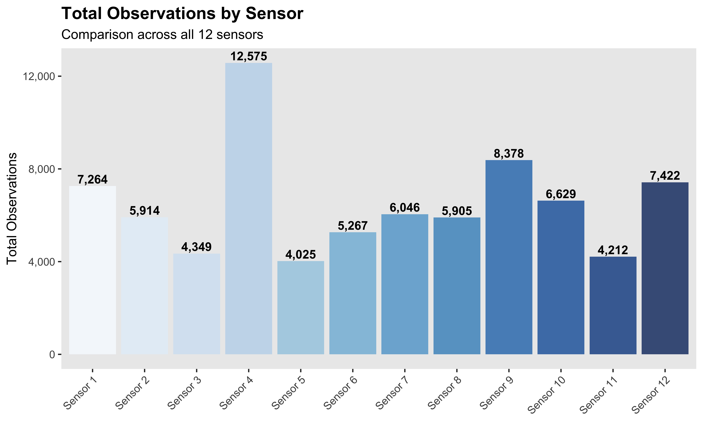
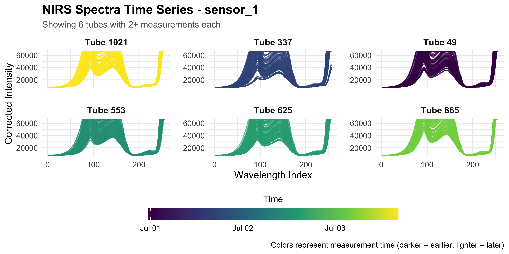
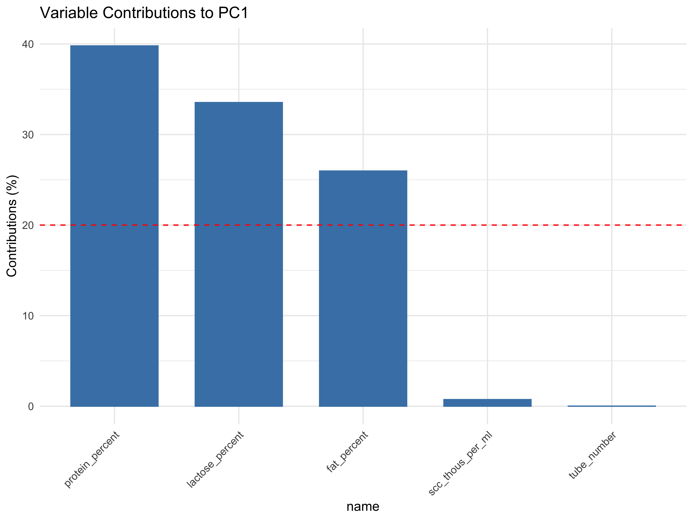

-   [Milk Quality Spectroscopy](#milk-quality-spectroscopy)
-   [Dataset](#dataset)
    -   [Key data components](#key-data-components)
    -   [Important limitations](#important-limitations)
    -   [Data evolution](#data-evolution)
    -   [Data processing](#data-processing)
        -   [Time series visualization](#time-series-visualization)
        -   [Saturated spectra](#saturated-spectra)
            -   [Detect and flag saturated
                spectra](#detect-and-flag-saturated-spectra)
            -   [Visualize saturation
                patterns](#visualize-saturation-patterns)
            -   [Interpolation method](#interpolation-method)
            -   [Removal and capping
                methods](#removal-and-capping-methods)
    -   [Exploratory Data Analysis](#exploratory-data-analysis)
        -   [Descriptive statistics for milk quality target
            variables](#descriptive-statistics-for-milk-quality-target-variables)
        -   [PCA analysis of milk quality
            targets](#pca-analysis-of-milk-quality-targets)
    -   [Modeling](#modeling)
        -   [Data preparation](#data-preparation)
        -   [Data splits and
            preprocessing](#data-splits-and-preprocessing)
        -   [Models tuning and
            evaluation](#models-tuning-and-evaluation)
        -   [Model performance
            comparison](#model-performance-comparison)
        -   [Prediction plots](#prediction-plots)
        -   [Feature Importance](#feature-importance)

<!-- README.md is generated from README.Rmd. Please edit that file -->

# Milk Quality Spectroscopy

<!-- badges: start -->
<!-- badges: end -->

``` r
if (requireNamespace("ggplot2", quietly = TRUE)) {
  ggplot2::theme_set(ggplot2::theme_minimal(base_size = 12))
}
```

``` r
set.seed(123)
```

``` r
suppressPackageStartupMessages({
  library(tidyverse)
  library(viridis)
  library(arrow)
  library(tidymodels)
  library(corrplot)
  library(vip)
  library(patchwork)
  library(yardstick)
  library(skimr)
  library(GGally)
  library(FactoMineR)
  library(factoextra)
  library(gridExtra)
  library(RColorBrewer)
  library(knitr)
  library(ggforce)
})
```

# Dataset

The data is structured by sensor/stall with each sensor directory
containing:

-   **Lab results** (CSV format with tube_no as primary key)
-   **Sensor configuration** (wavelengths, calibration coefficients)
-   **Spectral measurements** (Parquet files, one per milk sample)
-   **Dark spectra** (reference measurements)

## Key data components

**Lab Results**: Milk analysis including fat percentage, protein,
somatic cell count and, lactose linked to specific cows and milking
sessions.

**Spectral Data**: Raw 16-bit spectral arrays captured during milking,
with metadata like temperature, LED current, and integration time. Each
spectrum is classified as “dark,” “sample,” or “empty.”

**Sensor Info**: Each sensor has unique wavelength calibrations and
measurement parameters that aren’t standardized across sensors.

## Important limitations

-   Temperature and LED measurements are raw ADC values, not
    standardized between sensors
-   Each sensor measures different wavelengths
-   Some timing discrepancies remain due to clock source differences

## Data evolution

The dataset has evolved from initial CSV format to Parquet compression,
with spectral data consolidated into array columns rather than
individual wavelength columns for more efficient storage and processing.

## Data processing

``` r
dataset_path <- "Dataset/"
read_sensor_csvs <- function(sensor_folder) {
  sensor_path <- file.path(dataset_path, sensor_folder)
  lab_results <- read_csv(file.path(sensor_path, "lab_results.csv"), show_col_types = FALSE)
  lab_results$sensor <- sensor_folder
  sensor_data <- read_csv(file.path(sensor_path, "sensor.csv"), show_col_types = FALSE)
  sensor_data$sensor <- sensor_folder
  return(list(lab_results = lab_results, sensor_data = sensor_data))
}
```

``` r
read_sensor_parquets <- function(sensor_folder) {
  sensor_path <- file.path(dataset_path, sensor_folder)
  dark_spectra_path <- file.path(sensor_path, "dark_spectra", "dark_spectra.parquet")
  dark_spectra <- read_parquet(dark_spectra_path)
  spectra_path <- file.path(sensor_path, "spectra")
  tube_files <- list.files(spectra_path, pattern = "tube_no_\\d+\\.parquet$", full.names = TRUE)
  tube_spectra_list <- map(tube_files, read_parquet)
  names(tube_spectra_list) <- basename(tube_files)
  dark_spectra$sensor <- sensor_folder
  
  tube_spectra_list <- map(tube_spectra_list, ~ {
    .x$sensor <- sensor_folder
    return(.x)
  })
  
  return(list(dark_spectra = dark_spectra, tube_spectra = tube_spectra_list))
}
```

``` r
subtract_dark_spectrum <- function(tube_spectrum, dark_spectrum, verbose = FALSE) {
  if (nrow(tube_spectrum) != nrow(dark_spectrum)) {
    if (verbose) {
      cat(
        "Row count mismatch - Tube:",
        nrow(tube_spectrum),
        "Dark:",
        nrow(dark_spectrum),
        "- Trimming to",
        min(nrow(tube_spectrum), nrow(dark_spectrum)),
        "rows\n"
      )
    }
    min_rows <- min(nrow(tube_spectrum), nrow(dark_spectrum))
    tube_spectrum <- tube_spectrum[1:min_rows, ]
    dark_spectrum <- dark_spectrum[1:min_rows, ]
  }
  spectral_cols <- names(tube_spectrum)[sapply(tube_spectrum, is.numeric)]
  spectral_cols <- spectral_cols[spectral_cols != "sensor"]
  corrected_spectrum <- tube_spectrum
  
  for (col in spectral_cols) {
    if (col %in% names(dark_spectrum)) {
      if (length(tube_spectrum[[col]]) == length(dark_spectrum[[col]])) {
        corrected_spectrum[[col]] <- tube_spectrum[[col]] - dark_spectrum[[col]]
      } else {
        if (verbose) {
          cat("Column", col, "length mismatch, skipping\n")
        }
      }
    }
  }
  return(corrected_spectrum)
}
```

``` r
process_nir_data <- function(verbose = FALSE) {
  sensor_folders <- paste0("sensor_", 1:12)
  
  cat("Processing CSV files...\n")
  csv_data <- map(sensor_folders, read_sensor_csvs)
  names(csv_data) <- sensor_folders
  all_lab_results <- map_dfr(csv_data, ~ .x$lab_results)
  all_sensor_data <- map_dfr(csv_data, ~ .x$sensor_data)
  
  cat("Processing parquet files...\n")
  parquet_data <- map(sensor_folders, read_sensor_parquets)
  names(parquet_data) <- sensor_folders
  all_dark_spectra <- map_dfr(parquet_data, ~ .x$dark_spectra)
  corrected_spectra_list <- list()
  
  for (sensor in sensor_folders) {
    if (verbose) {
      cat(paste("Processing", sensor, "...\n"))
    } else {
      cat(".")
    }
    
    dark_spectrum <- parquet_data[[sensor]]$dark_spectra
    tube_spectra <- parquet_data[[sensor]]$tube_spectra
    corrected_tubes <- map(
      tube_spectra,
      ~ subtract_dark_spectrum(.x, dark_spectrum, verbose = verbose)
      )
    
    for (i in seq_along(corrected_tubes)) {
      tube_file <- names(corrected_tubes)[i]
      tube_number <- gsub("tube_no_(\\d+)\\.parquet", "\\1", tube_file)
      corrected_tubes[[i]]$tube_number <- tube_number
    }
    corrected_spectra_list[[sensor]] <- corrected_tubes
  }
  
  cat("\n")
  all_corrected_spectra <- map_dfr(corrected_spectra_list, ~ map_dfr(.x, identity))
  cat("Data processing complete!\n")
  
  return(
    list(
      lab_results = all_lab_results,
      sensor_data = all_sensor_data,
      dark_spectra = all_dark_spectra,
      corrected_spectra = all_corrected_spectra
    )
  )
}
```

``` r
nir_data <- process_nir_data(verbose = FALSE)
#> Processing CSV files...
#> Processing parquet files...
#> ............
#> Data processing complete!
```

``` r
cat("\n=== Data Summary ===\n")
#> 
#> === Data Summary ===
cat("Lab results shape:", nrow(nir_data$lab_results), "x", ncol(nir_data$lab_results), "\n")
#> Lab results shape: 1080 x 26
cat("Sensor data shape:", nrow(nir_data$sensor_data), "x", ncol(nir_data$sensor_data), "\n")
#> Sensor data shape: 12 x 11
cat("Dark spectra shape:", nrow(nir_data$dark_spectra), "x", ncol(nir_data$dark_spectra), "\n")
#> Dark spectra shape: 3991 x 9
cat("Corrected spectra shape:", nrow(nir_data$corrected_spectra), "x", ncol(nir_data$corrected_spectra), "\n")
#> Corrected spectra shape: 309142 x 13
cat("\nUnique sensors in corrected spectra:", length(unique(nir_data$corrected_spectra$sensor)), "\n")
#> 
#> Unique sensors in corrected spectra: 12
cat("Unique tube numbers:", length(unique(nir_data$corrected_spectra$tube_number)), "\n")
#> Unique tube numbers: 1080
```

``` r
nir_data$lab_results
#> # A tibble: 1,080 × 26
#>    tube_no barnname    rfid  lact grp   dim_days date       day_of_study
#>      <dbl>    <dbl>   <dbl> <dbl> <chr>    <dbl> <date>            <dbl>
#>  1       1     1126 8.40e14     1 A1         218 2025-06-30            1
#>  2      13     1161 8.40e14     1 A1         129 2025-06-30            1
#>  3      25     1181 8.40e14     1 A1          88 2025-06-30            1
#>  4      37     1083 8.40e14     1 A1         248 2025-06-30            1
#>  5      49     1149 8.40e14     1 A1          83 2025-06-30            1
#>  6      61      616 8.40e14     4 B2         204 2025-06-30            1
#>  7      73      456 8.40e14     5 B2         211 2025-06-30            1
#>  8      85      408 8.40e14     5 B2         249 2025-06-30            1
#>  9      97      746 8.40e14     3 B2          88 2025-06-30            1
#> 10     109      913 8.40e14     2 B2         246 2025-06-30            1
#> # ℹ 1,070 more rows
#> # ℹ 18 more variables: daily_milking <dbl>, study_milking <dbl>,
#> #   milking_end <chr>, avgmilkdur_mins <dbl>, milking_stall <dbl>,
#> #   milk_wt_lbs <dbl>, tube_number <dbl>, date_1 <date>, fat_percent <dbl>,
#> #   protein_percent <dbl>, scc_thous_per_ml <dbl>, lactose_percent <dbl>,
#> #   other_solids_percent <dbl>, mun_mg_per_dl <dbl>,
#> #   solids_not_fat_percent <dbl>, total_solids_percent <dbl>, endtime <dttm>, …
```

``` r
nir_data$sensor_data
#> # A tibble: 12 × 11
#>    sensor_uid       pcba box_number adc_gain adc_offset stall_number stall_title
#>    <chr>           <dbl>      <dbl>    <dbl>      <dbl>        <dbl> <chr>      
#>  1 B182C08004014D…    24         33       39        511            1 East Offic…
#>  2 B182C08004015A…    11          2       37        511            2 East       
#>  3 B182C08004018F…    37         25       38        511            3 East       
#>  4 B182C08004014A…    30         12       37        511            4 East       
#>  5 B182C08004016C…    16         21       38        511            5 East       
#>  6 B182C08004014E…    67         37       37        511            6 East-Entra…
#>  7 B182C080040163…    36         56       37        511            7 West Offic…
#>  8 B182C080040154…    15          4       39        511            8 West       
#>  9 B182C080040169…    21         20       37        511            9 West       
#> 10 B182C080040131…    14         24       37        511           10 West       
#> 11 B182C08004013D…    19          1       37        511           11 West       
#> 12 B182C080040191…    86         11       38        511           12 West Entra…
#> # ℹ 4 more variables: imager_sn <dbl>, sensor_wavelength_coefficients <chr>,
#> #   wavelengths_nm <chr>, sensor <chr>
```

### Time series visualization

``` r
visualize_all_sensors_temporal_summary <- function(nir_data) {
  temporal_summary <- nir_data$corrected_spectra %>%
    mutate(datetime = as.POSIXct(datetime)) %>%
    group_by(sensor) %>%
    summarise(
      n_measurements = n(),
      n_unique_tubes = n_distinct(tube_number),
      min_time = min(datetime),
      max_time = max(datetime),
      time_span_hours = as.numeric(difftime(max(datetime), min(datetime), units = "hours")),
      .groups = "drop"
    ) %>%
    mutate(avg_measurements_per_tube = round(n_measurements / n_unique_tubes, 2))
  print(temporal_summary)
  
  p_timeline <- nir_data$corrected_spectra %>%
    mutate(datetime = as.POSIXct(datetime)) %>%
    ggplot(aes(x = datetime, y = sensor, color = sensor)) +
    geom_point(alpha = 0.6, size = .5) +
    ggsci::scale_color_ucscgb() +
    labs(
      title = "Measurement Timeline Across All Sensors",
      x = "Date/Time",
      y = " ",
      caption = "Each point represents one spectral measurement"
    ) +
    theme_minimal() +
    theme(legend.position = "none")
  
  print(p_timeline)
  return(list(summary = temporal_summary, timeline_plot = p_timeline))
}
```

``` r
all_sensors_summary <- visualize_all_sensors_temporal_summary(nir_data)
#> # A tibble: 12 × 7
#>    sensor  n_measurements n_unique_tubes min_time            max_time           
#>    <chr>            <int>          <int> <dttm>              <dttm>             
#>  1 sensor…          25124             90 2025-06-30 22:43:44 2025-07-03 16:49:55
#>  2 sensor…          26353             90 2025-06-30 22:49:27 2025-07-03 16:47:42
#>  3 sensor…          26306             90 2025-06-30 22:49:40 2025-07-03 16:50:59
#>  4 sensor…          26820             90 2025-06-30 22:50:23 2025-07-03 16:51:14
#>  5 sensor…          23778             90 2025-06-30 22:43:59 2025-07-03 16:56:57
#>  6 sensor…          25791             90 2025-06-30 22:44:42 2025-07-03 16:50:31
#>  7 sensor…          25719             90 2025-06-30 22:39:36 2025-07-03 16:49:00
#>  8 sensor…          26679             90 2025-06-30 22:38:43 2025-07-03 16:50:48
#>  9 sensor…          26038             90 2025-06-30 22:45:30 2025-07-03 16:51:16
#> 10 sensor…          25764             90 2025-06-30 22:50:03 2025-07-03 16:49:00
#> 11 sensor…          25651             90 2025-06-30 22:48:41 2025-07-03 16:50:05
#> 12 sensor…          25119             90 2025-06-30 22:49:05 2025-07-03 16:47:37
#> # ℹ 2 more variables: time_span_hours <dbl>, avg_measurements_per_tube <dbl>
```


``` r
visualize_nirs_time_series <- function(
    nir_data,
    target_sensor = "sensor_1",
    min_measurements = 2
    ) {
  sensor_data <- nir_data$corrected_spectra %>%
    filter(sensor == target_sensor) %>%
    mutate(datetime = as.POSIXct(datetime))
  
  cat("=== Time Series Analysis for", target_sensor, "===\n")
  cat("Total measurements:", nrow(sensor_data), "\n")
  
  repeated_samples <- sensor_data %>%
    group_by(tube_number) %>%
    summarise(
      n_measurements = n(),
      time_span = difftime(max(datetime), min(datetime), units = "hours"),
      first_measurement = min(datetime),
      last_measurement = max(datetime),
      .groups = "drop"
    ) %>%
    filter(n_measurements >= min_measurements) %>%
    arrange(desc(n_measurements))
  
  cat(
    "Samples with",
    min_measurements,
    "or more measurements:",
    nrow(repeated_samples),
    "\n"
  )
  
  if (nrow(repeated_samples) == 0) {
    cat("No samples found with repeated measurements for time series analysis.\n")
    cat("Showing measurement frequency instead...\n")
    
    p1 <- sensor_data %>%
      ggplot(aes(x = datetime)) +
      geom_histogram(bins = 30, fill = "steelblue", alpha = 0.7) +
      labs(
        title = paste("Measurement Frequency Over Time -", target_sensor),
        x = "Date/Time",
        y = "Number of Measurements"
      ) +
      theme_minimal()
    
    print(p1)
    return(list(repeated_samples = repeated_samples, plot = p1))
  }
  
  samples_to_plot <- repeated_samples %>%
    slice_head(n = 5) %>%
    pull(tube_number)
  
  cat(
    "\nPlotting time series for tubes:",
    paste(samples_to_plot, collapse = ", "),
    "\n"
    )
  
  time_series_data <- sensor_data %>%
    filter(tube_number %in% samples_to_plot) %>%
    arrange(tube_number, datetime)
  
  extract_spectral_data <- function(data) {
    spectral_list <- list()
    for (i in 1:nrow(data)) {
      spec_array <- data$spec_array[[i]]
      spec_df <- data.frame(
        wavelength_index = 1:length(spec_array),
        intensity = as.numeric(spec_array),
        tube_number = data$tube_number[i],
        datetime = data$datetime[i],
        measurement_id = paste(data$tube_number[i], data$datetime[i])
      )
      spectral_list[[i]] <- spec_df
    }
    do.call(rbind, spectral_list)
  }
  
  spectral_data <- extract_spectral_data(time_series_data)
  
  p2 <- spectral_data %>%
    ggplot(aes(
      x = wavelength_index,
      y = intensity,
      color = datetime,
      group = measurement_id
    )) +
    geom_line(alpha = 0.7, size = 0.5) +
    facet_wrap(
      ~ tube_number,
      scales = "free_y",
      labeller = labeller(
        tube_number = function(x)
          paste("Tube", x)
      )
    ) +
    scale_color_viridis_c(name = "Time", trans = "time") +
    labs(
      title = paste("NIRS Spectra Time Series -", target_sensor),
      subtitle = "Each line represents a spectrum at a different time point",
      x = "Wavelength Index",
      y = "Corrected Intensity",
      caption = "Colors represent measurement time (darker = earlier, lighter = later)"
    ) +
    theme_minimal() +
    theme(
      strip.text = element_text(size = 10, face = "bold"),
      legend.position = "bottom")
  print(p2)
}
```

``` r
visualize_nirs_time_series(nir_data, "sensor_1", min_measurements = 2)
#> === Time Series Analysis for sensor_1 ===
#> Total measurements: 25124 
#> Samples with 2 or more measurements: 90 
#> 
#> Plotting time series for tubes: 1, 1021, 1057, 109, 169
```


### Saturated spectra

``` r
detect_and_handle_saturation <- function(nir_data,
                                         saturation_threshold = 60000,
                                         saturation_percentage = 0.05,
                                         method = "flag") {
  cat("=== Saturation Detection and Handling ===\n")
  is_saturated <- function(spec_array,
                           threshold = saturation_threshold,
                           percentage = saturation_percentage) {
    if (is.null(spec_array) || length(spec_array) == 0)
      return(FALSE)
    n_saturated <- sum(spec_array >= threshold, na.rm = TRUE)
    saturation_ratio <- n_saturated / length(spec_array)
    return(saturation_ratio >= percentage)
  }
  
  corrected_data <- nir_data$corrected_spectra %>%
    rowwise() %>%
    mutate(
      max_intensity = max(spec_array, na.rm = TRUE),
      mean_intensity = mean(spec_array, na.rm = TRUE),
      is_saturated = is_saturated(spec_array, saturation_threshold, saturation_percentage),
      n_saturated_points = sum(spec_array >= saturation_threshold, na.rm = TRUE),
      saturation_percentage = n_saturated_points / length(spec_array) * 100
    ) %>%
    ungroup()
  
  saturation_summary <- corrected_data %>%
    group_by(sensor) %>%
    summarise(
      total_spectra = n(),
      saturated_spectra = sum(is_saturated),
      saturation_rate = round(saturated_spectra / total_spectra * 100, 2),
      max_intensity_overall = max(max_intensity, na.rm = TRUE),
      mean_max_intensity = round(mean(max_intensity, na.rm = TRUE), 0),
      .groups = "drop"
    )
  
  cat("Saturation Summary by Sensor:\n")
  print(saturation_summary)
  total_saturated <- sum(corrected_data$is_saturated)
  total_spectra <- nrow(corrected_data)
  overall_rate <- round(total_saturated / total_spectra * 100, 2)
  
  cat(
    sprintf(
      "\nOverall: %d/%d spectra saturated (%.2f%%)\n",
      total_saturated,
      total_spectra,
      overall_rate
    )
  )
  
  if (method == "remove") {
    cat("\nRemoving saturated spectra...\n")
    clean_data <- corrected_data %>% filter(!is_saturated)
    cat(
      sprintf(
        "Removed %d saturated spectra. %d spectra remaining.\n",
        total_saturated,
        nrow(clean_data)
      )
    )
    
  } else if (method == "cap") {
    cat(sprintf(
      "\nCapping intensities at threshold: %d\n",
      saturation_threshold
    ))
    clean_data <- corrected_data %>%
      rowwise() %>%
      mutate(spec_array = list(pmin(spec_array, saturation_threshold))) %>%
      ungroup()
    
  } else if (method == "interpolate") {
    cat("\nInterpolating saturated regions...\n")
    clean_data <- corrected_data %>%
      rowwise() %>%
      mutate(spec_array = list(
        interpolate_saturated_points(spec_array, saturation_threshold)
      )) %>%
      ungroup()
    
  } else {
    cat("\nFlagging saturated spectra (no removal/modification)\n")
    clean_data <- corrected_data
  }
  
  return(
    list(
      data = clean_data,
      saturation_summary = saturation_summary,
      total_saturated = total_saturated,
      saturation_rate = overall_rate
    )
  )
}
```

``` r
interpolate_saturated_points <- function(spec_array, threshold) {
  if (is.null(spec_array) ||
      length(spec_array) == 0)
    return(spec_array)
  
  saturated_idx <- which(spec_array >= threshold)
  if (length(saturated_idx) == 0)
    return(spec_array)
  spec_interpolated <- spec_array
  saturated_groups <- split(saturated_idx, cumsum(c(1, diff(saturated_idx) != 1)))
  
  for (group in saturated_groups) {
    start_idx <- max(1, min(group) - 1)
    end_idx <- min(length(spec_array), max(group) + 1)
    
    if (start_idx < min(group) && end_idx > max(group)) {
      x_vals <- c(start_idx, end_idx)
      y_vals <- c(spec_array[start_idx], spec_array[end_idx])
      for (idx in group) {
        spec_interpolated[idx] <- approx(x_vals, y_vals, idx)$y
      }
    }
  }
  return(spec_interpolated)
}
```

``` r
visualize_saturation_patterns <- function(saturation_results,
                                          sensor_focus = "sensor_1",
                                          threshold = 60000) {
  p1 <- saturation_results$saturation_summary %>%
    ggplot(aes(x = sensor, y = saturation_rate, fill = saturation_rate)) +
    geom_col() +
    scale_fill_viridis_c(name = "Saturation\nRate (%)") +
    labs(
      title = "Saturation Rate by Sensor",
      x = "Sensor",
      y = "Saturation Rate (%)",
      caption = paste("Threshold:", threshold, "counts")
    ) +
    theme_minimal() +
    theme(axis.text.x = element_text(angle = 45, hjust = 1))
  
  print(p1)
  
  p2 <- saturation_results$data %>%
    ggplot(aes(x = max_intensity, fill = is_saturated)) +
    geom_histogram(bins = 50, alpha = 0.7) +
    geom_vline(
      xintercept = threshold,
      color = "red",
      linetype = "dashed",
      size = 1
    ) +
    scale_fill_manual(values = c("FALSE" = "steelblue", "TRUE" = "red"),
                      name = "Saturated") +
    labs(
      title = "Distribution of Maximum Intensities",
      x = "Maximum Intensity",
      y = "Count",
      caption = "Red line shows saturation threshold"
    ) +
    theme_minimal()
  
  print(p2)
  
  sensor_data <- saturation_results$data %>%
    filter(sensor == sensor_focus) %>%
    mutate(datetime = as.POSIXct(datetime))
  
  if (nrow(sensor_data) > 0) {
    p3 <- sensor_data %>%
      ggplot(aes(x = datetime, y = max_intensity, color = is_saturated)) +
      geom_point(alpha = 0.7) +
      geom_hline(yintercept = threshold,
                 color = "red",
                 linetype = "dashed") +
      scale_color_manual(values = c("FALSE" = "steelblue", "TRUE" = "red"),
                         name = "Saturated") +
      labs(
        title = paste("Saturation Over Time -", sensor_focus),
        x = "Date/Time",
        y = "Maximum Intensity",
        caption = "Red line shows saturation threshold"
      ) +
      theme_minimal()
    
    print(p3)
  }
  
  return(
    list(
      saturation_by_sensor = p1,
      intensity_distribution = p2,
      time_series = if (exists("p3"))
        p3
      else
        NULL
    )
  )
}
```

``` r
compare_saturation_handling <- function(nir_data,
                                        method = "interpolate",
                                        saturation_threshold = 60000,
                                        tube_example = NULL,
                                        sensor_example = "sensor_1") {
  results <- detect_and_handle_saturation(nir_data, saturation_threshold, method = method)
  if (is.null(tube_example)) {
    saturated_tubes <- results$data %>%
      filter(sensor == sensor_example, is_saturated == TRUE) %>%
      slice_head(n = 1)
    
    if (nrow(saturated_tubes) > 0) {
      tube_example <- saturated_tubes$tube_number[1]
    } else {
      tube_example <- results$data %>%
        filter(sensor == sensor_example) %>%
        slice_head(n = 1) %>%
        pull(tube_number)
    }
  }
  original_tube <- nir_data$corrected_spectra %>%
    filter(sensor == sensor_example, tube_number == tube_example) %>%
    slice_head(n = 1)
  
  processed_tube <- results$data %>%
    filter(sensor == sensor_example, tube_number == tube_example) %>%
    slice_head(n = 1)
  
  if (nrow(original_tube) > 0 && nrow(processed_tube) > 0) {
    comparison_data <- data.frame(
      wavelength_index = rep(1:length(original_tube$spec_array[[1]]), 2),
      intensity = c(original_tube$spec_array[[1]], processed_tube$spec_array[[1]]),
      type = rep(c("Original", paste("After", method)), each = length(original_tube$spec_array[[1]]))
    )
    
    p_compare <- comparison_data %>%
      ggplot(aes(x = wavelength_index, y = intensity, color = type)) +
      geom_line(size = 0.8) +
      geom_hline(
        yintercept = saturation_threshold,
        linetype = "dashed",
        color = "red",
        alpha = 0.7
      ) +
      scale_color_manual(values = c("Original" = "red", paste("After", method), "blue")) +
      labs(
        title = paste("Saturation Handling Comparison -", method),
        subtitle = paste("Tube", tube_example, "from", sensor_example),
        x = "Wavelength Index",
        y = "Corrected Intensity",
        color = "Processing",
        caption = "Red dashed line shows saturation threshold"
      ) +
      theme_minimal()
    
    print(p_compare)
  }
  return(results)
}
```

#### Detect and flag saturated spectra

``` r
saturation_results <- detect_and_handle_saturation(
  nir_data, 
  saturation_threshold = 60000, 
  saturation_percentage = 0.05, 
  method = "flag"
  )
#> === Saturation Detection and Handling ===
#> Saturation Summary by Sensor:
#> # A tibble: 12 × 6
#>    sensor  total_spectra saturated_spectra saturation_rate max_intensity_overall
#>    <chr>           <int>             <int>           <dbl>                 <int>
#>  1 sensor…         25124             18364            73.1                 65535
#>  2 sensor…         26353             20463            77.6                 65535
#>  3 sensor…         26306             22459            85.4                 65535
#>  4 sensor…         26820             19720            73.5                 65535
#>  5 sensor…         23778             18134            76.3                 65535
#>  6 sensor…         25791             22510            87.3                 65535
#>  7 sensor…         25719             11476            44.6                 65535
#>  8 sensor…         26679             23046            86.4                 65535
#>  9 sensor…         26038             21541            82.7                 65535
#> 10 sensor…         25764             19896            77.2                 65535
#> 11 sensor…         25651             20846            81.3                 65535
#> 12 sensor…         25119             17544            69.8                 65535
#> # ℹ 1 more variable: mean_max_intensity <dbl>
#> 
#> Overall: 235999/309142 spectra saturated (76.34%)
#> 
#> Flagging saturated spectra (no removal/modification)
```

#### Visualize saturation patterns

``` r
cat("\nCreating saturation visualization plots...\n")
#> 
#> Creating saturation visualization plots...
saturation_plots <- visualize_saturation_patterns(saturation_results, "sensor_1", threshold = 60000)
```



#### Interpolation method

``` r
# interpolated_results <- compare_saturation_handling(nir_data, method = "interpolate")
```

#### Removal and capping methods

``` r
removal_results <- compare_saturation_handling(nir_data, method = "remove")
#> === Saturation Detection and Handling ===
#> Saturation Summary by Sensor:
#> # A tibble: 12 × 6
#>    sensor  total_spectra saturated_spectra saturation_rate max_intensity_overall
#>    <chr>           <int>             <int>           <dbl>                 <int>
#>  1 sensor…         25124             18364            73.1                 65535
#>  2 sensor…         26353             20463            77.6                 65535
#>  3 sensor…         26306             22459            85.4                 65535
#>  4 sensor…         26820             19720            73.5                 65535
#>  5 sensor…         23778             18134            76.3                 65535
#>  6 sensor…         25791             22510            87.3                 65535
#>  7 sensor…         25719             11476            44.6                 65535
#>  8 sensor…         26679             23046            86.4                 65535
#>  9 sensor…         26038             21541            82.7                 65535
#> 10 sensor…         25764             19896            77.2                 65535
#> 11 sensor…         25651             20846            81.3                 65535
#> 12 sensor…         25119             17544            69.8                 65535
#> # ℹ 1 more variable: mean_max_intensity <dbl>
#> 
#> Overall: 235999/309142 spectra saturated (76.34%)
#> 
#> Removing saturated spectra...
#> Removed 235999 saturated spectra. 73143 spectra remaining.
```


``` r
capped_results <- compare_saturation_handling(nir_data, method = "cap")
#> === Saturation Detection and Handling ===
#> Saturation Summary by Sensor:
#> # A tibble: 12 × 6
#>    sensor  total_spectra saturated_spectra saturation_rate max_intensity_overall
#>    <chr>           <int>             <int>           <dbl>                 <int>
#>  1 sensor…         25124             18364            73.1                 65535
#>  2 sensor…         26353             20463            77.6                 65535
#>  3 sensor…         26306             22459            85.4                 65535
#>  4 sensor…         26820             19720            73.5                 65535
#>  5 sensor…         23778             18134            76.3                 65535
#>  6 sensor…         25791             22510            87.3                 65535
#>  7 sensor…         25719             11476            44.6                 65535
#>  8 sensor…         26679             23046            86.4                 65535
#>  9 sensor…         26038             21541            82.7                 65535
#> 10 sensor…         25764             19896            77.2                 65535
#> 11 sensor…         25651             20846            81.3                 65535
#> 12 sensor…         25119             17544            69.8                 65535
#> # ℹ 1 more variable: mean_max_intensity <dbl>
#> 
#> Overall: 235999/309142 spectra saturated (76.34%)
#> 
#> Capping intensities at threshold: 60000
```



## Exploratory Data Analysis

### Descriptive statistics for milk quality target variables

``` r
calculate_target_statistics <- function(nir_data) {
  cat("=== Descriptive Statistics for Milk Quality Targets ===\n\n")
  targets_data <- nir_data$lab_results %>%
    select(
      fat_percent, protein_percent, scc_thous_per_ml, lactose_percent,
      barnname, lact, grp, dim_days, daily_milking, milk_wt_lbs) %>%
    filter(
      !is.na(fat_percent), 
      !is.na(protein_percent), 
      !is.na(scc_thous_per_ml),
      !is.na(lactose_percent)
      )
  
  cat("Total samples with complete target data:", nrow(targets_data), "\n\n")
  target_vars <- c("fat_percent", "protein_percent", "scc_thous_per_ml", "lactose_percent")
  
  summary_stats <- targets_data %>%
    select(all_of(target_vars)) %>%
    summarise(
      across(everything(), list(
        n = ~ sum(!is.na(.x)),
        mean = ~ mean(.x, na.rm = TRUE),
        median = ~ median(.x, na.rm = TRUE),
        sd = ~ sd(.x, na.rm = TRUE),
        min = ~ min(.x, na.rm = TRUE),
        max = ~ max(.x, na.rm = TRUE),
        q25 = ~ quantile(.x, 0.25, na.rm = TRUE),
        q75 = ~ quantile(.x, 0.75, na.rm = TRUE),
        iqr = ~ IQR(.x, na.rm = TRUE),
        cv = ~ sd(.x, na.rm = TRUE) / mean(.x, na.rm = TRUE) * 100,
        skewness = ~ moments::skewness(.x, na.rm = TRUE),
        kurtosis = ~ moments::kurtosis(.x, na.rm = TRUE)
      ), .names = "{.col}_{.fn}")
    ) %>%
    pivot_longer(everything(), names_to = "stat", values_to = "value") %>%
    separate(stat, into = c("variable", "statistic"), sep = "_(?=[^_]*$)") %>%
    pivot_wider(names_from = statistic, values_from = value) %>%
    select(variable, n, mean, median, sd, cv, min, q25, q75, max, iqr, skewness, kurtosis)
  
  cat("Summary Statistics Table:\n")
  print(kable(summary_stats, digits = 3, format = "markdown"))
  cat("\n")
  
  return(list(
    summary_stats = summary_stats,
    targets_data = targets_data
  ))
}
```

``` r
create_distribution_plots <- function(targets_data) {
  cat("Creating distribution plots...\n")
  target_vars <- c("fat_percent", "protein_percent", "scc_thous_per_ml", "lactose_percent")
  hist_plots <- map(target_vars, ~ {
    targets_data %>%
      ggplot(aes(x = !!sym(.x))) +
      geom_histogram(aes(y = ..density..), bins = 30, alpha = 0.7, fill = "steelblue", color = "white") +
      geom_density(color = "red", size = 1, alpha = 0.7) +
      labs(
        title = paste("Distribution of", str_replace(.x, "_", " ") %>% str_to_title()),
        x = str_replace(.x, "_", " ") %>% str_to_title(),
        y = "Density"
      ) +
      theme_minimal() +
      theme(plot.title = element_text(size = 12, face = "bold"))
  })
  names(hist_plots) <- target_vars
  combined_hist <- wrap_plots(hist_plots, ncol = 2)
  print(combined_hist)
  box_plots <- targets_data %>%
    select(all_of(target_vars)) %>%
    pivot_longer(everything(), names_to = "variable", values_to = "value") %>%
    mutate(variable = str_replace(variable, "_", " ") %>% str_to_title()) %>%
    ggplot(aes(x = variable, y = value, fill = variable)) +
    geom_boxplot(alpha = 0.7, outlier.alpha = 0.6) +
    facet_wrap(~variable, scales = "free", ncol = 2) +
    labs(
      title = "Box Plots of Target Variables",
      x = "Variable",
      y = "Value"
    ) +
    theme_minimal() +
    theme(
      axis.text.x = element_blank(),
      legend.position = "none",
      strip.text = element_text(face = "bold")
    )
  print(box_plots)
  return(list(histograms = hist_plots, boxplots = box_plots))
}
```

``` r
analyze_correlations <- function(targets_data) {
  cat("Analyzing correlations between target variables...\n")
  target_vars <- c("fat_percent", "protein_percent", "scc_thous_per_ml", "lactose_percent")
  cor_matrix <- targets_data %>%
    select(all_of(target_vars)) %>%
    cor(use = "complete.obs")
  
  cat("Correlation Matrix:\n")
  print(round(cor_matrix, 3))
  cat("\n")
  
  corrplot(
    cor_matrix, 
    method = "color", 
    type = "upper", 
    order = "hclust",
    tl.cex = 0.8, 
    tl.col = "black",
    addCoef.col = "black",
    number.cex = 0.8,
    title = "Correlation Matrix of Target Variables",
    mar = c(0,0,2,0)
    )
  
  pairs_plot <- targets_data %>%
    select(all_of(target_vars)) %>%
    ggpairs(
      columnLabels = c("Fat %", "Protein %", "SCC (1000/ml)", "Lactose %"),
      title = "Pairwise Relationships Between Target Variables"
    ) +
    theme_minimal()
  
  print(pairs_plot)
  return(cor_matrix)
}
```

``` r
analyze_by_groups <- function(targets_data) {
  cat("Analyzing target variables by categorical groups...\n")
  target_vars <- c("fat_percent", "protein_percent", "scc_thous_per_ml", "lactose_percent")
  by_lactation <- targets_data %>%
    group_by(lact) %>%
    summarise(
      n = n(),
      across(all_of(target_vars), list(
        mean = ~ mean(.x, na.rm = TRUE),
        sd = ~ sd(.x, na.rm = TRUE)
      ), .names = "{.col}_{.fn}"),
      .groups = "drop"
    )
  
  cat("Summary by Lactation Number:\n")
  print(kable(by_lactation, digits = 3, format = "markdown"))
  cat("\n")
  
  by_group <- targets_data %>%
    group_by(grp) %>%
    summarise(
      n = n(),
      across(all_of(target_vars), list(
        mean = ~ mean(.x, na.rm = TRUE),
        sd = ~ sd(.x, na.rm = TRUE)
      ), .names = "{.col}_{.fn}"),
      .groups = "drop"
    )
  
  cat("Summary by Group:\n")
  print(kable(by_group, digits = 3, format = "markdown"))
  cat("\n")
  
  violin_lact <- targets_data %>%
    select(lact, all_of(target_vars)) %>%
    pivot_longer(cols = all_of(target_vars), names_to = "variable", values_to = "value") %>%
    mutate(
      variable = str_replace(variable, "_", " ") %>% str_to_title(),
      lact = factor(lact)
    ) %>%
    ggplot(aes(x = lact, y = value, fill = lact)) +
    geom_violin(alpha = 0.7) +
    geom_boxplot(width = 0.2, alpha = 0.8) +
    facet_wrap(~variable, scales = "free_y", ncol = 2) +
    labs(
      title = "Distribution of Target Variables by Lactation Number",
      x = "Lactation Number",
      y = "Value",
      fill = "Lactation"
    ) +
    theme_minimal() +
    theme(strip.text = element_text(face = "bold"))
  
  print(violin_lact)
  
  violin_group <- targets_data %>%
    select(grp, all_of(target_vars)) %>%
    pivot_longer(cols = all_of(target_vars), names_to = "variable", values_to = "value") %>%
    mutate(variable = str_replace(variable, "_", " ") %>% str_to_title()) %>%
    ggplot(aes(x = grp, y = value, fill = grp)) +
    geom_violin(alpha = 0.7) +
    geom_boxplot(width = 0.2, alpha = 0.8) +
    facet_wrap(~variable, scales = "free_y", ncol = 2) +
    labs(
      title = "Distribution of Target Variables by Group",
      x = "Group",
      y = "Value",
      fill = "Group"
    ) +
    theme_minimal() +
    theme(strip.text = element_text(face = "bold"))
  
  print(violin_group)
  
  return(list(
    by_lactation = by_lactation,
    by_group = by_group,
    violin_lact = violin_lact,
    violin_group = violin_group
  ))
}
```

``` r
identify_outliers <- function(targets_data) {
  cat("Identifying outliers in target variables...\n")
  target_vars <- c("fat_percent", "protein_percent", "scc_thous_per_ml", "lactose_percent")
  
  outlier_summary <- map_dfr(target_vars, ~ {
    var_data <- targets_data[[.x]]
    q1 <- quantile(var_data, 0.25, na.rm = TRUE)
    q3 <- quantile(var_data, 0.75, na.rm = TRUE)
    iqr <- q3 - q1
    lower_bound <- q1 - 1.5 * iqr
    upper_bound <- q3 + 1.5 * iqr
    
    outliers <- which(var_data < lower_bound | var_data > upper_bound)
    
    tibble(
      variable = .x,
      n_outliers = length(outliers),
      outlier_percentage = round(length(outliers) / length(var_data) * 100, 2),
      lower_bound = round(lower_bound, 3),
      upper_bound = round(upper_bound, 3),
      min_outlier = ifelse(length(outliers) > 0, round(min(var_data[outliers]), 3), NA),
      max_outlier = ifelse(length(outliers) > 0, round(max(var_data[outliers]), 3), NA)
    )
  })
  
  cat("Outlier Summary (using IQR method):\n")
  print(kable(outlier_summary, format = "markdown"))
  cat("\n")
  return(outlier_summary)
}
```

``` r
run_descriptive_analysis <- function(nir_data) {
  cat("Starting comprehensive descriptive analysis of target variables...\n\n")
  stats_results <- calculate_target_statistics(nir_data)
  dist_plots <- create_distribution_plots(stats_results$targets_data)
  correlations <- analyze_correlations(stats_results$targets_data)
  group_analysis <- analyze_by_groups(stats_results$targets_data)
  outliers <- identify_outliers(stats_results$targets_data)
  
  cat("=== Comprehensive Data Summary (skimr) ===\n")
  target_vars <- c("fat_percent", "protein_percent", "scc_thous_per_ml", "lactose_percent")
  skim_summary <- stats_results$targets_data %>%
    select(all_of(target_vars)) %>%
    skim()
  
  print(skim_summary)
  
  cat("\n=== Analysis Complete ===\n")
  cat("Key Insights:\n")
  cat("- Total samples analyzed:", nrow(stats_results$targets_data), "\n")
  cat("- Variables analyzed:", length(target_vars), "\n")
  cat("- Correlation range:", round(min(correlations[correlations != 1]), 3), 
      "to", round(max(correlations[correlations != 1]), 3), "\n")
  
  return(list(
    summary_stats = stats_results$summary_stats,
    targets_data = stats_results$targets_data,
    distributions = dist_plots,
    correlations = correlations,
    group_analysis = group_analysis,
    outliers = outliers,
    skim_summary = skim_summary
  ))
}
```

``` r
descriptive_results <- run_descriptive_analysis(nir_data)
#> Starting comprehensive descriptive analysis of target variables...
#> 
#> === Descriptive Statistics for Milk Quality Targets ===
#> 
#> Total samples with complete target data: 1080 
#> 
#> Summary Statistics Table:
#> 
#> 
#> |variable         |    n|    mean| median|      sd|      cv| min|  q25|   q75|    max|   iqr| skewness| kurtosis|
#> |:----------------|----:|-------:|------:|-------:|-------:|---:|----:|-----:|------:|-----:|--------:|--------:|
#> |fat_percent      | 1080|   3.389|    3.4|   0.833|  24.594|   0|  2.9|   3.9|    7.3|   1.0|   -0.482|    5.289|
#> |protein_percent  | 1080|   2.778|    2.8|   0.373|  13.411|   0|  2.6|   3.0|    3.5|   0.4|   -4.125|   32.093|
#> |scc_thous_per_ml | 1080| 229.217|   37.0| 627.646| 273.822|   0| 14.0| 157.0| 7508.0| 143.0|    6.401|   56.200|
#> |lactose_percent  | 1080|   4.717|    4.8|   0.520|  11.028|   0|  4.7|   4.9|    5.2|   0.2|   -7.642|   69.114|
#> 
#> Creating distribution plots...
```


    #> Analyzing correlations between target variables...
    #> Correlation Matrix:
    #>                  fat_percent protein_percent scc_thous_per_ml lactose_percent
    #> fat_percent            1.000           0.540            0.104           0.386
    #> protein_percent        0.540           1.000            0.131           0.730
    #> scc_thous_per_ml       0.104           0.131            1.000          -0.069
    #> lactose_percent        0.386           0.730           -0.069           1.000


    #> Analyzing target variables by categorical groups...
    #> Summary by Lactation Number:
    #> 
    #> 
    #> | lact|   n| fat_percent_mean| fat_percent_sd| protein_percent_mean| protein_percent_sd| scc_thous_per_ml_mean| scc_thous_per_ml_sd| lactose_percent_mean| lactose_percent_sd|
    #> |----:|---:|----------------:|--------------:|--------------------:|------------------:|---------------------:|-------------------:|--------------------:|------------------:|
    #> |    1| 531|            3.283|          0.735|                2.796|              0.303|               213.550|             386.547|                4.785|              0.339|
    #> |    2| 161|            3.564|          0.784|                2.872|              0.234|               166.366|             442.986|                4.748|              0.179|
    #> |    3| 153|            3.465|          0.883|                2.747|              0.236|                87.405|             265.345|                4.771|              0.218|
    #> |    4|  99|            3.469|          1.066|                2.784|              0.549|               515.111|            1567.636|                4.546|              0.877|
    #> |    5|  82|            3.552|          0.956|                2.710|              0.573|               213.061|             488.934|                4.566|              0.907|
    #> |    6|  27|            3.204|          1.034|                2.422|              0.704|               343.074|             448.302|                4.267|              1.246|
    #> |    7|  27|            3.378|          0.829|                2.585|              0.568|               602.630|             925.603|                4.452|              0.910|
    #> 
    #> Summary by Group:
    #> 
    #> 
    #> |grp |   n| fat_percent_mean| fat_percent_sd| protein_percent_mean| protein_percent_sd| scc_thous_per_ml_mean| scc_thous_per_ml_sd| lactose_percent_mean| lactose_percent_sd|
    #> |:---|---:|----------------:|--------------:|--------------------:|------------------:|---------------------:|-------------------:|--------------------:|------------------:|
    #> |A1  | 600|            3.355|          0.819|                2.780|              0.354|               219.357|             474.232|                4.749|              0.471|
    #> |B2  | 480|            3.431|          0.849|                2.776|              0.395|               241.542|             778.383|                4.678|              0.574|


    #> Identifying outliers in target variables...
    #> Outlier Summary (using IQR method):
    #> 
    #> 
    #> |variable         | n_outliers| outlier_percentage| lower_bound| upper_bound| min_outlier| max_outlier|
    #> |:----------------|----------:|------------------:|-----------:|-----------:|-----------:|-----------:|
    #> |fat_percent      |         20|               1.85|         1.4|         5.4|           0|         7.3|
    #> |protein_percent  |         11|               1.02|         2.0|         3.6|           0|         0.0|
    #> |scc_thous_per_ml |        137|              12.69|      -200.5|       371.5|         372|      7508.0|
    #> |lactose_percent  |         59|               5.46|         4.4|         5.2|           0|         4.3|
    #> 
    #> === Comprehensive Data Summary (skimr) ===
    #> ── Data Summary ────────────────────────
    #>                            Values    
    #> Name                       Piped data
    #> Number of rows             1080      
    #> Number of columns          4         
    #> _______________________              
    #> Column type frequency:               
    #>   numeric                  4         
    #> ________________________             
    #> Group variables            None      
    #> 
    #> ── Variable type: numeric ──────────────────────────────────────────────────────
    #>   skim_variable    n_missing complete_rate   mean      sd p0  p25  p50   p75
    #> 1 fat_percent              0             1   3.39   0.833  0  2.9  3.4   3.9
    #> 2 protein_percent          0             1   2.78   0.373  0  2.6  2.8   3  
    #> 3 scc_thous_per_ml         0             1 229.   628.     0 14   37   157  
    #> 4 lactose_percent          0             1   4.72   0.520  0  4.7  4.8   4.9
    #>     p100 hist 
    #> 1    7.3 ▁▃▇▁▁
    #> 2    3.5 ▁▁▁▇▆
    #> 3 7508   ▇▁▁▁▁
    #> 4    5.2 ▁▁▁▁▇
    #> 
    #> === Analysis Complete ===
    #> Key Insights:
    #> - Total samples analyzed: 1080 
    #> - Variables analyzed: 4 
    #> - Correlation range: -0.069 to 0.73
    cat("\n=== Quick Summary ===\n")
    #> 
    #> === Quick Summary ===
    cat("Mean values:\n")
    #> Mean values:
    descriptive_results$summary_stats %>%
      select(variable, mean) %>%
      mutate(mean = round(mean, 3)) %>%
      print()
    #> # A tibble: 4 × 2
    #>   variable           mean
    #>   <chr>             <dbl>
    #> 1 fat_percent        3.39
    #> 2 protein_percent    2.78
    #> 3 scc_thous_per_ml 229.  
    #> 4 lactose_percent    4.72

    cat("\nCoefficient of Variation (CV%):\n")
    #> 
    #> Coefficient of Variation (CV%):
    descriptive_results$summary_stats %>%
      select(variable, cv) %>%
      mutate(cv = round(cv, 2)) %>%
      arrange(desc(cv)) %>%
      print()
    #> # A tibble: 4 × 2
    #>   variable            cv
    #>   <chr>            <dbl>
    #> 1 scc_thous_per_ml 274. 
    #> 2 fat_percent       24.6
    #> 3 protein_percent   13.4
    #> 4 lactose_percent   11.0

### PCA analysis of milk quality targets

``` r
prepare_pca_data <- function(nir_data) {
  cat("=== Preparing Data for PCA Analysis ===\n")
  pca_data <- nir_data$lab_results %>%
    select(
      fat_percent, protein_percent, scc_thous_per_ml, lactose_percent,
      dim_days, daily_milking, milk_wt_lbs,
      lact, grp, tube_number
    ) %>%
    filter(
      !is.na(fat_percent), 
      !is.na(protein_percent), 
      !is.na(scc_thous_per_ml), 
      !is.na(lactose_percent)
    ) %>%
    mutate(
      lact = factor(lact),
      grp = factor(grp)
    )
  cat("Dataset dimensions:", nrow(pca_data), "samples x", ncol(pca_data), "variables\n")
  cat("Target variables: fat_percent, protein_percent, scc_thous_per_ml, lactose_percent\n")
  cat("Additional quantitative variables: dim_days, daily_milking, milk_wt_lbs\n")
  cat("Supplementary categorical variables: lact, grp\n\n")
  return(pca_data)
}
```

``` r
run_pca_analysis <- function(pca_data, scale_data = TRUE) {
  cat("=== Running PCA Analysis ===\n")
  quanti_vars <- c(
    "fat_percent", "protein_percent", "scc_thous_per_ml", "lactose_percent",
    "dim_days", "daily_milking", "milk_wt_lbs"
    )
  quali_vars <- c("lact", "grp")
  quanti_indices <- which(names(pca_data) %in% quanti_vars)
  quali_indices <- which(names(pca_data) %in% quali_vars)
  pca_result <- PCA(
    pca_data,
    scale.unit = scale_data,
    quanti.sup = if(length(setdiff(quanti_indices, 1:4)) > 0) setdiff(quanti_indices, 1:4) else NULL,
    quali.sup = quali_indices,
    graph = FALSE
  )
  cat("PCA completed successfully!\n")
  cat("Number of components:", ncol(pca_result$var$coord), "\n")
  cat("Scaling applied:", scale_data, "\n\n")
  return(pca_result)
}
```

``` r
analyze_eigenvalues <- function(pca_result) {
  cat("=== Eigenvalue Analysis ===\n")
  eigenvalues <- get_eigenvalue(pca_result)
  print(round(eigenvalues, 3))
  cat("\n")
  
  scree_plot <- fviz_eig(
    pca_result, 
    addlabels = TRUE, 
    ylim = c(0, 50),
    title = "Scree Plot - Variance Explained by Each Component",
    xlab = "Principal Components",
    ylab = "Percentage of Variance Explained"
    ) +
    theme_minimal() +
    geom_hline(yintercept = 10, linetype = "dashed", color = "red", alpha = 0.7) +
    labs(caption = "Red line indicates 10% variance threshold")
  
  print(scree_plot)
  
  cum_var_plot <- as.data.frame(eigenvalues) %>%
    mutate(component = 1:nrow(.)) %>%
    ggplot(aes(x = component, y = cumulative.variance.percent)) +
    geom_line(size = 1.2, color = "steelblue") +
    geom_point(size = 3, color = "steelblue") +
    geom_hline(yintercept = 80, linetype = "dashed", color = "red", alpha = 0.7) +
    scale_x_continuous(breaks = 1:nrow(eigenvalues)) +
    labs(
      title = "Cumulative Variance Explained",
      x = "Principal Components",
      y = "Cumulative Variance (%)",
      caption = "Red line indicates 80% variance threshold"
    ) +
    theme_minimal()
  
  print(cum_var_plot)
  return(eigenvalues)
}
```

``` r
analyze_variable_contributions <- function(pca_result) {
  cat("=== Variable Contributions Analysis ===\n")
  var_contrib <- get_pca_var(pca_result)
  
  cat("Variable coordinates on PC1 and PC2:\n")
  print(round(var_contrib$coord[, 1:2], 3))
  cat("\n")
  
  cat("Variable contributions to PC1 and PC2 (%):\n")
  print(round(var_contrib$contrib[, 1:2], 2))
  cat("\n")
  
  cat("Cos2 (quality of representation) for PC1 and PC2:\n")
  print(round(var_contrib$cos2[, 1:2], 3))
  cat("\n")
  
  contrib_pc1 <- fviz_contrib(
    pca_result, 
    choice = "var", 
    axes = 1, 
    top = 10,
    title = "Variable Contributions to PC1",
    fill = "steelblue", 
    color = "steelblue"
    ) +
    theme_minimal() +
    theme(axis.text.x = element_text(angle = 45, hjust = 1))
  
  contrib_pc2 <- fviz_contrib(
    pca_result, 
    choice = "var", 
    axes = 2, 
    top = 10,
    title = "Variable Contributions to PC2", 
    fill = "coral", 
    color = "coral"
    ) +
    theme_minimal() +
    theme(axis.text.x = element_text(angle = 45, hjust = 1))
  
  print(contrib_pc1)
  print(contrib_pc2)
  
  contrib_combined <- fviz_contrib(
    pca_result, 
    choice = "var", 
    axes = 1:2,
    title = "Variable Contributions to PC1 and PC2",
    fill = "darkgreen",
    color = "darkgreen"
    ) +
    theme_minimal() +
    theme(axis.text.x = element_text(angle = 45, hjust = 1))
  
  print(contrib_combined)
  return(var_contrib)
}
```

``` r
create_pca_biplots <- function(pca_result, pca_data) {
  cat("=== Creating PCA Biplots ===\n")
  biplot_basic <- fviz_pca_biplot(
    pca_result,
    repel = TRUE,
    col.var = "contrib",
    gradient.cols = c("#00AFBB", "#E7B800", "#FC4E07"),
    title = "PCA Biplot - Variables and Individuals",
    legend.title = "Contribution"
    ) +
    theme_minimal()
  
  print(biplot_basic)
  
  biplot_lact <- fviz_pca_ind(
    pca_result,
    col.ind = pca_data$lact,
    palette = "jco",
    addEllipses = TRUE,
    legend.title = "Lactation Number",
    title = "PCA - Individuals Colored by Lactation Number",
    repel = TRUE
    ) +
    theme_minimal()
  
  print(biplot_lact)
  
  biplot_group <- fviz_pca_ind(
    pca_result,
    col.ind = pca_data$grp,
    palette = "Dark2",
    addEllipses = TRUE,
    legend.title = "Group",
    title = "PCA - Individuals Colored by Group",
    repel = TRUE
    ) +
    theme_minimal()
  
  print(biplot_group)
  
  var_plot <- fviz_pca_var(
    pca_result,
    col.var = "cos2",
    gradient.cols = c("#00AFBB", "#E7B800", "#FC4E07"),
    repel = TRUE,
    title = "PCA - Variables Factor Map",
    legend.title = "Cos2"
    ) +
    theme_minimal()
  
  print(var_plot)
  
  return(list(
    biplot_basic = biplot_basic,
    biplot_lact = biplot_lact,
    biplot_group = biplot_group,
    var_plot = var_plot
  ))
}
```

``` r
analyze_supplementary_variables <- function(pca_result) {
  cat("=== Supplementary Variables Analysis ===\n")
  if (!is.null(pca_result$quanti.sup)) {
    cat("Supplementary Quantitative Variables Coordinates:\n")
    print(round(pca_result$quanti.sup$coord[, 1:2], 3))
    cat("\n")
    sup_quanti_plot <- fviz_pca_var(
      pca_result, choice = "quanti.sup",
      col.var = "steelblue",
      repel = TRUE,
      title = "Supplementary Quantitative Variables"
      ) +
      theme_minimal()
    print(sup_quanti_plot)
  }
  
  if (!is.null(pca_result$quali.sup)) {
    cat("Supplementary Qualitative Variables:\n")
    cat("Coordinates of category centroids:\n")
    print(round(pca_result$quali.sup$coord[, 1:2], 3))
    cat("\n")
    
    cat("Cos2 of categories:\n")
    print(round(pca_result$quali.sup$cos2[, 1:2], 3))
    cat("\n")
    sup_quali_plot <- fviz_pca_var(
      pca_result, choice = "quali.sup",
      col.var = "coral",
      repel = TRUE,
      title = "Supplementary Qualitative Variables"
      ) +
      theme_minimal()
    print(sup_quali_plot)
  }
}
```

``` r
interpret_pca_results <- function(pca_result, eigenvalues, var_contrib) {
  cat("=== PCA Results Interpretation ===\n")
  
   if (is.matrix(eigenvalues)) {
    eigenvalues <- as.data.frame(eigenvalues)
  }
  
  cat("COMPONENT INTERPRETATION:\n")
  cat("------------------------\n")
  pc1_vars <- var_contrib$contrib[, 1]
  pc1_top <- names(sort(pc1_vars, decreasing = TRUE))[1:3]
  cat(sprintf("PC1 (%.1f%% variance):\n", eigenvalues$variance.percent[1]))
  cat("- Main contributors:", paste(pc1_top, collapse = ", "), "\n")
  cat("- Loadings (coordinates):\n")
  for (var in pc1_top) {
    cat(sprintf("  %s: %.3f\n", var, var_contrib$coord[var, 1]))
  }
  cat("\n")
  pc2_vars <- var_contrib$contrib[, 2]
  pc2_top <- names(sort(pc2_vars, decreasing = TRUE))[1:3]
  cat(sprintf("PC2 (%.1f%% variance):\n", eigenvalues$variance.percent[2]))
  cat("- Main contributors:", paste(pc2_top, collapse = ", "), "\n")
  cat("- Loadings (coordinates):\n")
  for (var in pc2_top) {
    cat(sprintf("  %s: %.3f\n", var, var_contrib$coord[var, 2]))
  }
  cat("\n")
  cat("QUALITY OF REPRESENTATION (Cos2):\n")
  cat("----------------------------------\n")
  total_cos2 <- rowSums(var_contrib$cos2[, 1:2])
  well_represented <- names(total_cos2[total_cos2 > 0.6])
  poorly_represented <- names(total_cos2[total_cos2 < 0.4])
  
  if (length(well_represented) > 0) {
    cat("Well represented variables (Cos2 > 0.6):", paste(well_represented, collapse = ", "), "\n")
  }
  if (length(poorly_represented) > 0) {
    cat("Poorly represented variables (Cos2 < 0.4):", paste(poorly_represented, collapse = ", "), "\n")
  }
  cat("\n")
  cat("SUMMARY:\n")
  cat("--------\n")
  cat(sprintf("- First two components explain %.1f%% of total variance\n", sum(eigenvalues$variance.percent[1:2])))
  cat(sprintf("- Component 1 primarily represents: %s\n", paste(pc1_top[1:2], collapse = " and ")))
  cat(sprintf("- Component 2 primarily represents: %s\n", paste(pc2_top[1:2], collapse = " and ")))
  
  return(list(
    pc1_contributors = pc1_top,
    pc2_contributors = pc2_top,
    well_represented = well_represented,
    poorly_represented = poorly_represented
  ))
}
```

``` r
create_correlation_circle <- function(pca_result) {
  cat("Creating correlation circle...\n")
  corr_circle <- fviz_pca_var(
    pca_result,
    col.var = "contrib",
    gradient.cols = c("blue", "yellow", "red"),
    repel = TRUE,
    title = "Correlation Circle - Variable Relationships",
    legend.title = "Contribution"
    ) +
    theme_minimal() +
    geom_circle(
      aes(x0 = 0, y0 = 0, r = 1), 
      color = "gray",
      linetype = "dashed",
      inherit.aes = FALSE
      ) +
    xlim(-1.2, 1.2) + ylim(-1.2, 1.2)
  print(corr_circle)
  return(corr_circle)
}
```

``` r
run_complete_pca_analysis <- function(nir_data) {
  cat("=== Starting Complete PCA Analysis of Milk Quality Targets ===\n\n")
  pca_data <- prepare_pca_data(nir_data)
  pca_result <- run_pca_analysis(pca_data, scale_data = TRUE)
  eigenvalues <- analyze_eigenvalues(pca_result)
  var_contrib <- analyze_variable_contributions(pca_result)
  biplots <- create_pca_biplots(pca_result, pca_data)
  analyze_supplementary_variables(pca_result)
  corr_circle <- create_correlation_circle(pca_result)
  interpretation <- interpret_pca_results(pca_result, eigenvalues, var_contrib)
  
  cat("\n=== PCA Analysis Complete ===\n")
  
  return(list(
    pca_result = pca_result,
    pca_data = pca_data,
    eigenvalues = eigenvalues,
    var_contrib = var_contrib,
    biplots = biplots,
    corr_circle = corr_circle,
    interpretation = interpretation
  ))
}
```

``` r
pca_analysis_results <- run_complete_pca_analysis(nir_data)
#> === Starting Complete PCA Analysis of Milk Quality Targets ===
#> 
#> === Preparing Data for PCA Analysis ===
#> Dataset dimensions: 1080 samples x 10 variables
#> Target variables: fat_percent, protein_percent, scc_thous_per_ml, lactose_percent
#> Additional quantitative variables: dim_days, daily_milking, milk_wt_lbs
#> Supplementary categorical variables: lact, grp
#> 
#> === Running PCA Analysis ===
#> PCA completed successfully!
#> Number of components: 5 
#> Scaling applied: TRUE 
#> 
#> === Eigenvalue Analysis ===
#>       eigenvalue variance.percent cumulative.variance.percent
#> Dim.1      2.124           42.488                      42.488
#> Dim.2      1.078           21.551                      64.039
#> Dim.3      0.964           19.286                      83.325
#> Dim.4      0.608           12.161                      95.486
#> Dim.5      0.226            4.514                     100.000
```


    #> === Variable Contributions Analysis ===
    #> Variable coordinates on PC1 and PC2:
    #>                  Dim.1  Dim.2
    #> fat_percent      0.743  0.163
    #> protein_percent  0.919 -0.005
    #> scc_thous_per_ml 0.124  0.762
    #> lactose_percent  0.844 -0.252
    #> tube_number      0.002  0.638
    #> 
    #> Variable contributions to PC1 and PC2 (%):
    #>                  Dim.1 Dim.2
    #> fat_percent      25.96  2.47
    #> protein_percent  39.78  0.00
    #> scc_thous_per_ml  0.73 53.91
    #> lactose_percent  33.53  5.90
    #> tube_number       0.00 37.72
    #> 
    #> Cos2 (quality of representation) for PC1 and PC2:
    #>                  Dim.1 Dim.2
    #> fat_percent      0.552 0.027
    #> protein_percent  0.845 0.000
    #> scc_thous_per_ml 0.015 0.581
    #> lactose_percent  0.712 0.064
    #> tube_number      0.000 0.406



    #> === Creating PCA Biplots ===


    #> === Supplementary Variables Analysis ===
    #> Supplementary Quantitative Variables Coordinates:
    #>                Dim.1  Dim.2
    #> dim_days       0.201  0.140
    #> daily_milking  0.146 -0.012
    #> milk_wt_lbs   -0.085 -0.197


    #> Supplementary Qualitative Variables:
    #> Coordinates of category centroids:
    #>         Dim.1  Dim.2
    #> lact_1  0.038 -0.129
    #> lact_2  0.292 -0.003
    #> lact_3  0.034 -0.110
    #> lact_4 -0.093  0.479
    #> lact_5 -0.186  0.141
    #> lact_6 -1.202  0.369
    #> lact_7 -0.578  0.612
    #> A1      0.016  0.015
    #> B2     -0.020 -0.018
    #> 
    #> Cos2 of categories:
    #>        Dim.1 Dim.2
    #> lact_1 0.032 0.369
    #> lact_2 0.661 0.000
    #> lact_3 0.013 0.136
    #> lact_4 0.026 0.693
    #> lact_5 0.208 0.119
    #> lact_6 0.823 0.077
    #> lact_7 0.375 0.420
    #> A1     0.022 0.019
    #> B2     0.022 0.019


    #> Creating correlation circle...


    #> === PCA Results Interpretation ===
    #> COMPONENT INTERPRETATION:
    #> ------------------------
    #> PC1 (42.5% variance):
    #> - Main contributors: protein_percent, lactose_percent, fat_percent 
    #> - Loadings (coordinates):
    #>   protein_percent: 0.919
    #>   lactose_percent: 0.844
    #>   fat_percent: 0.743
    #> 
    #> PC2 (21.6% variance):
    #> - Main contributors: scc_thous_per_ml, tube_number, lactose_percent 
    #> - Loadings (coordinates):
    #>   scc_thous_per_ml: 0.762
    #>   tube_number: 0.638
    #>   lactose_percent: -0.252
    #> 
    #> QUALITY OF REPRESENTATION (Cos2):
    #> ----------------------------------
    #> Well represented variables (Cos2 > 0.6): protein_percent, lactose_percent 
    #> 
    #> SUMMARY:
    #> --------
    #> - First two components explain 64.0% of total variance
    #> - Component 1 primarily represents: protein_percent and lactose_percent
    #> - Component 2 primarily represents: scc_thous_per_ml and tube_number
    #> 
    #> === PCA Analysis Complete ===

    if (is.matrix(pca_analysis_results$eigenvalues)) {
      pca_analysis_results$eigenvalues <- as.data.frame(pca_analysis_results$eigenvalues)
    }

    cat("\n=== Quick PCA Summary ===\n")
    #> 
    #> === Quick PCA Summary ===
    cat("Variance explained by PC1:", round(pca_analysis_results$eigenvalues$variance.percent[1], 1), "%\n")
    #> Variance explained by PC1: 42.5 %
    cat("Variance explained by PC2:", round(pca_analysis_results$eigenvalues$variance.percent[2], 1), "%\n")
    #> Variance explained by PC2: 21.6 %
    cat("Total variance explained by PC1+PC2:", 
        round(sum(pca_analysis_results$eigenvalues$variance.percent[1:2]), 1), "%\n")
    #> Total variance explained by PC1+PC2: 64 %
    cat("Main PC1 contributors:", paste(pca_analysis_results$interpretation$pc1_contributors[1:2], collapse = ", "), "\n")
    #> Main PC1 contributors: protein_percent, lactose_percent
    cat("Main PC2 contributors:", paste(pca_analysis_results$interpretation$pc2_contributors[1:2], collapse = ", "), "\n")
    #> Main PC2 contributors: scc_thous_per_ml, tube_number

## Modeling

### Data preparation

``` r
prepare_modeling_data <- function(nir_data, use_interpolated = FALSE) {
  cat("Preparing data for modeling...\n")
  if (use_interpolated && exists("interpolated_data")) {
    spectral_data <- interpolated_data$data
    cat("Using interpolated spectral data\n")
  } else {
    spectral_data <- nir_data$corrected_spectra
    cat("Using original corrected spectral data\n")
  }
  
  spectral_features <- spectral_data %>%
    select(tube_number, sensor, spec_array) %>%
    mutate(tube_number = as.character(tube_number)) %>%
    rowwise() %>%
    mutate(
      spec_data = list(setNames(as.numeric(spec_array), paste0("wl_", 1:length(spec_array))))
    ) %>%
    ungroup() %>%
    select(-spec_array) %>%
    unnest_wider(spec_data)
  
  lab_data <- nir_data$lab_results %>%
    select(
      tube_number, fat_percent, protein_percent, scc_thous_per_ml, lactose_percent,
      barnname, lact, grp, dim_days, daily_milking, milk_wt_lbs
      ) %>%
    filter(
      !is.na(fat_percent), 
      !is.na(protein_percent), 
      !is.na(scc_thous_per_ml), 
      !is.na(lactose_percent)
      )
  
  modeling_data <- spectral_features %>%
    inner_join(lab_data, by = "tube_number") %>%
    filter(if_all(starts_with("wl_"), ~ !is.na(.x)))
  
  cat("Final dataset dimensions:", nrow(modeling_data), "x", ncol(modeling_data), "\n")
  cat("Number of spectral features:", sum(grepl("^wl_", names(modeling_data))), "\n")
  
  return(modeling_data)
}
```

### Data splits and preprocessing

``` r
create_modeling_workflow <- function(modeling_data, target_variable) {
  cat(sprintf("\n=== Creating workflow for %s ===\n", target_variable))
  data_split <- initial_split(modeling_data, prop = 0.8, strata = all_of(target_variable))
  train_data <- training(data_split)
  test_data <- testing(data_split)
  cat("Training set:", nrow(train_data), "samples\n")
  cat("Test set:", nrow(test_data), "samples\n")
  cv_folds <- vfold_cv(train_data, v = 5, strata = all_of(target_variable))
  
  recipe_spec <- recipe(as.formula(paste(target_variable, "~ .")), data = train_data) %>%
    step_rm(tube_number, sensor) %>%
    step_dummy(all_nominal_predictors()) %>%
    step_zv(all_predictors()) %>%
    step_corr(all_numeric_predictors(), threshold = 0.95) %>%
    step_normalize(all_numeric_predictors()) %>%
    step_pca(starts_with("wl_"), threshold = 0.95, prefix = "PC")
  return(list(
    split = data_split,
    train = train_data,
    test = test_data,
    cv_folds = cv_folds,
    recipe = recipe_spec
  ))
}
```

### Models tuning and evaluation

``` r
define_models <- function() {
  cat("Defining model specifications...\n")
  rf_spec <- rand_forest(
    mtry = tune(),
    trees = tune(),
    min_n = tune()
  ) %>%
    set_engine("ranger", importance = "impurity") %>%
    set_mode("regression")
  
  elastic_spec <- linear_reg(
    penalty = tune(),
    mixture = tune()
  ) %>%
    set_engine("glmnet") %>%
    set_mode("regression")
  
  xgb_spec <- boost_tree(
    trees = tune(),
    tree_depth = tune(),
    learn_rate = tune(),
    min_n = tune()
  ) %>%
    set_engine("xgboost") %>%
    set_mode("regression")
  
  svm_spec <- svm_rbf(
    cost = tune(),
    rbf_sigma = tune()
  ) %>%
    set_engine("kernlab") %>%
    set_mode("regression")
  
  return(list(
    random_forest = rf_spec,
    elastic_net = elastic_spec,
    xgboost = xgb_spec,
    svm = svm_spec
  ))
}
```

``` r
tune_and_evaluate_models <- function(workflow_data, models, target_variable) {
  cat(sprintf("Tuning models for %s...\n", target_variable))
  results <- list()
  for (model_name in names(models)) {
    cat(sprintf("Processing %s...\n", model_name))
    workflow_spec <- workflow() %>%
      add_recipe(workflow_data$recipe) %>%
      add_model(models[[model_name]])
    
    if (model_name == "random_forest") {
      tune_grid <- grid_regular(
        mtry(range = c(5, 20)),
        trees(range = c(100, 500)),
        min_n(range = c(5, 20)),
        levels = 3
      )
    } else if (model_name == "elastic_net") {
      tune_grid <- grid_regular(
        penalty(),
        mixture(),
        levels = 5
      )
    } else if (model_name == "xgboost") {
      tune_grid <- grid_regular(
        trees(range = c(100, 500)),
        tree_depth(range = c(3, 10)),
        learn_rate(range = c(0.01, 0.3)),
        min_n(range = c(5, 20)),
        levels = 3
      )
    } else if (model_name == "svm") {
      tune_grid <- grid_regular(
        cost(),
        rbf_sigma(),
        levels = 4
      )
    }
    
    tune_results <- workflow_spec %>%
      tune_grid(
        resamples = workflow_data$cv_folds,
        grid = tune_grid,
        metrics = metric_set(rmse, rsq, mae),
        control = control_grid(save_pred = TRUE, verbose = FALSE)
      )
    
    best_params <- tune_results %>%
      select_best(metric = "rmse")
    
    final_workflow <- workflow_spec %>%
      finalize_workflow(best_params)
    
    final_fit <- final_workflow %>%
      fit(workflow_data$train)
    
    test_predictions <- final_fit %>%
      predict(workflow_data$test) %>%
      bind_cols(workflow_data$test %>% select(all_of(target_variable)))
    
    test_metrics <- test_predictions %>%
      metrics(truth = !!sym(target_variable), estimate = .pred)
    
    results[[model_name]] <- list(
      tune_results = tune_results,
      best_params = best_params,
      final_fit = final_fit,
      test_predictions = test_predictions,
      test_metrics = test_metrics
    )
  }
  return(results)
}
```

### Model performance comparison

``` r
compare_model_performance <- function(model_results, target_variable) {
  cat(sprintf("\n=== Model Performance Comparison for %s ===\n", target_variable))
  performance_summary <- map_dfr(model_results, ~ {
    .x$test_metrics %>%
      filter(.metric %in% c("rmse", "rsq", "mae")) %>%
      select(.metric, .estimate)
  }, .id = "model")

  performance_table <- performance_summary %>%
    pivot_wider(names_from = .metric, values_from = .estimate) %>%
    arrange(rmse)
  
  print(performance_table)
  
  p1 <- performance_summary %>%
    filter(.metric == "rmse") %>%
    ggplot(aes(x = reorder(model, .estimate), y = .estimate, fill = model)) +
    geom_col() +
    coord_flip() +
    labs(
      title = paste("RMSE Comparison -", target_variable),
      x = "Model",
      y = "RMSE",
      fill = "Model"
    ) +
    theme_minimal() +
    theme(legend.position = "none")
  
  p2 <- performance_summary %>%
    filter(.metric == "rsq") %>%
    ggplot(aes(x = reorder(model, -.estimate), y = .estimate, fill = model)) +
    geom_col() +
    coord_flip() +
    labs(
      title = paste("R² Comparison -", target_variable),
      x = "Model",
      y = "R²",
      fill = "Model"
    ) +
    theme_minimal() +
    theme(legend.position = "none")
  
  print(p1 / p2)
  return(performance_table)
}
```

### Prediction plots

``` r
create_prediction_plots <- function(model_results, target_variable) {
  plots <- map(names(model_results), ~ {
    predictions <- model_results[[.x]]$test_predictions
    predictions %>%
      ggplot(aes(x = !!sym(target_variable), y = .pred)) +
      geom_point(alpha = 0.6) +
      geom_abline(intercept = 0, slope = 1, color = "red", linetype = "dashed") +
      labs(
        title = paste(.x, "-", target_variable),
        x = paste("Actual", target_variable),
        y = paste("Predicted", target_variable)
      ) +
      theme_minimal()
  })
  names(plots) <- names(model_results)
  combined_plot <- wrap_plots(plots, ncol = 2)
  print(combined_plot)
  return(plots)
}
```

### Feature Importance

``` r
extract_feature_importance <- function(model_results, target_variable, top_n = 15) {
  cat(sprintf("\nExtracting feature importance for %s...\n", target_variable))
  importance_plots <- list()
  for (model_name in names(model_results)) {
    tryCatch({
      if (model_name %in% c("random_forest", "xgboost")) {
        importance_plot <- model_results[[model_name]]$final_fit %>%
          extract_fit_parsnip() %>%
          vip(num_features = top_n) +
          labs(title = paste("Feature Importance -", model_name, "-", target_variable)) +
          theme_minimal()
        importance_plots[[model_name]] <- importance_plot
      }
    }, error = function(e) {
      cat(sprintf("Could not extract importance for %s: %s\n", model_name, e$message))
    })
  }
  if (length(importance_plots) > 0) {
    combined_importance <- wrap_plots(importance_plots, ncol = 2)
    print(combined_importance)
  }
  return(importance_plots)
}
```
